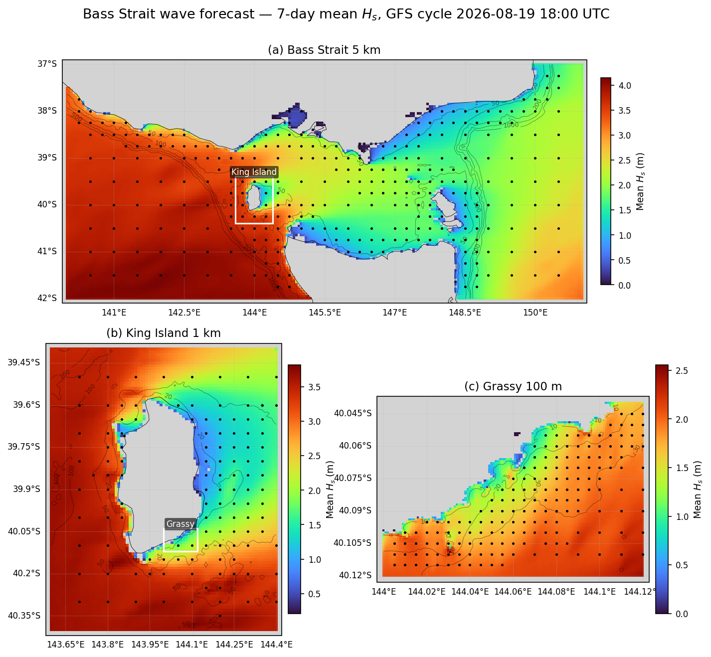

  

# Oceanum Bass Strait Wave Forecast

**August 2026**

| | |
|---|---|
| **Model** | SWAN 41.31 |
| **Forecast horizon** | 7 days |
| **Spatial resolution** | 0.05 degree (~5 km) to 0.001 degree (~100 m) |
| **Temporal resolution** | 1 hourly |
| **Region** | 140E - 151E, 42S - 37S |
| **Forcings** | GFS/ECMWF winds, Mercator/TPXO9 currents, and Oceanum spectra |
| **Update frequency** | 6-hourly (GFS) / 12-hourly (ECMWF) |

---

## Dataset description

The Bass Strait wave forecast dataset provides operational wave predictions across Bass Strait, the shallow and energetically complex waterway separating mainland Australia from Tasmania (Figure 1). The parent domain spans the full width of the strait from the South Australian and Victorian coasts in the west, across King Island, the Hunter and Furneaux island groups and the northern Tasmanian coast, to the Tasman Sea east of Flinders Island. Wave forecasts are produced using the SWAN (Simulating WAves Nearshore) third-generation spectral wave model, with a 7-day forecast horizon. The strait is exposed at both ends: long-period Southern Ocean swell propagates in from the west through the King Island gap and refracts strongly over the shallow central sill, while locally generated wind sea builds rapidly over the short fetches inside the strait. The model resolves both regimes together with the modulation of wave propagation by strong tidal currents.

Two forcing configurations are available: <a href="https://www.ncep.noaa.gov/products/gfs/" target="_blank">NOAA GFS</a> updated every 6 hours (00, 06, 12, 18 UTC) and <a href="https://www.ecmwf.int/en/forecasts/datasets/open-data" target="_blank">ECMWF IFS</a> updated every 12 hours (00, 12 UTC). Ocean currents are prescribed from a combination of the <a href="https://data.marine.copernicus.eu/product/GLOBAL_ANALYSISFORECAST_PHY_001_024/description" target="_blank">Mercator global ocean analysis and forecast</a> and the <a href="https://www.tpxo.net/global/tpxo9-atlas" target="_blank">TPXO9 tidal atlas</a>, capturing both the mesoscale circulation and the strong tidal streams that run through the strait. Spectral boundary conditions are supplied by the Oceanum Global WW3 wave forecast forced with the respective wind source. Bathymetry for the 5 km parent domain is prescribed from the <a href="https://ecat.ga.gov.au/geonetwork/srv/api/records/7ff1f558-8ef4-427b-9696-007b76aab2c6?language=eng" target="_blank">AusBathyTopo 250m 2026</a> grid from Geoscience Australia, while the two nested domains use the higher-resolution <a href="https://ecat.ga.gov.au/geonetwork/srv/eng/catalog.search#/metadata/147043" target="_blank">Bass Strait 30 m depth model</a>.

The modelling setup employs the <a href="https://journals.ametsoc.org/view/journals/atot/29/9/jtech-d-11-00092_1.xml" target="_blank">ST6</a> source term parameterisations with Collins bottom friction. Spectra are discretised into 36 directional bins and 32 frequency bins, covering a frequency range from 0.037 to 0.7102 Hz with 10% logarithmic increments. The model features a three-level nesting structure:

- **Bass Strait 5 km** (0.05°): Regional parent domain covering 140–151°E, 42–37°S, nested within the Oceanum Global WW3 wave forecast
- **King Island 1 km** (0.01°): High-resolution nest covering 143.6–144.4°E, 40.4–39.4°S, nested within the Bass Strait 5 km parent
- **Grassy 100 m** (0.001°): Ultra-high-resolution nest covering 144.0–144.12°E, 40.12–40.04°S, nested within the King Island 1 km domain

The King Island 1 km domain resolves the sharp gradient in wave energy across the island, from the fully exposed Southern Ocean swell window on the west coast to the sheltered lee on the east coast. The Grassy 100 m domain resolves the harbour of Grassy on the southeast coast of King Island and its approaches, capturing the nearshore refraction and sheltering that control wave conditions at the berth.

The dataset provides hourly forecast estimates for 38 ocean wave parameters (Table 3) including spectral quantities integrated over the full spectrum and for spectral partitions. Partitions are defined from an 8-second split (sea/swell) and from the Watershed method, which identifies one wind-forced partition and up to three swell partitions. Forecasts are archived for 7 days, and frequency-direction wave spectra are available at 295 sites in the Bass Strait domain, 119 sites in the King Island domain, and 168 sites in the Grassy domain. Nowcast datasets are also available, constructed by retaining the most recent data from each forecast cycle to provide a continuous near-real-time historical record.

**Figure 1.** Mean significant wave height over a single 7-day forecast (GFS cycle 2026-08-19 18:00 UTC) for each of the three nested domains. Spectra output site locations are shown by black dots, and the extent of each nested domain is outlined in white on its parent panel. Grey shading is the model land mask. Depth contours are shown at 50, 100, 200, 500 and 1000 m in panel (a), 20, 50 and 100 m in panel (b), and 10, 20 and 30 m in panel (c). Note that each panel uses its own colour scale.

---

## Validation

The wave model physics and calibration have been validated against satellite altimeter observations for the corresponding <a href="./oceanum_bass_strait_wave_hindcast.md">Bass Strait hindcast</a> and <a href="./oceanum_king_island_wave_hindcast.md">King Island hindcast</a> domains, which share the same grids, bathymetry and physics configuration as the forecast. Validation results are available through the <a href="https://hindcast-satellite-validation-main-prod.apps.oceanum.io/" target="_blank">Oceanum Hindcast Satellite Validation App</a>, which provides density scatter plots, quantile comparisons, and statistical metrics for the Bass Strait region.

---

## Data description

**Table 1.** Data description.

| Field | Value |
|---|---|
| **Title** | Oceanum Bass Strait wave forecast |
| **Institution** | <a href="https://oceanum.io" target="_blank">Oceanum</a> |
| **Access** | <a href="https://ui.datamesh.oceanum.io/" target="_blank">Oceanum Datamesh</a> |
| **Source** | <a href="https://swanmodel.sourceforge.io/" target="_blank">SWAN 41.31A</a> |
| **Source terms** | <a href="https://journals.ametsoc.org/view/journals/atot/29/9/jtech-d-11-00092_1.xml" target="_blank">ST6</a> |
| **Forecast horizon** | 7 days |
| **Update frequency** | 6-hourly (GFS) / 12-hourly (ECMWF) |
| **Archive period** | 7 days |
| **Temporal resolution** | 1 hourly |
| **Spatial coverage (5 km Bass Strait)** | [140E, 42S, 151E, 37S] at 0.05 degree |
| **Spatial coverage (1 km King Island)** | [143.6E, 40.4S, 144.4E, 39.4S] at 0.01 degree |
| **Spatial coverage (100 m Grassy)** | [144E, 40.12S, 144.12E, 40.04S] at 0.001 degree |
| **Spectra sites (5 km Bass Strait)** | 295 |
| **Spectra sites (1 km King Island)** | 119 |
| **Spectra sites (100 m Grassy)** | 168 |
| **Frequency discretisation** | 32 frequencies between 0.037 - 0.7102 Hz at 10% logarithmic increments |
| **Direction resolution** | 10 deg |
| **Bathymetry** | <a href="https://ecat.ga.gov.au/geonetwork/srv/api/records/7ff1f558-8ef4-427b-9696-007b76aab2c6?language=eng" target="_blank">AusBathyTopo 250m 2026</a> (5 km domain), <a href="https://ecat.ga.gov.au/geonetwork/srv/eng/catalog.search#/metadata/147043" target="_blank">Bass Strait 30 m depth model</a> (1 km and 100 m domains) |
| **Winds** | <a href="https://www.ncep.noaa.gov/products/gfs/" target="_blank">NOAA GFS</a> / <a href="https://www.ecmwf.int/en/forecasts/datasets/open-data" target="_blank">ECMWF IFS</a> |
| **Currents** | <a href="https://data.marine.copernicus.eu/product/GLOBAL_ANALYSISFORECAST_PHY_001_024/description" target="_blank">Mercator Global Ocean Analysis and Forecast</a> + <a href="https://www.tpxo.net/global/tpxo9-atlas" target="_blank">TPXO9 Atlas</a> |
| **Boundary** | Oceanum Global WW3 wave forecast (GFS or ECMWF forced) |

### Nested domains

**Table 2.** Nested domain overview.

| Domain | Resolution | Bounds | Spectra sites | Nested within |
|---|---|---|---|---|
| Bass Strait | 0.05° (~5 km) | 140–151°E, 42–37°S | 295 | Oceanum Global WW3 |
| King Island | 0.01° (~1 km) | 143.6–144.4°E, 40.4–39.4°S | 119 | Bass Strait 5 km |
| Grassy | 0.001° (~100 m) | 144.0–144.12°E, 40.12–40.04°S | 168 | King Island 1 km |

### Linked Datamesh datasources

#### GFS-forced (6-hourly updates)

**Bass Strait 5 km:**
- <a href="https://ui.datamesh.oceanum.io/datasource/oceanum_wave_gfs_bass5km_grid" target="_blank">Oceanum Bass Strait 5 km GFS wave forecast parameters</a>
- <a href="https://ui.datamesh.oceanum.io/datasource/oceanum_wave_gfs_bass5km_spec" target="_blank">Oceanum Bass Strait 5 km GFS wave forecast spectra</a>
- <a href="https://ui.datamesh.oceanum.io/datasource/oceanum_wave_gfs_bass5km_grid_nowcast" target="_blank">Oceanum Bass Strait 5 km GFS wave nowcast parameters</a>
- <a href="https://ui.datamesh.oceanum.io/datasource/oceanum_wave_gfs_bass5km_spec_nowcast" target="_blank">Oceanum Bass Strait 5 km GFS wave nowcast spectra</a>

**King Island 1 km:**
- <a href="https://ui.datamesh.oceanum.io/datasource/oceanum_wave_gfs_king1km_grid" target="_blank">Oceanum King Island 1 km GFS wave forecast parameters</a>
- <a href="https://ui.datamesh.oceanum.io/datasource/oceanum_wave_gfs_king1km_spec" target="_blank">Oceanum King Island 1 km GFS wave forecast spectra</a>
- <a href="https://ui.datamesh.oceanum.io/datasource/oceanum_wave_gfs_king1km_grid_nowcast" target="_blank">Oceanum King Island 1 km GFS wave nowcast parameters</a>
- <a href="https://ui.datamesh.oceanum.io/datasource/oceanum_wave_gfs_king1km_spec_nowcast" target="_blank">Oceanum King Island 1 km GFS wave nowcast spectra</a>

**Grassy 100 m:**
- <a href="https://ui.datamesh.oceanum.io/datasource/oceanum_wave_gfs_grassy100m_grid" target="_blank">Oceanum Grassy 100 m GFS wave forecast parameters</a>
- <a href="https://ui.datamesh.oceanum.io/datasource/oceanum_wave_gfs_grassy100m_spec" target="_blank">Oceanum Grassy 100 m GFS wave forecast spectra</a>
- <a href="https://ui.datamesh.oceanum.io/datasource/oceanum_wave_gfs_grassy100m_grid_nowcast" target="_blank">Oceanum Grassy 100 m GFS wave nowcast parameters</a>
- <a href="https://ui.datamesh.oceanum.io/datasource/oceanum_wave_gfs_grassy100m_spec_nowcast" target="_blank">Oceanum Grassy 100 m GFS wave nowcast spectra</a>

#### ECMWF-forced (12-hourly updates)

**Bass Strait 5 km:**
- <a href="https://ui.datamesh.oceanum.io/datasource/oceanum_wave_ec_bass5km_grid" target="_blank">Oceanum Bass Strait 5 km ECMWF wave forecast parameters</a>
- <a href="https://ui.datamesh.oceanum.io/datasource/oceanum_wave_ec_bass5km_spec" target="_blank">Oceanum Bass Strait 5 km ECMWF wave forecast spectra</a>
- <a href="https://ui.datamesh.oceanum.io/datasource/oceanum_wave_ec_bass5km_grid_nowcast" target="_blank">Oceanum Bass Strait 5 km ECMWF wave nowcast parameters</a>
- <a href="https://ui.datamesh.oceanum.io/datasource/oceanum_wave_ec_bass5km_spec_nowcast" target="_blank">Oceanum Bass Strait 5 km ECMWF wave nowcast spectra</a>

**King Island 1 km:**
- <a href="https://ui.datamesh.oceanum.io/datasource/oceanum_wave_ec_king1km_grid" target="_blank">Oceanum King Island 1 km ECMWF wave forecast parameters</a>
- <a href="https://ui.datamesh.oceanum.io/datasource/oceanum_wave_ec_king1km_spec" target="_blank">Oceanum King Island 1 km ECMWF wave forecast spectra</a>
- <a href="https://ui.datamesh.oceanum.io/datasource/oceanum_wave_ec_king1km_grid_nowcast" target="_blank">Oceanum King Island 1 km ECMWF wave nowcast parameters</a>
- <a href="https://ui.datamesh.oceanum.io/datasource/oceanum_wave_ec_king1km_spec_nowcast" target="_blank">Oceanum King Island 1 km ECMWF wave nowcast spectra</a>

**Grassy 100 m:**
- <a href="https://ui.datamesh.oceanum.io/datasource/oceanum_wave_ec_grassy100m_grid" target="_blank">Oceanum Grassy 100 m ECMWF wave forecast parameters</a>
- <a href="https://ui.datamesh.oceanum.io/datasource/oceanum_wave_ec_grassy100m_spec" target="_blank">Oceanum Grassy 100 m ECMWF wave forecast spectra</a>
- <a href="https://ui.datamesh.oceanum.io/datasource/oceanum_wave_ec_grassy100m_grid_nowcast" target="_blank">Oceanum Grassy 100 m ECMWF wave nowcast parameters</a>
- <a href="https://ui.datamesh.oceanum.io/datasource/oceanum_wave_ec_grassy100m_spec_nowcast" target="_blank">Oceanum Grassy 100 m ECMWF wave nowcast spectra</a>

---

## Integrated parameters gridded output

Integrated wave parameters are stored hourly over each domain at the native model resolution. Table 3 describes long names and units of the 38 gridded output parameters, including one wind-forced partition and up to three swell partitions from the Watershed method. The same parameter set is served for all three domains and both forcing configurations.

**Table 3.** Gridded output parameters.

*Variable names link to the corresponding <a href="https://vocab.nerc.ac.uk/standard_name/" target="_blank">NERC Vocabulary Server</a> standard name where available. All parameters are defined on the `time`, `latitude` and `longitude` coordinates.*

| Variable | Long Name | Units |
|---|---|---|
| <a href="https://vocab.nerc.ac.uk/standard_name/sea_floor_depth_below_sea_surface/" target="_blank">depth</a> | depth below sea surface | m |
| <a href="https://vocab.nerc.ac.uk/standard_name/sea_surface_wave_from_direction_at_variance_spectral_density_maximum/" target="_blank">dpm</a> | mean direction at the spectral peak of wind and swell waves | degree |
| <a href="https://vocab.nerc.ac.uk/standard_name/sea_surface_wind_wave_from_direction_at_variance_spectral_density_maximum/" target="_blank">dpmsea</a> | mean direction at the spectral peak of wind waves below 8 seconds period | degree |
| <a href="https://vocab.nerc.ac.uk/standard_name/sea_surface_swell_wave_from_direction_at_variance_spectral_density_maximum/" target="_blank">dpmswe</a> | mean direction at the spectral peak of swell waves above 8 seconds period | degree |
| <a href="https://vocab.nerc.ac.uk/standard_name/sea_surface_wave_directional_spread/" target="_blank">dspr</a> | directional spreading of wind and swell waves | degree |
| fspr | normalised width of the frequency spectrum of wind and swell waves | - |
| <a href="https://vocab.nerc.ac.uk/standard_name/sea_surface_wave_significant_height/" target="_blank">hs</a> | significant height of wind and swell waves | m |
| <a href="https://vocab.nerc.ac.uk/standard_name/sea_surface_wind_wave_significant_height/" target="_blank">hsea</a> | significant height of wind waves under 8 seconds period | m |
| <a href="https://vocab.nerc.ac.uk/standard_name/sea_surface_swell_wave_significant_height/" target="_blank">hswe</a> | significant height of swell waves above 8 seconds period | m |
| <a href="https://vocab.nerc.ac.uk/standard_name/sea_surface_wind_wave_from_direction/" target="_blank">pdir0</a> | mean direction of wind waves (partition 0) | degree |
| <a href="https://vocab.nerc.ac.uk/standard_name/sea_surface_primary_swell_wave_from_direction/" target="_blank">pdir1</a> | mean direction of primary swell waves (partition 1) | degree |
| <a href="https://vocab.nerc.ac.uk/standard_name/sea_surface_secondary_swell_wave_from_direction/" target="_blank">pdir2</a> | mean direction of secondary swell waves (partition 2) | degree |
| <a href="https://vocab.nerc.ac.uk/standard_name/sea_surface_tertiary_swell_wave_from_direction/" target="_blank">pdir3</a> | mean direction of tertiary swell waves (partition 3) | degree |
| <a href="https://vocab.nerc.ac.uk/standard_name/sea_surface_wind_wave_directional_spread/" target="_blank">pdspr0</a> | directional spreading of wind waves (partition 0) | degree |
| <a href="https://vocab.nerc.ac.uk/standard_name/sea_surface_primary_swell_wave_directional_spread/" target="_blank">pdspr1</a> | directional spreading of primary swell waves (partition 1) | degree |
| <a href="https://vocab.nerc.ac.uk/standard_name/sea_surface_secondary_swell_wave_directional_spread/" target="_blank">pdspr2</a> | directional spreading of secondary swell waves (partition 2) | degree |
| <a href="https://vocab.nerc.ac.uk/standard_name/sea_surface_tertiary_swell_wave_directional_spread/" target="_blank">pdspr3</a> | directional spreading of tertiary swell waves (partition 3) | degree |
| <a href="https://vocab.nerc.ac.uk/standard_name/sea_surface_wind_wave_significant_height/" target="_blank">phs0</a> | significant height of wind waves (partition 0) | m |
| <a href="https://vocab.nerc.ac.uk/standard_name/sea_surface_primary_swell_wave_significant_height/" target="_blank">phs1</a> | significant height of primary swell waves (partition 1) | m |
| <a href="https://vocab.nerc.ac.uk/standard_name/sea_surface_secondary_swell_wave_significant_height/" target="_blank">phs2</a> | significant height of secondary swell waves (partition 2) | m |
| <a href="https://vocab.nerc.ac.uk/standard_name/sea_surface_tertiary_swell_wave_significant_height/" target="_blank">phs3</a> | significant height of tertiary swell waves (partition 3) | m |
| <a href="https://vocab.nerc.ac.uk/standard_name/sea_surface_wind_wave_period_at_variance_spectral_density_maximum/" target="_blank">ptp0</a> | peak period of wind waves (partition 0) | s |
| <a href="https://vocab.nerc.ac.uk/standard_name/sea_surface_primary_swell_wave_period_at_variance_spectral_density_maximum/" target="_blank">ptp1</a> | peak period of primary swell waves (partition 1) | s |
| <a href="https://vocab.nerc.ac.uk/standard_name/sea_surface_secondary_swell_wave_period_at_variance_spectral_density_maximum/" target="_blank">ptp2</a> | peak period of secondary swell waves (partition 2) | s |
| <a href="https://vocab.nerc.ac.uk/standard_name/sea_surface_tertiary_swell_wave_period_at_variance_spectral_density_maximum/" target="_blank">ptp3</a> | peak period of tertiary swell waves (partition 3) | s |
| pwlen0 | mean wavelength of wind waves (partition 0) | m |
| pwlen1 | mean wavelength of primary swell waves (partition 1) | m |
| pwlen2 | mean wavelength of secondary swell waves (partition 2) | m |
| pwlen3 | mean wavelength of tertiary swell waves (partition 3) | m |
| <a href="https://vocab.nerc.ac.uk/standard_name/sea_surface_wave_mean_period_from_variance_spectral_density_first_frequency_moment/" target="_blank">tm01</a> | mean absolute wave period of wind and swell waves from the first frequency moment | s |
| <a href="https://vocab.nerc.ac.uk/standard_name/sea_surface_wave_mean_period_from_variance_spectral_density_second_frequency_moment/" target="_blank">tm02</a> | mean absolute wave period of wind and swell waves from the second frequency moment | s |
| <a href="https://vocab.nerc.ac.uk/standard_name/sea_surface_wave_period_at_variance_spectral_density_maximum/" target="_blank">tps</a> | smooth relative peak wave period of wind and swell waves | s |
| <a href="https://vocab.nerc.ac.uk/standard_name/sea_surface_wind_wave_period_at_variance_spectral_density_maximum/" target="_blank">tpssea</a> | smooth relative peak wave period of wind waves below 8 seconds period | s |
| <a href="https://vocab.nerc.ac.uk/standard_name/sea_surface_swell_wave_period_at_variance_spectral_density_maximum/" target="_blank">tpsswe</a> | smooth relative peak wave period of swell waves above 8 seconds period | s |
| <a href="https://vocab.nerc.ac.uk/standard_name/eastward_sea_water_velocity/" target="_blank">xcur</a> | eastward component of current velocity | m/s |
| <a href="https://vocab.nerc.ac.uk/standard_name/eastward_wind/" target="_blank">xwnd</a> | eastward component of wind velocity | m/s |
| <a href="https://vocab.nerc.ac.uk/standard_name/northward_sea_water_velocity/" target="_blank">ycur</a> | northward component of current velocity | m/s |
| <a href="https://vocab.nerc.ac.uk/standard_name/northward_wind/" target="_blank">ywnd</a> | northward component of wind velocity | m/s |

---

## Spectra output

Frequency-direction wave spectra are stored hourly at selected sites across all domains: 295 sites in the Bass Strait 5 km parent domain, 119 sites in the King Island 1 km domain, and 168 sites in the Grassy 100 m domain. Spectra are discretised into 36 directional bins (10 degree resolution) and 32 frequency bins (0.037 - 0.7102 Hz at 10% logarithmic increments).

**Table 4.** Spectra output parameters.

*Variable names link to the corresponding <a href="https://vocab.nerc.ac.uk/standard_name/" target="_blank">NERC Vocabulary Server</a> standard name where available. Spectra are defined on the `time`, `site`, `freq` and `dir` coordinates; `lon` and `lat` are per-site data variables giving each site's location.*

| Variable | Long Name | Units |
|---|---|---|
| <a href="https://vocab.nerc.ac.uk/standard_name/sea_surface_wave_directional_variance_spectral_density/" target="_blank">efth</a> | sea surface wave variance spectral density | m² s / deg |
| <a href="https://vocab.nerc.ac.uk/standard_name/sea_floor_depth_below_sea_surface/" target="_blank">dpt</a> | water depth | m |
| <a href="https://vocab.nerc.ac.uk/standard_name/wind_speed/" target="_blank">wspd</a> | wind speed | m/s |
| <a href="https://vocab.nerc.ac.uk/standard_name/wind_from_direction/" target="_blank">wdir</a> | wind direction | degree |
| <a href="https://vocab.nerc.ac.uk/standard_name/latitude/" target="_blank">lat</a> | latitude | degrees_north |
| <a href="https://vocab.nerc.ac.uk/standard_name/longitude/" target="_blank">lon</a> | longitude | degrees_east |

---

www.oceanum.science
