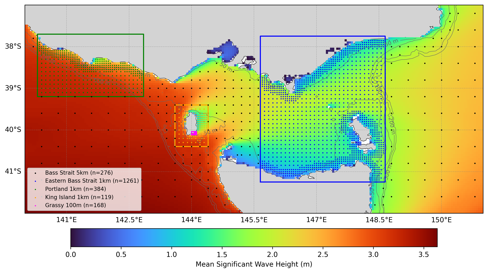

# Oceanum Bass Strait Wave Hindcast Specification

**February 2025**

| | |
|---|---|
| **Model** | SWAN 41.31 |
| **Period** | Jan 1993 - Updating |
| **Spatial resolution** | 0.05 degree (Bass Strait), 0.01 degree (nests), 0.001 degree (Grassy) |
| **Temporal resolution** | 1 hourly |
| **Region** | 140E - 151E, 42S - 37S |
| **Forcings** | ERA5 winds, Glorys/TPXO9 currents, and Oceanum spectra |

---

## Dataset description

The Bass Strait wave hindcast dataset provides a detailed account of ocean wave parameters across Bass Strait, the complex waterway between mainland Australia and Tasmania (Figure 1). Wave spectra are computed over a 30+ year period between 1993 and present using the SWAN (Simulating WAves Nearshore) third-generation spectral wave model. The model is driven by inputs from the Oceanum Global Wave Model for spectral boundaries and <a href="https://www.ecmwf.int/en/forecasts/dataset/ecmwf-reanalysis-v5" target="_blank">ERA5 reanalysis winds</a> from the European Centre for Medium-Range Weather Forecasts. Wave-current interactions are included through coupling with ocean currents from <a href="https://data.marine.copernicus.eu/product/GLOBAL_MULTIYEAR_PHY_001_030/description" target="_blank">Glorys reanalysis</a> and tidal currents from the TPXO9 atlas. Bathymetry is derived from the <a href="https://ecat.ga.gov.au/geonetwork/srv/eng/catalog.search#/metadata/148997" target="_blank">Australian Bathymetry and Topography 2023</a> 250m grid from Geosciences Australia.

The modelling setup employs the <a href="https://journals.ametsoc.org/view/journals/atot/29/9/jtech-d-11-00092_1.xml" target="_blank">ST6</a> source term parameterisations. Spectra are discretised into 36 directional bins and 32 frequency bins, covering a frequency range from 0.037 to 0.7102 Hz with 10% logarithmic increments. The parent domain features a regular grid with 5 km (0.05 degree) resolution covering Bass Strait and adjacent Southern Ocean waters. Higher-resolution nested domains provide detailed wave information for specific regions:

- **Eastern Bass Strait (1 km)**: Covers the eastern Bass Strait and northern Tasmanian coast
- **Portland (1 km)**: Covers the Portland area in western Victoria
- **King Island (1 km)**: Covers King Island in western Bass Strait (2015-2025)
- **Grassy (100 m)**: Ultra-high-resolution domain covering Grassy harbour on King Island (2015-2025)

The dataset provides hourly estimates for an extensive array of ocean wave parameters (Table 2) including spectral quantities integrated over the full spectrum and for spectral partitions (defined from an 8-second split and from the Watershed method). These data are stored over the entire grid at native resolution. Additionally, frequency-direction wave spectra are available at 276 sites for Bass Strait, 1261 sites for Eastern Bass Strait, 384 sites for Portland, 119 sites for King Island, and 168 sites for Grassy (see Figure 1).

**Figure 1.** Mean significant wave height from the Bass Strait hindcast domain. The locations of 2D spectra hourly output are shown by the dots. Coloured boxes indicate the extent of nested high-resolution domains. Depth contours are shown at 50m, 100m, 200m, and 500m.

---

## Validation

The wave hindcast can be validated against satellite altimeter observations using the <a href="https://hindcast-satellite-validation-main-prod.apps.oceanum.io/" target="_blank">Oceanum Hindcast Satellite Validation App</a>. This interactive tool allows users to compare modelled significant wave height against satellite altimeter measurements at any location within the model domain, providing density scatter plots, quantile comparisons, and statistical metrics.

---

## Data description

**Table 1.** Data description.

| Field | Value |
|---|---|
| **Title** | Oceanum Bass Strait wave hindcast |
| **Institution** | <a href="https://oceanum.io" target="_blank">Oceanum</a> |
| **Access** | <a href="https://ui.datamesh.oceanum.io/" target="_blank">Oceanum Datamesh</a> |
| **Source** | <a href="https://swanmodel.sourceforge.io/" target="_blank">SWAN 41.31A</a> |
| **Source terms** | <a href="https://journals.ametsoc.org/view/journals/atot/29/9/jtech-d-11-00092_1.xml" target="_blank">ST6</a> |
| **Temporal coverage** | 1993-01-01 to present (updating) |
| **Temporal resolution** | Hourly |
| **Spatial coverage (Bass Strait)** | [140E, 42S, 151E, 37S] at 0.05 degree |
| **Spatial coverage (Eastern Bass Strait)** | [145.65E, 41.25S, 148.65E, 37.75S] at 0.01 degree |
| **Spatial coverage (Portland)** | [140.3E, 39.2S, 142.85E, 37.7S] at 0.01 degree |
| **Spatial coverage (King Island)** | [143.6E, 40.4S, 144.4E, 39.4S] at 0.01 degree |
| **Spatial coverage (Grassy)** | [144E, 40.12S, 144.12E, 40.04S] at 0.001 degree |
| **Spectra output sites (Bass Strait)** | 276 |
| **Spectra output sites (Eastern Bass Strait)** | 1261 |
| **Spectra output sites (Portland)** | 384 |
| **Spectra output sites (King Island)** | 119 |
| **Spectra output sites (Grassy)** | 168 |
| **Frequency discretisation** | 32 frequencies between 0.037 - 0.7102 Hz at 10% logarithmic increments |
| **Direction resolution** | 10 deg |
| **Bathymetry** | <a href="https://ecat.ga.gov.au/geonetwork/srv/eng/catalog.search#/metadata/148997" target="_blank">Australian Bathymetry and Topography 2023 250m</a> |
| **Winds** | <a href="https://www.ecmwf.int/en/forecasts/dataset/ecmwf-reanalysis-v5" target="_blank">ERA5 Reanalysis</a> |
| **Currents** | <a href="https://data.marine.copernicus.eu/product/GLOBAL_MULTIYEAR_PHY_001_030/description" target="_blank">Glorys Reanalysis</a> + <a href="https://www.tpxo.net/global/tpxo9-atlas" target="_blank">TPXO9 Tides</a> |
| **Boundary** | <a href="https://ui.datamesh.oceanum.io/datasource/oceanum_wave_glob05_era5_v1_spec" target="_blank">Oceanum Global WW3 ERA5 hourly wave spectra</a> |

### Linked Datamesh datasources

#### Bass Strait (5 km)

- <a href="https://ui.datamesh.oceanum.io/datasource/oceanum_wave_bass_5km_era5_grid" target="_blank">Oceanum Bass Strait 5 km hourly wave parameters</a>
- <a href="https://ui.datamesh.oceanum.io/datasource/oceanum_wave_bass_5km_era5_spec" target="_blank">Oceanum Bass Strait 5 km hourly wave spectra</a>
- <a href="https://ui.datamesh.oceanum.io/datasource/oceanum_wave_bass_5km_era5_gridstats" target="_blank">Oceanum Bass Strait 5 km gridded wave statistics</a>

#### Eastern Bass Strait (1 km)

- <a href="https://ui.datamesh.oceanum.io/datasource/oceanum_wave_ebass_1km_era5_grid" target="_blank">Oceanum Eastern Bass Strait 1 km hourly wave parameters</a>
- <a href="https://ui.datamesh.oceanum.io/datasource/oceanum_wave_ebass_1km_era5_spec" target="_blank">Oceanum Eastern Bass Strait 1 km hourly wave spectra</a>

#### Portland (1 km)

- <a href="https://ui.datamesh.oceanum.io/datasource/oceanum_wave_ptlan_1km_era5_grid" target="_blank">Oceanum Portland 1 km hourly wave parameters</a>
- <a href="https://ui.datamesh.oceanum.io/datasource/oceanum_wave_ptlan_1km_era5_spec" target="_blank">Oceanum Portland 1 km hourly wave spectra</a>

#### King Island (1 km)

- <a href="https://ui.datamesh.oceanum.io/datasource/oceanum_wave_king_1km_era5_grid" target="_blank">Oceanum King Island 1 km hourly wave parameters</a>
- <a href="https://ui.datamesh.oceanum.io/datasource/oceanum_wave_king_1km_era5_spec" target="_blank">Oceanum King Island 1 km hourly wave spectra</a>

#### Grassy (100 m)

- <a href="https://ui.datamesh.oceanum.io/datasource/oceanum_wave_grassy_100m_era5_grid" target="_blank">Oceanum Grassy 100 m hourly wave parameters</a>
- <a href="https://ui.datamesh.oceanum.io/datasource/oceanum_wave_grassy_100m_era5_spec" target="_blank">Oceanum Grassy 100 m hourly wave spectra</a>

---

## Integrated parameters gridded output

Integrated wave parameters are stored hourly over the domain at the native model resolution. Table 2 describes long names and units of all 39 gridded output parameters.

**Table 2.** Gridded output parameters.

| Variable | Long Name | Units |
|---|---|---|
| depth | depth below sea surface | m |
| dpm | mean direction at the spectral peak of wind and swell waves | degree |
| dpmsea | mean direction at the spectral peak of wind waves below 8 seconds period | degree |
| dpmswe | mean direction at the spectral peak of swell waves above 8 seconds period | degree |
| dspr | directional spreading of wind and swell waves | degree |
| fspr | normalised width of the frequency spectrum of wind and swell waves | - |
| hs | significant height of wind and swell waves | m |
| hsea | significant height of wind waves under 8 seconds period | m |
| hswe | significant height of swell waves above 8 seconds period | m |
| pdir0 | directional spreading of wind waves | degree |
| pdir1 | directional spreading of primary swell waves | degree |
| pdir2 | directional spreading of secondary swell waves | degree |
| pdir3 | directional spreading of tertiary swell waves | degree |
| pdspr0 | directional spreading of wind waves | degree |
| pdspr1 | directional spreading of primary swell waves | degree |
| pdspr2 | directional spreading of secondary swell waves | degree |
| pdspr3 | directional spreading of tertiary swell waves | degree |
| phs0 | sea surface wind wave significant height | m |
| phs1 | sea surface primary swell wave significant height | m |
| phs2 | sea surface secondary swell wave significant height | m |
| phs3 | sea surface tertiary swell wave significant height | m |
| ptp0 | sea surface wind wave period at variance spectral density maximum | s |
| ptp1 | sea surface primary swell wave period at variance spectral density maximum | s |
| ptp2 | sea surface secondary swell wave period at variance spectral density maximum | s |
| ptp3 | sea surface tertiary swell wave period at variance spectral density maximum | s |
| pwlen0 | mean wavelength of wind waves | m |
| pwlen1 | mean wavelength of primary swell waves | m |
| pwlen2 | mean wavelength of secondary swell waves | m |
| pwlen3 | mean wavelength of tertiary swell waves | m |
| tm01 | mean absolute wave period of wind and swell waves from the first frequency moment | s |
| tm02 | mean absolute wave period of wind and swell waves from the second frequency moment | s |
| tps | smooth relative peak wave period of wind and swell waves | s |
| tpssea | smooth relative peak wave period of wind waves below 8 seconds period | s |
| tpsswe | smooth relative peak wave period of swell waves above 8 seconds period | s |
| ucur | eastward component of current velocity | m/s |
| vcur | northward component of current velocity | m/s |
| xwnd | eastward component of wind velocity | m/s |
| ywnd | northward component of wind velocity | m/s |

---

www.oceanum.science
