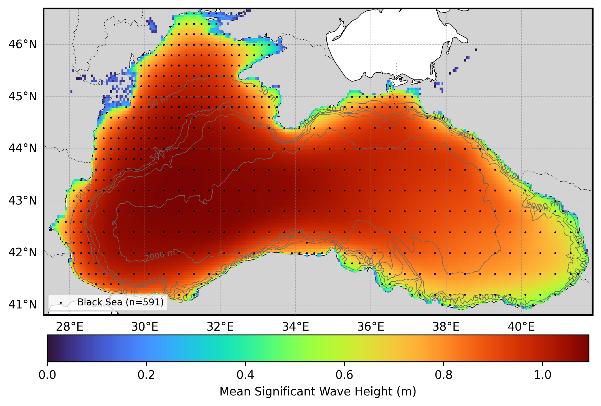

# Oceanum Black Sea CFSR Wave Hindcast Specification

**February 2025**

| | |
|---|---|
| **Model** | SWAN 41.31 |
| **Period** | Jan 1979 - Oct 2024 |
| **Spatial resolution** | 0.05 degree (~5 km) |
| **Temporal resolution** | 1 hourly |
| **Region** | 27.3E - 41.9E, 40.8N - 46.7N |
| **Forcings** | CFSR winds and Oceanum spectra |

---

## Dataset description

The Black Sea wave hindcast dataset provides a detailed account of ocean wave parameters across the entire Black Sea basin (Figure 1). The domain encompasses the complete Black Sea from the Bosphorus Strait in the southwest to the Sea of Azov connection in the northeast, including the coastal waters of Turkey, Bulgaria, Romania, Ukraine, Russia, and Georgia. Wave spectra are computed over a 45+ year period between 1979 and present using the SWAN (Simulating WAves Nearshore) third-generation spectral wave model. The model is driven by inputs from the Oceanum Global Wave Model for spectral boundaries and <a href="https://cfs.ncep.noaa.gov/" target="_blank">CFSR reanalysis winds</a> from the National Oceanic and Atmospheric Administration (NOAA). The wind forcing transitions from CFSv1 (1979-2010) to CFSv2 (2011-present) to maintain consistency with the available reanalysis products. The hindcast is calibrated against the satellite altimeter dataset of <a href="https://www.nature.com/articles/s41597-019-0083-9" target="_blank">Ribal and Young (2019)</a>. Bathymetry is derived from the <a href="https://www.gebco.net/data_and_products/gridded_bathymetry_data/" target="_blank">GEBCO 2024</a> global bathymetric grid.

The modelling setup employs the <a href="https://journals.ametsoc.org/view/journals/atot/29/9/jtech-d-11-00092_1.xml" target="_blank">ST6</a> source term parameterisations. Spectra are discretised into 36 directional bins and 35 frequency bins, covering a frequency range from 0.0407 to 1.15 Hz with 10% logarithmic increments. The model features a regular grid with a 5 km (0.05 degree) resolution, spanning the entire Black Sea basin.

The dataset provides hourly estimates for an extensive array of ocean wave parameters (Table 2) including spectral quantities integrated over the full spectrum and for spectral partitions. Partitions are defined from an 8-second split (sea/swell) and from the Watershed method, which identifies one wind-forced partition and up to three swell partitions. These data are stored over the entire grid at native resolution. Additionally, frequency-direction wave spectra are available at 591 sites distributed across the domain (see Figure 1).

**Figure 1.** Mean significant wave height from the Black Sea hindcast domain. The locations of 2D spectra hourly output are shown by the black dots. Depth contours are shown at 50m, 200m, 500m, 1000m, and 2000m.

---

## Validation

The wave hindcast can be validated against satellite altimeter observations using the <a href="https://hindcast-satellite-validation-main-prod.apps.oceanum.io/" target="_blank">Oceanum Hindcast Satellite Validation App</a>. This interactive tool allows users to compare modelled significant wave height against satellite altimeter measurements at any location within the model domain, providing density scatter plots, quantile comparisons, and statistical metrics.

---

## Data description

**Table 1.** Data description.

| Field | Value |
|---|---|
| **Title** | Oceanum Black Sea CFSR wave hindcast |
| **Institution** | <a href="https://oceanum.io" target="_blank">Oceanum</a> |
| **Access** | <a href="https://ui.datamesh.oceanum.io/" target="_blank">Oceanum Datamesh</a> |
| **Source** | <a href="https://swanmodel.sourceforge.io/" target="_blank">SWAN 41.31A</a> |
| **Source terms** | <a href="https://journals.ametsoc.org/view/journals/atot/29/9/jtech-d-11-00092_1.xml" target="_blank">ST6</a> |
| **Temporal coverage** | 1979-01-01 to 2024-10-01 |
| **Temporal resolution** | 1 hourly |
| **Spatial coverage** | [27.3E, 40.8N, 41.9E, 46.7N] at 0.05 degree |
| **Spectra output sites** | 591 |
| **Frequency discretisation** | 35 frequencies between 0.0407 - 1.15 Hz at 10% logarithmic increments |
| **Direction resolution** | 10 deg |
| **Bathymetry** | <a href="https://www.gebco.net/data_and_products/gridded_bathymetry_data/" target="_blank">GEBCO 2024 Grid</a> |
| **Winds** | <a href="https://cfs.ncep.noaa.gov/" target="_blank">CFSR Reanalysis</a> (CFSv1 1979-2010, CFSv2 2011-present) |
| **Boundary** | <a href="https://ui.datamesh.oceanum.io/datasource/oceanum_wave_glob05_era5_v1_spec" target="_blank">Oceanum Global WW3 ERA5 hourly wave spectra</a> |

### Linked Datamesh datasources

- <a href="https://ui.datamesh.oceanum.io/datasource/oceanum_wave_blacksea_cfsr_v1_grid" target="_blank">Oceanum Black Sea 5 km hourly wave parameters</a>
- <a href="https://ui.datamesh.oceanum.io/datasource/oceanum_wave_blacksea_cfsr_v1_spec" target="_blank">Oceanum Black Sea 5 km hourly wave spectra</a>

---

## Integrated parameters gridded output

Integrated wave parameters are stored hourly over the domain at the native model resolution. Table 2 describes long names and units of the 21 gridded output parameters, including one wind-forced partition and three swell partitions from the Watershed method.

**Table 2.** Gridded output parameters.

| Variable | Long Name | Units |
|---|---|---|
| depth | depth below sea surface | m |
| botlev | bottom level | m |
| dpm | mean direction at the spectral peak of wind and swell waves | degree |
| dpmsea | mean direction at the spectral peak of wind waves below 8 seconds period | degree |
| dpmswe | mean direction at the spectral peak of swell waves above 8 seconds period | degree |
| dspr | directional spreading of wind and swell waves | degree |
| fspr | normalised width of the frequency spectrum of wind and swell waves | - |
| hs | significant height of wind and swell waves | m |
| hsea | significant height of wind waves under 8 seconds period | m |
| hswe | significant height of swell waves above 8 seconds period | m |
| pdir0 | mean direction of wind waves (partition 0) | degree |
| pdspr0 | directional spreading of wind waves (partition 0) | degree |
| phs0 | significant height of wind waves (partition 0) | m |
| ptp0 | peak period of wind waves (partition 0) | s |
| pwlen0 | mean wavelength of wind waves (partition 0) | m |
| tm01 | mean absolute wave period of wind and swell waves from the first frequency moment | s |
| tm02 | mean absolute wave period of wind and swell waves from the second frequency moment | s |
| tps | smooth relative peak wave period of wind and swell waves | s |
| tpssea | smooth relative peak wave period of wind waves below 8 seconds period | s |
| tpsswe | smooth relative peak wave period of swell waves above 8 seconds period | s |
| xwnd | eastward component of wind velocity | m/s |
| ywnd | northward component of wind velocity | m/s |

---

www.oceanum.science
