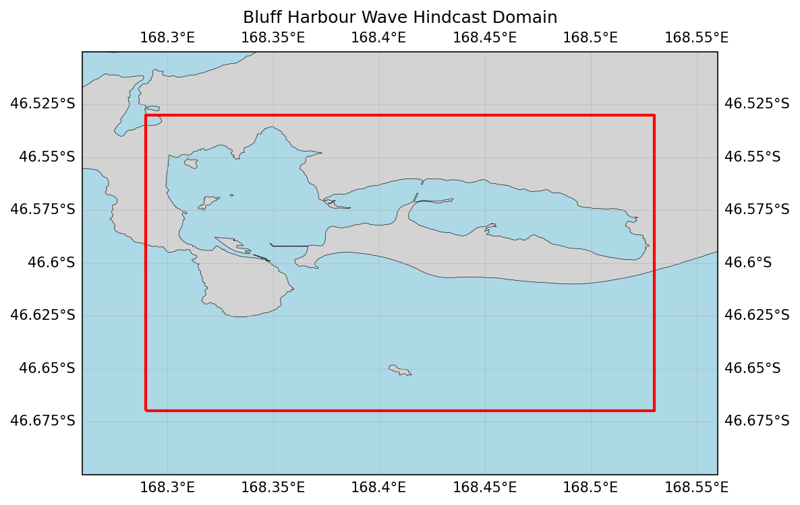

# Oceanum Bluff Harbour CCAM Wave Hindcast Specification

**February 2025**

| | |
|---|---|
| **Model** | SWAN 41.31 |
| **Period** | Jan 2010 - Jan 2020 |
| **Spatial resolution** | 0.001 degree (~100 m) |
| **Temporal resolution** | 1 hourly |
| **Region** | 168.29E - 168.53E, 46.67S - 46.53S |
| **Forcings** | CCAM winds, tidal currents, and Oceanum spectra |

---

## Dataset description

The Bluff Harbour wave hindcast dataset provides an ultra-high resolution account of ocean wave parameters across Bluff Harbour and adjacent Foveaux Strait waters in Southland, New Zealand (Figure 1). The domain encompasses the complete harbour basin and surrounding coastal waters, capturing the interaction between Southern Ocean swell systems and locally generated wind waves. Wave spectra are computed over a 10-year period between 2010 and 2020 using the SWAN (Simulating WAves Nearshore) third-generation spectral wave model. This specialised hindcast is designed for detailed harbour-scale applications requiring accurate representation of local wind effects and wave-current interactions.

The model is driven by high-resolution winds from the <a href="https://www.ccrc.unsw.edu.au/ccam" target="_blank">CCAM (Conformal Cubic Atmospheric Model)</a> regional atmospheric hindcast produced by Oceanum for Southland, New Zealand. This dynamically downscaled atmospheric forcing provides improved representation of local wind patterns compared to global reanalyses. Tidal currents and water levels are prescribed from Oceanum's high-resolution Bluff tidal model, enabling accurate representation of wave-current interactions in the harbour entrance and Foveaux Strait. Spectral boundary conditions are supplied by the <a href="https://ui.datamesh.oceanum.io/datasource/oceanum_wave_southland_nz_ccam_v1_spec" target="_blank">Oceanum Southland CCAM wave spectra</a> to ensure realistic representation of regional wave climate. Bathymetry is derived from GEBCO 2020 supplemented with local high-resolution bathymetric surveys.

The modelling setup employs the <a href="https://journals.ametsoc.org/view/journals/atot/29/9/jtech-d-11-00092_1.xml" target="_blank">ST6</a> source term parameterisations. Spectra are discretised into 36 directional bins and 36 frequency bins, covering a frequency range from 0.037 to 1.04 Hz with 10% logarithmic increments. The model features a regular grid with an ultra-high 100 m (0.001 degree) resolution, capturing detailed wave transformation processes within the harbour and surrounding coastal waters.

The dataset provides hourly estimates for key ocean wave parameters (Table 2) including significant wave height, peak period, and mean direction. These data are stored over the entire grid at native resolution. This ultra-high resolution gridded dataset is particularly suitable for detailed port and harbour design, coastal infrastructure planning, nearshore wave climate characterisation, and site-specific engineering assessments for Bluff Harbour operations and surrounding coastal areas.

**Figure 1.** Bluff Harbour wave hindcast domain extent with land mask. The model covers Bluff Harbour and adjacent Foveaux Strait waters at 100m resolution.

---

## Data description

**Table 1.** Data description.

| Field | Value |
|---|---|
| **Title** | Oceanum Bluff Harbour CCAM wave hindcast |
| **Institution** | <a href="https://oceanum.io" target="_blank">Oceanum</a> |
| **Access** | <a href="https://ui.datamesh.oceanum.io/" target="_blank">Oceanum Datamesh</a> |
| **Source** | <a href="https://swanmodel.sourceforge.io/" target="_blank">SWAN 41.31A</a> |
| **Source terms** | <a href="https://journals.ametsoc.org/view/journals/atot/29/9/jtech-d-11-00092_1.xml" target="_blank">ST6</a> |
| **Temporal coverage** | 2010-01-01 to 2020-01-01 |
| **Temporal resolution** | 1 hourly |
| **Spatial coverage** | [168.29E, 46.67S, 168.53E, 46.53S] at 0.001 degree |
| **Frequency discretisation** | 36 frequencies between 0.037 - 1.04 Hz at 10% logarithmic increments |
| **Direction resolution** | 10 deg |
| **Bathymetry** | <a href="https://www.gebco.net/data_and_products/gridded_bathymetry_data/" target="_blank">GEBCO 2020</a> + local bathymetric surveys |
| **Winds** | <a href="https://www.ccrc.unsw.edu.au/ccam" target="_blank">Oceanum Southland CCAM</a> 4km atmospheric hindcast |
| **Tides** | Oceanum Bluff 100m tidal constituents |
| **Boundary** | <a href="https://ui.datamesh.oceanum.io/datasource/oceanum_wave_southland_nz_ccam_v1_spec" target="_blank">Oceanum Southland CCAM hourly wave spectra</a> |

### Linked Datamesh datasources

- <a href="https://ui.datamesh.oceanum.io/datasource/oceanum_wave_bluff_ccam_v1_grid" target="_blank">Oceanum Bluff Harbour 100m hourly wave parameters</a>

---

## Gridded output parameters

Integrated wave parameters are stored hourly over the domain at the native model resolution. Table 2 describes the gridded output parameters.

**Table 2.** Gridded output parameters.

| Variable | Long Name | Units |
|---|---|---|
| depth | depth below sea surface | m |
| hs | significant height of wind and swell waves | m |
| tps | smooth relative peak wave period of wind and swell waves | s |
| dpm | mean direction at the spectral peak of wind and swell waves | degree |
| xwnd | eastward component of wind velocity | m/s |
| ywnd | northward component of wind velocity | m/s |
| xcur | eastward component of tidal current velocity | m/s |
| ycur | northward component of tidal current velocity | m/s |

---

www.oceanum.science
