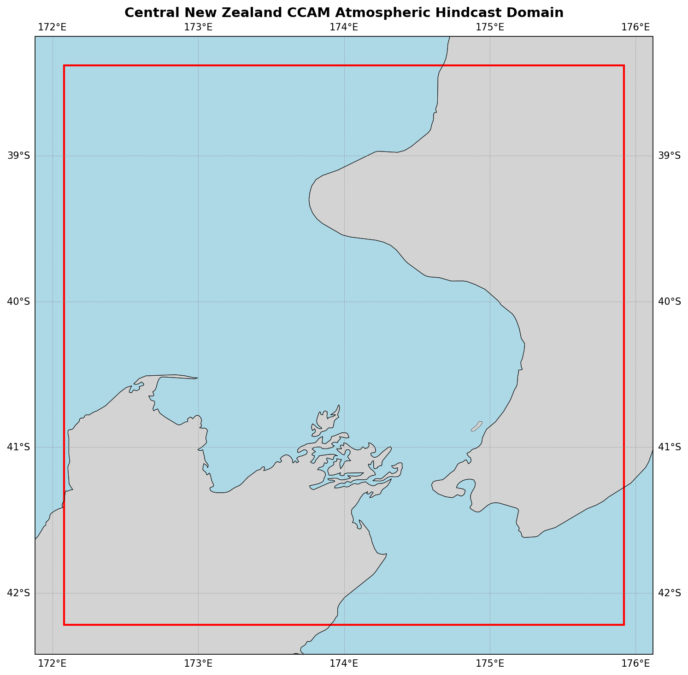

  

# Oceanum Central New Zealand CCAM Atmospheric Hindcast

**February 2025**

| | |
|---|---|
| **Model** | CCAM |
| **Period** | Jan 1999 - Jan 2020 |
| **Spatial resolution** | 0.04 degree (~4 km) |
| **Temporal resolution** | 1 hourly |
| **Region** | 172.08E - 175.92E, 42.22S - 38.38S |
| **Forcing** | ERA5 reanalysis |

---

## Dataset description

The Central New Zealand CCAM atmospheric hindcast provides high-resolution meteorological data over the central North Island and Cook Strait region of New Zealand (Figure 1). The domain encompasses the lower North Island including Wellington, the Wairarapa, Taranaki, and Manawatu-Whanganui regions, as well as the northern South Island including Marlborough and Nelson. This strategically important area includes Cook Strait, one of the most meteorologically complex regions in New Zealand due to the funnelling of winds between the two main islands.

The dataset is produced using the <a href="https://www.ccrc.unsw.edu.au/ccam" target="_blank">Conformal Cubic Atmospheric Model (CCAM)</a>, a variable-resolution global atmospheric model developed by CSIRO. CCAM employs dynamical downscaling to simulate climate and weather at fine spatial resolutions while maintaining interaction with global circulation patterns. The model is forced by <a href="https://www.ecmwf.int/en/forecasts/dataset/ecmwf-reanalysis-v5" target="_blank">ERA5 reanalysis</a> from the European Centre for Medium-Range Weather Forecasts, providing consistent and accurate large-scale atmospheric forcing.

The 4 km resolution enables accurate representation of New Zealand's complex topography and its influence on local atmospheric processes. Key features captured include orographic effects from the Tararua and Rimutaka ranges, sea breeze circulations, terrain-induced flow modifications, and the acceleration of winds through Cook Strait. The model provides multi-level atmospheric variables at six height levels (10m, 20m, 40m, 100m, 150m, 200m), enabling detailed vertical profiling of the atmospheric boundary layer.

The dataset provides hourly estimates for a comprehensive suite of atmospheric variables (Table 2) including wind components at multiple heights, temperature, humidity, pressure fields, cloud properties, and precipitation. Derived variables for wind speed are also available. This dataset is suitable for applications including wind resource assessment, renewable energy planning, air quality modelling, and as atmospheric forcing for regional ocean and wave models.

**Figure 1.** Central New Zealand CCAM atmospheric hindcast domain extent. The model covers the lower North Island, Cook Strait, and northern South Island at 4km resolution.

---

## Data description

**Table 1.** Data description.

| Field | Value |
|---|---|
| **Title** | Oceanum Central New Zealand CCAM atmospheric hindcast |
| **Institution** | <a href="https://oceanum.io" target="_blank">Oceanum</a> |
| **Access** | <a href="https://ui.datamesh.oceanum.io/" target="_blank">Oceanum Datamesh</a> |
| **Source** | <a href="https://www.ccrc.unsw.edu.au/ccam" target="_blank">CCAM (Conformal Cubic Atmospheric Model)</a> |
| **Temporal coverage** | 1999-01-01 to 2020-01-01 |
| **Temporal resolution** | 1 hourly |
| **Spatial coverage** | [172.08E, 42.22S, 175.92E, 38.38S] at 0.04 degree (~4 km) |
| **Vertical levels** | 10m, 20m, 40m, 100m, 150m, 200m |
| **Forcing** | <a href="https://www.ecmwf.int/en/forecasts/dataset/ecmwf-reanalysis-v5" target="_blank">ERA5 reanalysis</a> |

### Linked Datamesh datasources

- <a href="https://ui.datamesh.oceanum.io/datasource/oceanum_meteo_central_nz_ccam_v1" target="_blank">Oceanum Central NZ CCAM meteo hindcast</a>

---

## Output parameters

Atmospheric variables are stored hourly over the domain at the native model resolution. Table 2 describes the key output parameters.

**Table 2.** Output parameters.

| Variable | Long Name | Units |
|---|---|---|
| cbas_ave | average cloud base | sigma |
| cfrac | cloud fraction | - |
| clh | high cloud cover | % |
| cll | low cloud cover | % |
| clm | mid cloud cover | % |
| clt | total cloud cover | % |
| ctop_ave | average cloud top | sigma |
| hus | water vapour mixing ratio | kg/kg |
| huss | screen mixing ratio | kg/kg |
| orog | surface height | m |
| pr | precipitation | kg/m²/s |
| prc | convective precipitation | kg/m²/s |
| press | air pressure | hPa |
| prhmax | maximum hourly precip rate | kg/m²/s |
| prmax | maximum precipitation rate in a timestep | kg/m²/s |
| ps | surface pressure | Pa |
| psl | mean sea level pressure | Pa |
| rh | relative humidity | % |
| ta | air temperature | K |
| tauu | zonal wind stress | N/m² |
| tauv | meridional wind stress | N/m² |
| td | dew point temperature | K |
| theta | potential air temperature | K |
| ts | surface temperature | K |
| tsea | sea surface temperature | K |
| u10max | x-component max 10m wind | m/s |
| ua | zonal wind | m/s |
| uas | x-component 10m wind | m/s |
| va | meridional wind | m/s |
| vas | y-component 10m wind | m/s |
| zg | geopotential height | m |
| zmla | PBL depth | m |
| zolnd | surface roughness | m |

### Derived variables

| Variable | Long Name | Units |
|---|---|---|
| wspd | wind speed (from ua, va) | m/s |
| wspdsfc | surface wind speed (from uas, vas) | m/s |

---

www.oceanum.science
