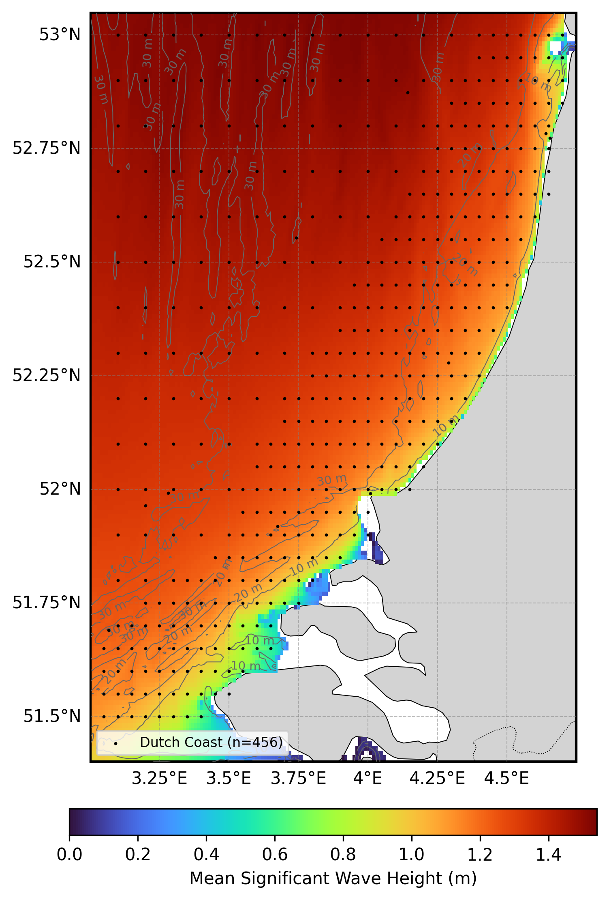

  

# Oceanum Dutch Coast ECMWF Wave Forecast

**February 2025**

| | |
|---|---|
| **Model** | SWAN 41.31 |
| **Forecast horizon** | 7 days |
| **Spatial resolution** | 0.01 degree (~1 km) |
| **Temporal resolution** | 1 hourly |
| **Region** | 3E - 4.75E, 51.4N - 53.05N |
| **Forcings** | ECMWF winds, tidal currents, and Oceanum spectra |
| **Update frequency** | 12-hourly |

---

## Dataset description

The Dutch Coast wave forecast dataset provides operational wave predictions across the Netherlands coastal waters, including the North Sea approaches, and the Dutch coastline (Figure 1). The domain covers the entire Dutch continental shelf from the Belgian border to the German Bight. Wave forecasts are produced using the SWAN (Simulating WAves Nearshore) third-generation spectral wave model, with a 7-day forecast horizon updated every 12 hours (00, 12 UTC).

Wind forcing is provided by <a href="https://www.ecmwf.int/en/forecasts/datasets/open-data" target="_blank">ECMWF IFS Open Data</a> global atmospheric model. Spectral boundary conditions are supplied by the <a href="https://ui.datamesh.oceanum.io/datasource/oceanum_wave_ec_weuro_grid" target="_blank">Oceanum Western Europe ECMWF wave forecast</a>. Tidal currents are prescribed from Oceanum's Western Europe tidal constituents, enabling accurate representation of wave-current interactions in the shallow North Sea and Waddenzee. Bathymetry is derived from the <a href="https://www.gebco.net/data_and_products/gridded_bathymetry_data/" target="_blank">GEBCO 2024</a> global bathymetric grid.

The modelling setup employs the <a href="https://journals.ametsoc.org/view/journals/atot/29/9/jtech-d-11-00092_1.xml" target="_blank">ST6</a> source term parameterisations. Spectra are discretised into 36 directional bins and 32 frequency bins, covering a frequency range from 0.037 to 0.71 Hz with 10% logarithmic increments. The model features a regular grid with a 1 km (0.01 degree) resolution, capturing detailed nearshore wave transformation processes.

The dataset provides hourly forecast estimates for key ocean wave parameters (Table 2) including spectral quantities integrated over the full spectrum and for spectral partitions. Partitions are defined from an 8-second split (sea/swell) and from the Watershed method, which identifies one wind-forced partition and up to three swell partitions. Forecasts are archived for 30 days, and frequency-direction wave spectra are available at 456 sites distributed across the domain. Nowcast datasets are also available, constructed by retaining the most recent data from each forecast cycle to provide a continuous near-real-time historical record.

**Figure 1.** Mean significant wave height from the Dutch Coast ERA5 hindcast domain (used for forecast validation).

---

## Validation

The wave model physics and calibration have been validated against satellite altimeter observations for the corresponding hindcast domain. Validation results are available through the <a href="https://hindcast-satellite-validation-main-prod.apps.oceanum.io/" target="_blank">Oceanum Hindcast Satellite Validation App</a>, which provides density scatter plots, quantile comparisons, and statistical metrics for the Western Europe region.

---

## Data description

**Table 1.** Data description.

| Field | Value |
|---|---|
| **Title** | Oceanum Dutch Coast wave forecast |
| **Institution** | <a href="https://oceanum.io" target="_blank">Oceanum</a> |
| **Access** | <a href="https://ui.datamesh.oceanum.io/" target="_blank">Oceanum Datamesh</a> |
| **Source** | <a href="https://swanmodel.sourceforge.io/" target="_blank">SWAN 41.31A</a> |
| **Source terms** | <a href="https://journals.ametsoc.org/view/journals/atot/29/9/jtech-d-11-00092_1.xml" target="_blank">ST6</a> |
| **Forecast horizon** | 7 days |
| **Update frequency** | 12-hourly (ECMWF) |
| **Archive period** | 30 days |
| **Temporal resolution** | 1 hourly |
| **Spatial coverage** | [3E, 51.4N, 4.75E, 53.05N] at 0.01 degree |
| **Spectra output sites** | 456 |
| **Frequency discretisation** | 32 frequencies between 0.037 - 0.71 Hz at 10% logarithmic increments |
| **Direction resolution** | 10 deg |
| **Bathymetry** | <a href="https://www.gebco.net/data_and_products/gridded_bathymetry_data/" target="_blank">GEBCO 2024 Grid</a> |
| **Winds** | <a href="https://www.ecmwf.int/en/forecasts/datasets/open-data" target="_blank">ECMWF IFS</a> |
| **Currents** | Oceanum Western Europe tidal constituents |
| **Boundary** | <a href="https://ui.datamesh.oceanum.io/datasource/oceanum_wave_ec_weuro_grid" target="_blank">Oceanum Western Europe ECMWF wave forecast</a> |

### Linked Datamesh datasources

**ECMWF-forced (12-hourly updates):**
- <a href="https://ui.datamesh.oceanum.io/datasource/oceanum_wave_ec_dutch_grid" target="_blank">Oceanum Dutch ECMWF wave forecast parameters</a>
- <a href="https://ui.datamesh.oceanum.io/datasource/oceanum_wave_ec_dutch_spec" target="_blank">Oceanum Dutch ECMWF wave forecast spectra</a>

**Nowcasts (continuous near-real-time archive):**
- <a href="https://ui.datamesh.oceanum.io/datasource/oceanum_wave_ec_dutch_grid_nowcast" target="_blank">Oceanum Dutch ECMWF wave nowcast parameters</a>
- <a href="https://ui.datamesh.oceanum.io/datasource/oceanum_wave_ec_dutch_spec_nowcast" target="_blank">Oceanum Dutch ECMWF wave nowcast spectra</a>

---

## Gridded output parameters

Integrated wave parameters are stored hourly over the domain at the native model resolution. Table 2 describes the gridded output parameters.

**Table 2.** Gridded output parameters.

*All parameters are defined on the `time`, `latitude` and `longitude` coordinates.*

| Variable | Long Name | Units |
|---|---|---|
| depth | depth below sea surface | m |
| dpm | mean direction at the spectral peak of wind and swell waves | degree |
| dpmsea | mean direction at the spectral peak of wind waves below 8 seconds period | degree |
| dpmswe | mean direction at the spectral peak of swell waves above 8 seconds period | degree |
| dspr | directional spreading of wind and swell waves | degree |
| fspr | normalised width of the frequency spectrum of wind and swell waves | - |
| hs | significant height of wind and swell waves | m |
| hsea | significant height of wind waves under 8 seconds period | m |
| hswe | significant height of swell waves above 8 seconds period | m |
| pdir0 | mean direction of wind waves (partition 0) | degree |
| pdir1 | mean direction of primary swell waves (partition 1) | degree |
| pdir2 | mean direction of secondary swell waves (partition 2) | degree |
| pdir3 | mean direction of tertiary swell waves (partition 3) | degree |
| pdspr0 | directional spreading of wind waves (partition 0) | degree |
| pdspr1 | directional spreading of primary swell waves (partition 1) | degree |
| pdspr2 | directional spreading of secondary swell waves (partition 2) | degree |
| pdspr3 | directional spreading of tertiary swell waves (partition 3) | degree |
| phs0 | significant height of wind waves (partition 0) | m |
| phs1 | significant height of primary swell waves (partition 1) | m |
| phs2 | significant height of secondary swell waves (partition 2) | m |
| phs3 | significant height of tertiary swell waves (partition 3) | m |
| ptp0 | peak period of wind waves (partition 0) | s |
| ptp1 | peak period of primary swell waves (partition 1) | s |
| ptp2 | peak period of secondary swell waves (partition 2) | s |
| ptp3 | peak period of tertiary swell waves (partition 3) | s |
| pwlen0 | mean wavelength of wind waves (partition 0) | m |
| pwlen1 | mean wavelength of primary swell waves (partition 1) | m |
| pwlen2 | mean wavelength of secondary swell waves (partition 2) | m |
| pwlen3 | mean wavelength of tertiary swell waves (partition 3) | m |
| tm01 | mean absolute wave period of wind and swell waves from the first frequency moment | s |
| tm02 | mean absolute wave period of wind and swell waves from the second frequency moment | s |
| tps | smooth relative peak wave period of wind and swell waves | s |
| tpssea | smooth relative peak wave period of wind waves below 8 seconds period | s |
| tpsswe | smooth relative peak wave period of swell waves above 8 seconds period | s |
| xwnd | eastward component of wind velocity | m/s |
| ywnd | northward component of wind velocity | m/s |

---

## Spectra output

Frequency-direction wave spectra are stored hourly at the spectra output sites within the domain. Table 3 describes the spectra output variables, using the exact variable names served by Datamesh.

**Table 3.** Spectra output variables.

*Spectra are defined on the `time`, `site`, `freq` and `dir` coordinates; `lon` and `lat` are per-site data variables giving each site's location.*

| Variable | Long Name | Units |
|---|---|---|
| efth | sea surface wave variance spectral density | m² s / deg |
| dpt | water depth | m |
| wspd | wind speed | m/s |
| wdir | wind direction | degree |
| lat | latitude | degrees_north |
| lon | longitude | degrees_east |

---

www.oceanum.science
