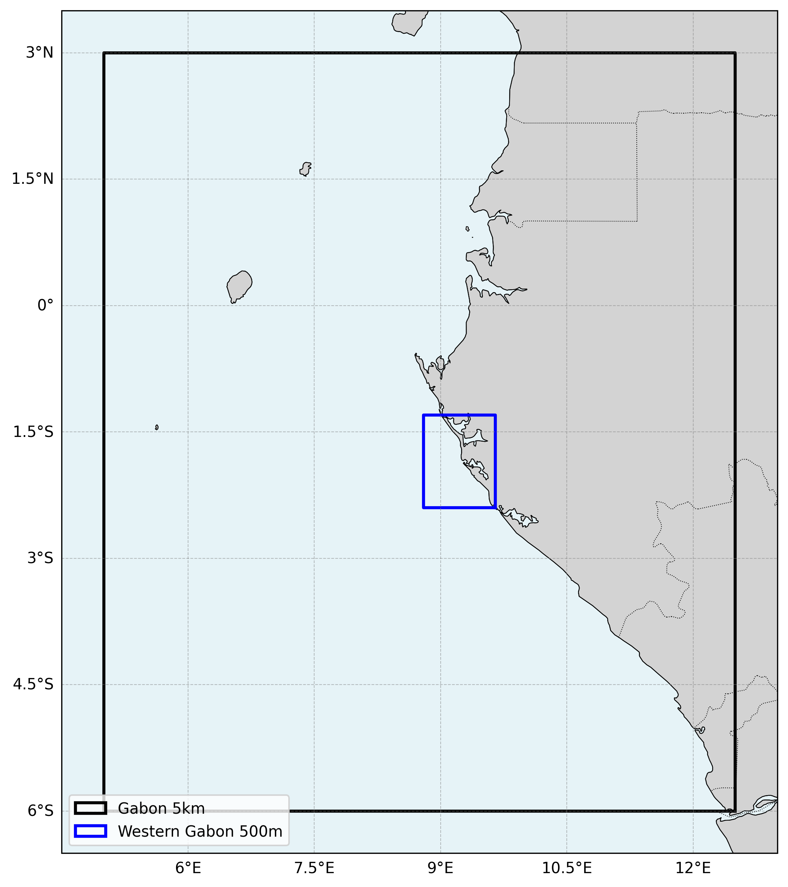

# Oceanum Gabon Wave Forecast Specification

**February 2025**

| | |
|---|---|
| **Model** | SWAN 41.31 |
| **Forecast horizon** | 7 days |
| **Spatial resolution** | 0.05 degree (~5 km) parent, 0.005 degree (~500 m) nested |
| **Temporal resolution** | 1 hourly |
| **Region** | 5E - 12.5E, 6S - 3N |
| **Forcings** | ECMWF winds, Mercator currents, and Oceanum spectra |
| **Update frequency** | 12-hourly |

---

## Dataset description

The Gabon wave forecast dataset provides operational wave predictions across the Gabon coastal waters and adjacent Atlantic Ocean (Figure 1). The domain encompasses the entire Gabon coastline and extends offshore to capture Atlantic Ocean swell propagation. Wave forecasts are produced using the SWAN (Simulating WAves Nearshore) third-generation spectral wave model, with a 7-day forecast horizon updated every 12 hours (00, 12 UTC).

Wind forcing is provided by <a href="https://www.ecmwf.int/en/forecasts/datasets/open-data" target="_blank">ECMWF IFS Open Data</a> global atmospheric model. Ocean currents are prescribed from Mercator global ocean analysis to capture wave-current interactions. Spectral boundary conditions are supplied by the <a href="https://ui.datamesh.oceanum.io/datasource/oceanum_wave_glob05_ec_grid" target="_blank">Oceanum Global WW3 ECMWF wave forecast</a>. Bathymetry is derived from the <a href="https://www.gebco.net/data_and_products/gridded_bathymetry_data/" target="_blank">GEBCO 2025</a> global bathymetric grid.

The modelling setup employs the <a href="https://journals.ametsoc.org/view/journals/atot/29/9/jtech-d-11-00092_1.xml" target="_blank">ST6</a> source term parameterisations. Spectra are discretised into 36 directional bins and 32 frequency bins, covering a frequency range from 0.037 to 0.71 Hz with 10% logarithmic increments. The parent domain features a regular grid with a 5 km (0.05 degree) resolution, with a nested 500 m (0.005 degree) domain covering the Western Gabon coastal region for detailed nearshore wave predictions.

The dataset provides hourly forecast estimates for key ocean wave parameters (Table 2) including spectral quantities integrated over the full spectrum and for spectral partitions. Partitions are defined from an 8-second split (sea/swell) and from the Watershed method, which identifies one wind-forced partition and up to two swell partitions. Forecasts are archived for 30 days, and frequency-direction wave spectra are available at selected sites in the nested Western Gabon domain.

**Figure 1.** Gabon wave forecast domain extent showing the parent 5 km domain and nested Western Gabon 500 m domain.

---

## Validation

The wave model physics and calibration follow the same approach validated against satellite altimeter observations for Oceanum's West Africa hindcast domain. The ST6 source term parameterisation has been extensively validated for tropical Atlantic conditions.

---

## Data description

**Table 1.** Data description.

| Field | Value |
|---|---|
| **Title** | Oceanum Gabon wave forecast |
| **Institution** | <a href="https://oceanum.io" target="_blank">Oceanum</a> |
| **Access** | <a href="https://ui.datamesh.oceanum.io/" target="_blank">Oceanum Datamesh</a> |
| **Source** | <a href="https://swanmodel.sourceforge.io/" target="_blank">SWAN 41.31A</a> |
| **Source terms** | <a href="https://journals.ametsoc.org/view/journals/atot/29/9/jtech-d-11-00092_1.xml" target="_blank">ST6</a> |
| **Forecast horizon** | 7 days |
| **Update frequency** | 12-hourly (ECMWF) |
| **Archive period** | 30 days |
| **Temporal resolution** | 1 hourly |
| **Spatial coverage (5km)** | [5E, 6S, 12.5E, 3N] at 0.05 degree |
| **Spatial coverage (500m)** | [8.8E, 2.4S, 9.65E, 1.3S] at 0.005 degree |
| **Frequency discretisation** | 32 frequencies between 0.037 - 0.71 Hz at 10% logarithmic increments |
| **Direction resolution** | 10 deg |
| **Bathymetry** | <a href="https://www.gebco.net/data_and_products/gridded_bathymetry_data/" target="_blank">GEBCO 2025 Grid</a> |
| **Winds** | <a href="https://www.ecmwf.int/en/forecasts/datasets/open-data" target="_blank">ECMWF IFS</a> |
| **Currents** | <a href="https://data.marine.copernicus.eu/" target="_blank">Mercator Global Ocean Analysis</a> |
| **Boundary** | <a href="https://ui.datamesh.oceanum.io/datasource/oceanum_wave_glob05_ec_grid" target="_blank">Oceanum Global WW3 ECMWF wave forecast</a> |

### Linked Datamesh datasources

#### Gabon 5 km (ECMWF, 12-hourly updates)

- <a href="https://ui.datamesh.oceanum.io/datasource/oceanum_wave_ec_gabon5km_grid" target="_blank">Oceanum Gabon 5 km ECMWF wave forecast parameters</a>

#### Western Gabon 500 m (ECMWF, 12-hourly updates)

- <a href="https://ui.datamesh.oceanum.io/datasource/oceanum_wave_ec_wgabon500m_grid" target="_blank">Oceanum Western Gabon 500 m ECMWF wave forecast parameters</a>
- <a href="https://ui.datamesh.oceanum.io/datasource/oceanum_wave_ec_wgabon500m_spec" target="_blank">Oceanum Western Gabon 500 m ECMWF wave forecast spectra</a>

---

## Integrated parameters gridded output

Integrated wave parameters are stored hourly over the domain at the native model resolution. Table 2 describes long names and units of the 21 gridded output parameters, including one wind-forced partition and two swell partitions from the Watershed method.

**Table 2.** Gridded output parameters.

| Variable | Long Name | Units |
|---|---|---|
| depth | depth below sea surface | m |
| dpm | mean direction at the spectral peak of wind and swell waves | degree |
| dpmsea | mean direction at the spectral peak of wind waves below 8 seconds period | degree |
| dpmswe | mean direction at the spectral peak of swell waves above 8 seconds period | degree |
| dspr | directional spreading of wind and swell waves | degree |
| fspr | normalised width of the frequency spectrum of wind and swell waves | - |
| hs | significant height of wind and swell waves | m |
| hsea | significant height of wind waves under 8 seconds period | m |
| hswe | significant height of swell waves above 8 seconds period | m |
| pdir0 | mean direction of wind waves (partition 0) | degree |
| pdir1 | mean direction of primary swell waves (partition 1) | degree |
| pdir2 | mean direction of secondary swell waves (partition 2) | degree |
| pdspr0 | directional spreading of wind waves (partition 0) | degree |
| pdspr1 | directional spreading of primary swell waves (partition 1) | degree |
| pdspr2 | directional spreading of secondary swell waves (partition 2) | degree |
| phs0 | significant height of wind waves (partition 0) | m |
| phs1 | significant height of primary swell waves (partition 1) | m |
| phs2 | significant height of secondary swell waves (partition 2) | m |
| ptp0 | peak period of wind waves (partition 0) | s |
| ptp1 | peak period of primary swell waves (partition 1) | s |
| ptp2 | peak period of secondary swell waves (partition 2) | s |
| pwlen0 | mean wavelength of wind waves (partition 0) | m |
| pwlen1 | mean wavelength of primary swell waves (partition 1) | m |
| pwlen2 | mean wavelength of secondary swell waves (partition 2) | m |
| tm01 | mean wave period based on first moment | s |
| tm02 | mean wave period based on second moment | s |
| tps | peak period of wind and swell waves | s |
| tpssea | peak period of wind waves below 8 seconds period | s |
| tpsswe | peak period of swell waves above 8 seconds period | s |
| uwnd | eastward wind component at 10m | m/s |
| vwnd | northward wind component at 10m | m/s |

---

www.oceanum.science
