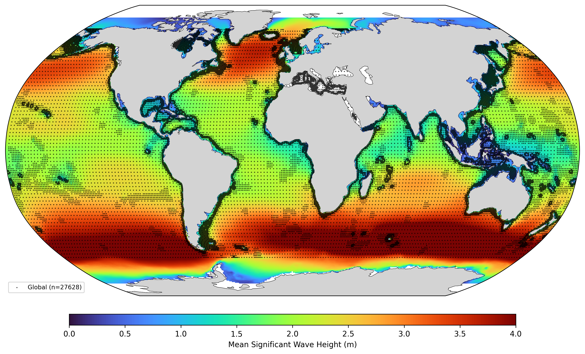

  

# Oceanum Global ERA5 Wave Hindcast

**February 2025**

| | |
|---|---|
| **Model** | WAVEWATCH III 6.07 |
| **Temporal coverage** | 1979 - present |
| **Spatial resolution** | 0.5 degree (~50 km) |
| **Temporal resolution** | 3 hourly |
| **Region** | Global (0E - 359.5E, 77.5S - 77.5N) |
| **Forcings** | ERA5 winds and sea ice concentration |

---

## Dataset description

The Oceanum global wave hindcast provides a continuous multi-decadal record of wave conditions across all ocean basins (Figure 1). Wave fields are produced using the WAVEWATCH III (WW3) third-generation spectral wave model at 0.5-degree resolution, spanning from 1979 to present at 3-hourly temporal resolution.

Wind forcing and sea ice concentration are provided by <a href="https://www.ecmwf.int/en/forecasts/dataset/ecmwf-reanalysis-v5" target="_blank">ERA5</a> reanalysis from the European Centre for Medium-Range Weather Forecasts. The model includes sea ice effects through coupling with ice concentration data, with wave attenuation applied in ice-covered regions. Bathymetry is derived from <a href="https://www.gebco.net/data_and_products/gridded_bathymetry_data/" target="_blank">GEBCO 2020</a>.

The modelling setup employs the ST4 source term parameterisations with calibrated parameters for global wave climate representation. Spectra are discretised into 24 directional bins and 32 frequency bins, covering a frequency range from 0.037 to 0.71 Hz with 10% logarithmic increments.

The dataset provides 3-hourly estimates for key ocean wave parameters (Table 2) including spectral quantities integrated over the full spectrum and for spectral partitions. Partitions are defined from an 8-second split (sea/swell) and from the Watershed method, which identifies one wind-sea partition and up to four swell partitions. Frequency-direction wave spectra are available at 26,962 strategically selected sites worldwide (black dots in Figure 1).

The global hindcast is well suited for deep water wave climate analysis anywhere on the planet. A key application is providing directional spectral boundary conditions for downscaling regional and coastal wave models. The spectra output network is designed with variable density, ranging from 2 degrees in deep water to 0.5 degrees near coastlines, ensuring appropriate resolution for boundary forcing across diverse modelling applications. The spectral data is optimised for very fast access (seconds to a few minutes), enabling efficient operational and research workflows.

**Figure 1.** Mean significant wave height (Hs) over the global domain from the Oceanum ERA5 wave hindcast (1979-2020). Black dots indicate spectra output locations.

---

## Validation

The global wave hindcast has been validated against satellite altimeter observations from multiple missions including Jason-2, Jason-3, Sentinel-3A, and Sentinel-3B. Validation statistics demonstrate excellent agreement with observed wave heights across all ocean basins. The model captures seasonal and interannual variability in global wave climate, including extreme events and long-term trends. Detailed validation results are available in the <a href="https://datasets.oceanum.io/oceanum_global_wave_hindcast_specification.pdf" target="_blank">full specification document</a>.

Interactive validation results are available through the <a href="https://validation.oceanum.io" target="_blank">Oceanum Validation App</a>.

---

## Data description

**Table 1.** Data description.

| Field | Value |
|---|---|
| **Title** | Oceanum global ERA5 wave hindcast |
| **Institution** | <a href="https://oceanum.io" target="_blank">Oceanum</a> |
| **Access** | <a href="https://ui.datamesh.oceanum.io/" target="_blank">Oceanum Datamesh</a> |
| **Source** | <a href="https://github.com/NOAA-EMC/WW3" target="_blank">WAVEWATCH III 6.07</a> |
| **Source terms** | ST4 |
| **Temporal coverage** | 1979 - present |
| **Temporal resolution** | 3 hourly |
| **Spatial coverage** | Global (0E - 359.5E, 77.5S - 77.5N) at 0.5 degree |
| **Frequency discretisation** | 32 frequencies between 0.037 - 0.71 Hz at 10% logarithmic increments |
| **Direction resolution** | 15 deg |
| **Bathymetry** | <a href="https://www.gebco.net/data_and_products/gridded_bathymetry_data/" target="_blank">GEBCO 2020</a> |
| **Winds** | <a href="https://www.ecmwf.int/en/forecasts/dataset/ecmwf-reanalysis-v5" target="_blank">ERA5</a> |
| **Sea ice** | <a href="https://www.ecmwf.int/en/forecasts/dataset/ecmwf-reanalysis-v5" target="_blank">ERA5</a> |

### Linked Datamesh datasources

- <a href="https://ui.datamesh.oceanum.io/datasource/oceanum_wave_glob05_era5_v1_grid" target="_blank">Oceanum global ERA5 wave hindcast parameters</a>
- <a href="https://ui.datamesh.oceanum.io/datasource/oceanum_wave_glob05_era5_v1_spec" target="_blank">Oceanum global ERA5 wave hindcast spectra</a>
- <a href="https://ui.datamesh.oceanum.io/datasource/oceanum_wave_glob05_era5_v1_gridstats" target="_blank">Oceanum global ERA5 wave hindcast statistics</a>

---

## Integrated parameters gridded output

Integrated wave parameters are stored 3-hourly over the domain at the native model resolution. Table 2 describes long names and units of key gridded output parameters.

**Table 2.** Gridded output parameters.

| Variable | Long Name | Units |
|---|---|---|
| dpt | depth below sea surface | m |
| hs | significant height of wind and swell waves | m |
| lm | mean wave length | m |
| t02 | mean wave period (Tm0,2) | s |
| t0m1 | mean wave period (Tm0,-1) | s |
| t01 | mean wave period (Tm0,1) | s |
| fp | peak frequency | Hz |
| dir | mean wave direction | degree |
| spr | mean directional spread | degree |
| dp | peak wave direction | degree |
| phs0 | significant height of wind waves (partition 0) | m |
| phs1 | significant height of primary swell waves (partition 1) | m |
| phs2 | significant height of secondary swell waves (partition 2) | m |
| phs3 | significant height of tertiary swell waves (partition 3) | m |
| phs4 | significant height of quaternary swell waves (partition 4) | m |
| ptp0 | peak period of wind waves (partition 0) | s |
| ptp1 | peak period of primary swell waves (partition 1) | s |
| ptp2 | peak period of secondary swell waves (partition 2) | s |
| ptp3 | peak period of tertiary swell waves (partition 3) | s |
| ptp4 | peak period of quaternary swell waves (partition 4) | s |
| plp0 | peak wave length of wind waves (partition 0) | m |
| plp1 | peak wave length of primary swell waves (partition 1) | m |
| plp2 | peak wave length of secondary swell waves (partition 2) | m |
| plp3 | peak wave length of tertiary swell waves (partition 3) | m |
| plp4 | peak wave length of quaternary swell waves (partition 4) | m |
| pdir0 | mean direction of wind waves (partition 0) | degree |
| pdir1 | mean direction of primary swell waves (partition 1) | degree |
| pdir2 | mean direction of secondary swell waves (partition 2) | degree |
| pdir3 | mean direction of tertiary swell waves (partition 3) | degree |
| pdir4 | mean direction of quaternary swell waves (partition 4) | degree |
| pspr0 | directional spreading of wind waves (partition 0) | degree |
| pspr1 | directional spreading of primary swell waves (partition 1) | degree |
| pspr2 | directional spreading of secondary swell waves (partition 2) | degree |
| pspr3 | directional spreading of tertiary swell waves (partition 3) | degree |
| pspr4 | directional spreading of quaternary swell waves (partition 4) | degree |
| pdp0 | peak direction of wind waves (partition 0) | degree |
| pdp1 | peak direction of primary swell waves (partition 1) | degree |
| pdp2 | peak direction of secondary swell waves (partition 2) | degree |
| pdp3 | peak direction of tertiary swell waves (partition 3) | degree |
| pdp4 | peak direction of quaternary swell waves (partition 4) | degree |
| uss | surface Stokes drift | m/s |
| uwnd | eastward wind component at 10m | m/s |
| vwnd | northward wind component at 10m | m/s |
| ice | sea ice concentration | - |

---

www.oceanum.science
