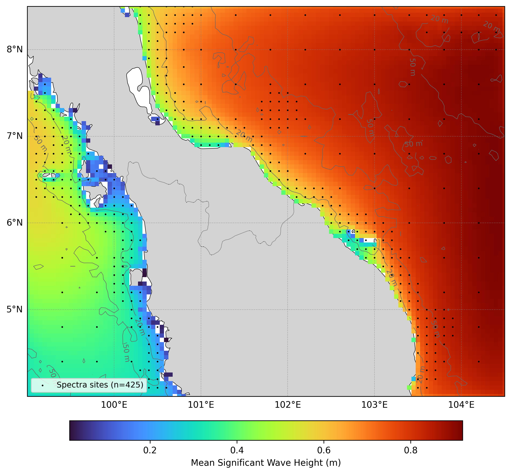

  

# Oceanum Malay Peninsula ERA5 Wave Hindcast

**February 2025**

| | |
|---|---|
| **Model** | SWAN 41.31 |
| **Period** | Feb 1979 - Updating |
| **Spatial resolution** | 0.05 degree |
| **Temporal resolution** | 1 hourly |
| **Region** | 99E - 104.5E, 4N - 8.5N |
| **Forcings** | ERA5 winds and Oceanum spectra |

---

## Dataset description

The Malay Peninsula wave hindcast dataset provides a detailed account of ocean wave parameters across the waters surrounding the Malay Peninsula, including the Strait of Malacca, South China Sea, and Andaman Sea regions (Figure 1). Wave spectra are computed over a 45+ year period between 1979 and present using the SWAN (Simulating WAves Nearshore) third-generation spectral wave model. The model is driven by inputs from the Oceanum Global Wave Model for spectral boundaries and <a href="https://www.ecmwf.int/en/forecasts/dataset/ecmwf-reanalysis-v5" target="_blank">ERA5 reanalysis winds</a> from the European Centre for Medium-Range Weather Forecasts. Bathymetry is derived from the <a href="https://www.gebco.net/data_and_products/gridded_bathymetry_data/" target="_blank">GEBCO 2025</a> grid.

The modelling setup employs the <a href="https://journals.ametsoc.org/view/journals/atot/29/9/jtech-d-11-00092_1.xml" target="_blank">ST6</a> source term parameterisations. Spectra are discretised into 36 directional bins and 43 frequency bins, covering a frequency range from 0.037 to 2.03 Hz with 10% logarithmic increments. The model features a regular grid with 5 km (0.05 degree) resolution, capturing complex wave dynamics in this strategically important maritime region, including the interaction between monsoon-driven wind waves, Indian Ocean swell, and South China Sea wave systems.

The dataset provides hourly estimates for an extensive array of ocean wave parameters (Table 2) including spectral quantities integrated over the full spectrum and for spectral partitions (defined from an 8-second split and from the Watershed method). These data are stored over the entire grid at native resolution. Additionally, frequency-direction wave spectra are available at 425 sites, with resolution increasing from deep ocean areas towards the coast (see Figure 1).

**Figure 1.** Mean significant wave height from the Malay Peninsula hindcast domain. The locations of 2D spectra hourly output are shown by the black dots. Depth contours are shown at 20m, 50m, 100m, and 200m.

---

## Validation

The wave hindcast can be validated against satellite altimeter observations using the <a href="https://hindcast-satellite-validation-main-prod.apps.oceanum.io/" target="_blank">Oceanum Hindcast Satellite Validation App</a>. This interactive tool allows users to compare modelled significant wave height against satellite altimeter measurements at any location within the model domain, providing density scatter plots, quantile comparisons, and statistical metrics.

---

## Data description

**Table 1.** Data description.

| Field | Value |
|---|---|
| **Title** | Oceanum Malay Peninsula wave hindcast |
| **Institution** | <a href="https://oceanum.io" target="_blank">Oceanum</a> |
| **Access** | <a href="https://ui.datamesh.oceanum.io/" target="_blank">Oceanum Datamesh</a> |
| **Source** | <a href="https://swanmodel.sourceforge.io/" target="_blank">SWAN 41.31A</a> |
| **Source terms** | <a href="https://journals.ametsoc.org/view/journals/atot/29/9/jtech-d-11-00092_1.xml" target="_blank">ST6</a> |
| **Temporal coverage** | 1979-02-01 to present (updating) |
| **Temporal resolution** | Hourly |
| **Spatial coverage** | [99E, 4N, 104.5E, 8.5N] at 0.05 degree |
| **Spectra output sites** | 425 |
| **Frequency discretisation** | 43 frequencies between 0.037 - 2.03 Hz at 10% logarithmic increments |
| **Direction resolution** | 10 deg |
| **Bathymetry** | <a href="https://www.gebco.net/data_and_products/gridded_bathymetry_data/" target="_blank">GEBCO 2025 Grid</a> |
| **Winds** | <a href="https://www.ecmwf.int/en/forecasts/dataset/ecmwf-reanalysis-v5" target="_blank">ERA5 Reanalysis</a> |
| **Boundary** | <a href="https://ui.datamesh.oceanum.io/datasource/oceanum_wave_glob05_era5_v1_spec" target="_blank">Oceanum Global WW3 ERA5 hourly wave spectra</a> |

### Linked Datamesh datasources

- <a href="https://ui.datamesh.oceanum.io/datasource/oceanum_wave_malay_5km_era5_grid" target="_blank">Oceanum Malay Peninsula 5 km hourly wave parameters</a>
- <a href="https://ui.datamesh.oceanum.io/datasource/oceanum_wave_malay_5km_era5_spec" target="_blank">Oceanum Malay Peninsula 5 km hourly wave spectra</a>
- <a href="https://ui.datamesh.oceanum.io/datasource/oceanum_wave_malay_5km_era5_gridstats" target="_blank">Oceanum Malay Peninsula 5 km gridded wave statistics</a>

---

## Integrated parameters gridded output

Integrated wave parameters are stored hourly over the domain at the native model resolution. Table 2 describes long names and units of all 27 gridded output parameters.

**Table 2.** Gridded output parameters.

| Variable | Long Name | Units |
|---|---|---|
| depth | depth below sea surface | m |
| dpm | mean direction at the spectral peak of wind and swell waves | degree |
| dpmsea | mean direction at the spectral peak of wind waves below 8 seconds period | degree |
| dpmswe | mean direction at the spectral peak of swell waves above 8 seconds period | degree |
| dspr | directional spreading of wind and swell waves | degree |
| fspr | normalised width of the frequency spectrum of wind and swell waves | - |
| hs | significant height of wind and swell waves | m |
| hsea | significant height of wind waves under 8 seconds period | m |
| hswe | significant height of swell waves above 8 seconds period | m |
| pdir0 | directional spreading of wind waves | degree |
| pdir1 | directional spreading of primary swell waves | degree |
| pdspr0 | directional spreading of wind waves | degree |
| pdspr1 | directional spreading of primary swell waves | degree |
| phs0 | sea surface wind wave significant height | m |
| phs1 | sea surface primary swell wave significant height | m |
| ptp0 | sea surface wind wave period at variance spectral density maximum | s |
| ptp1 | sea surface primary swell wave period at variance spectral density maximum | s |
| pwlen0 | mean wavelength of wind waves | m |
| pwlen1 | mean wavelength of primary swell waves | m |
| tm01 | mean absolute wave period of wind and swell waves from the first frequency moment | s |
| tm02 | mean absolute wave period of wind and swell waves from the second frequency moment | s |
| tps | smooth relative peak wave period of wind and swell waves | s |
| tpssea | smooth relative peak wave period of wind waves below 8 seconds period | s |
| tpsswe | smooth relative peak wave period of swell waves above 8 seconds period | s |
| xwnd | eastward component of wind velocity | m/s |
| ywnd | northward component of wind velocity | m/s |

---

www.oceanum.science
