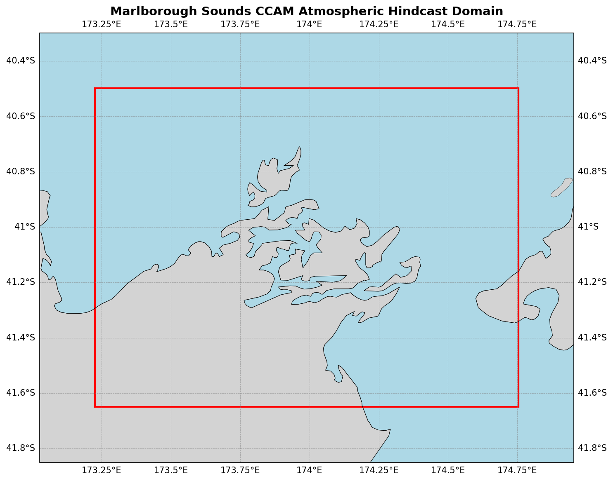

  

# Oceanum Marlborough Sounds CCAM Atmospheric Hindcast

**February 2025**

| | |
|---|---|
| **Model** | CCAM |
| **Period** | Jan 2017 - Jun 2024 |
| **Spatial resolution** | 0.01 degree (~1 km) |
| **Temporal resolution** | 1 hourly |
| **Region** | 173.23E - 174.75E, 41.65S - 40.50S |
| **Forcing** | ERA5 reanalysis |

---

## Dataset description

The Marlborough Sounds CCAM atmospheric hindcast provides very high-resolution meteorological data over the Marlborough Sounds region at the northern tip of New Zealand's South Island (Figure 1). The domain encompasses the intricate network of drowned river valleys that form the Sounds, including Queen Charlotte Sound, Pelorus Sound, and Kenepuru Sound, as well as the adjacent Cook Strait waters. This region features some of New Zealand's most complex coastal topography, with steep-sided valleys and narrow waterways that strongly influence local wind patterns.

The dataset is produced using the <a href="https://www.ccrc.unsw.edu.au/ccam" target="_blank">Conformal Cubic Atmospheric Model (CCAM)</a>, a variable-resolution global atmospheric model developed by CSIRO. CCAM employs dynamical downscaling to simulate climate and weather at fine spatial resolutions while maintaining interaction with global circulation patterns. The model is forced by <a href="https://www.ecmwf.int/en/forecasts/dataset/ecmwf-reanalysis-v5" target="_blank">ERA5 reanalysis</a> from the European Centre for Medium-Range Weather Forecasts, providing consistent and accurate large-scale atmospheric forcing.

The very high 1 km resolution enables detailed representation of the complex fjord-like topography of Marlborough Sounds and its influence on local wind patterns. Key features captured include wind channelling through the sounds, katabatic (downslope) winds draining from surrounding hills, sea breeze circulations, and the interaction with Cook Strait wind acceleration. The model provides atmospheric variables at three height levels (10m, 80m, and 150m), enabling vertical profiling of the atmospheric boundary layer.

The dataset provides hourly estimates for a comprehensive suite of atmospheric variables (Table 2) including wind components at multiple heights, temperature, humidity, pressure fields, cloud properties, precipitation, and solar radiation (DNI). This dataset is suitable for applications including wind resource assessment, marine operations planning, air quality modelling, and as atmospheric forcing for regional ocean models such as the Oceanum Marlborough Sounds SCHISM ocean hindcast.

**Figure 1.** Marlborough Sounds CCAM atmospheric hindcast domain extent. The model covers the Marlborough Sounds and adjacent Cook Strait waters at 1km resolution.

---

## Data description

**Table 1.** Data description.

| Field | Value |
|---|---|
| **Title** | Oceanum Marlborough Sounds CCAM atmospheric hindcast |
| **Institution** | <a href="https://oceanum.io" target="_blank">Oceanum</a> |
| **Access** | <a href="https://ui.datamesh.oceanum.io/" target="_blank">Oceanum Datamesh</a> |
| **Source** | <a href="https://www.ccrc.unsw.edu.au/ccam" target="_blank">CCAM (Conformal Cubic Atmospheric Model)</a> |
| **Temporal coverage** | 2017-01-01 to 2024-06-01 |
| **Temporal resolution** | 1 hourly |
| **Spatial coverage** | [173.23E, 41.65S, 174.75E, 40.50S] at 0.01 degree (~1 km) |
| **Vertical levels** | 10m, 80m, 150m |
| **Forcing** | <a href="https://www.ecmwf.int/en/forecasts/dataset/ecmwf-reanalysis-v5" target="_blank">ERA5 reanalysis</a> |

### Linked Datamesh datasources

- <a href="https://ui.datamesh.oceanum.io/datasource/oceanum_meteo_ms_ccam_v1" target="_blank">Oceanum Marlborough Sounds meteo hindcast</a>

---

## Output parameters

Atmospheric variables are stored hourly over the domain at the native model resolution. Table 2 describes the key output parameters.

**Table 2.** Output parameters.

*Variable names link to the corresponding <a href="https://vocab.nerc.ac.uk/standard_name/" target="_blank">NERC Vocabulary Server</a> standard name where available.*

| Variable | Long Name | Units |
|---|---|---|
| <a href="https://vocab.nerc.ac.uk/standard_name/cloud_area_fraction/" target="_blank">cfrac</a> | cloud fraction | - |
| <a href="https://vocab.nerc.ac.uk/standard_name/cloud_area_fraction_in_atmosphere_layer/" target="_blank">clh</a> | high cloud cover | % |
| <a href="https://vocab.nerc.ac.uk/standard_name/cloud_area_fraction_in_atmosphere_layer/" target="_blank">cll</a> | low cloud cover | % |
| <a href="https://vocab.nerc.ac.uk/standard_name/cloud_area_fraction_in_atmosphere_layer/" target="_blank">clm</a> | mid cloud cover | % |
| <a href="https://vocab.nerc.ac.uk/standard_name/cloud_area_fraction/" target="_blank">clt</a> | total cloud cover | % |
| <a href="https://vocab.nerc.ac.uk/standard_name/surface_direct_downwelling_shortwave_flux_in_air/" target="_blank">dni</a> | direct normal irradiance | W/m² |
| <a href="https://vocab.nerc.ac.uk/standard_name/specific_humidity/" target="_blank">hus</a> | water vapour mixing ratio | kg/kg |
| <a href="https://vocab.nerc.ac.uk/standard_name/humidity_mixing_ratio/" target="_blank">huss</a> | screen mixing ratio | kg/kg |
| <a href="https://vocab.nerc.ac.uk/standard_name/surface_altitude/" target="_blank">orog</a> | surface height | m |
| <a href="https://vocab.nerc.ac.uk/standard_name/precipitation_flux/" target="_blank">pr</a> | precipitation | kg/m²/s |
| <a href="https://vocab.nerc.ac.uk/standard_name/convective_precipitation_flux/" target="_blank">prc</a> | convective precipitation | kg/m²/s |
| <a href="https://vocab.nerc.ac.uk/standard_name/air_pressure/" target="_blank">press</a> | air pressure | hPa |
| <a href="https://vocab.nerc.ac.uk/standard_name/precipitation_flux/" target="_blank">prmax</a> | maximum precipitation rate in a timestep | kg/m²/s |
| <a href="https://vocab.nerc.ac.uk/standard_name/surface_air_pressure/" target="_blank">ps</a> | surface pressure | Pa |
| <a href="https://vocab.nerc.ac.uk/standard_name/air_pressure_at_mean_sea_level/" target="_blank">psl</a> | mean sea level pressure | Pa |
| <a href="https://vocab.nerc.ac.uk/standard_name/surface_downwelling_longwave_flux_in_air/" target="_blank">rlds</a> | LW downwelling at ground | W/m² |
| <a href="https://vocab.nerc.ac.uk/standard_name/surface_net_downward_radiative_flux/" target="_blank">rnet</a> | net radiation at surface | W/m² |
| <a href="https://vocab.nerc.ac.uk/standard_name/surface_downwelling_shortwave_flux_in_air/" target="_blank">rsds</a> | SW downwelling at ground | W/m² |
| <a href="https://vocab.nerc.ac.uk/standard_name/surface_net_downward_shortwave_flux/" target="_blank">sgn_ave</a> | SW net at ground | W/m² |
| <a href="https://vocab.nerc.ac.uk/standard_name/air_temperature/" target="_blank">ta</a> | air temperature | K |
| <a href="https://vocab.nerc.ac.uk/standard_name/dew_point_temperature/" target="_blank">td</a> | dew point temperature | K |
| <a href="https://vocab.nerc.ac.uk/standard_name/surface_temperature/" target="_blank">ts</a> | surface temperature | K |
| <a href="https://vocab.nerc.ac.uk/standard_name/sea_surface_temperature/" target="_blank">tsea</a> | sea surface temperature | K |
| <a href="https://vocab.nerc.ac.uk/standard_name/wind_speed_of_gust/" target="_blank">u10max</a> | x-component max 10m wind | m/s |
| <a href="https://vocab.nerc.ac.uk/standard_name/eastward_wind/" target="_blank">ua</a> | zonal wind | m/s |
| <a href="https://vocab.nerc.ac.uk/standard_name/eastward_wind/" target="_blank">uas</a> | x-component 10m wind | m/s |
| <a href="https://vocab.nerc.ac.uk/standard_name/northward_wind/" target="_blank">va</a> | meridional wind | m/s |
| <a href="https://vocab.nerc.ac.uk/standard_name/northward_wind/" target="_blank">vas</a> | y-component 10m wind | m/s |
| <a href="https://vocab.nerc.ac.uk/standard_name/geopotential_height/" target="_blank">zg</a> | geopotential height | m |
| <a href="https://vocab.nerc.ac.uk/standard_name/atmosphere_boundary_layer_thickness/" target="_blank">zmla</a> | PBL depth | m |
| <a href="https://vocab.nerc.ac.uk/standard_name/surface_roughness_length/" target="_blank">zolnd</a> | surface roughness | m |

---

www.oceanum.science
