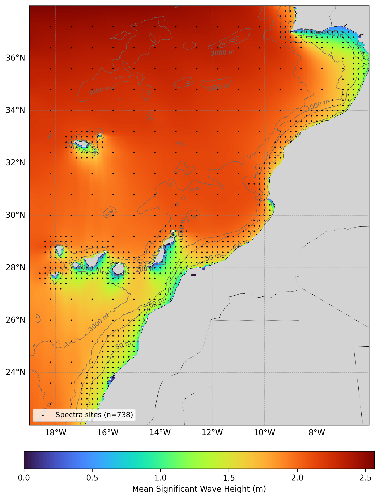

# Oceanum Morocco Wave Hindcast Specification

**February 2025**

| | |
|---|---|
| **Model** | SWAN 41.31 |
| **Period** | Jun 1994 - Updating |
| **Spatial resolution** | 0.05 degree |
| **Temporal resolution** | 1 hourly |
| **Region** | 19W - 6W, 22N - 38N |
| **Forcings** | Reprocessed ERA5 winds, Glorys currents, and Oceanum spectra |

---

## Dataset description

The Morocco wave hindcast dataset provides a detailed account of ocean wave parameters across the Northwest African Atlantic coast, covering the waters from Western Sahara to the Strait of Gibraltar (Figure 1). The domain extends offshore to include the Canary and Madeira archipelagos, capturing their shadowing effects on wave propagation. Wave spectra are computed over a 30-year period between 1994 and present using the SWAN (Simulating WAves Nearshore) third-generation spectral wave model. The model is driven by inputs from the Oceanum Global Wave Model for spectral boundaries and reprocessed ERA5 winds (WIND_GLO_PHY_L4_MY_012_006) from Copernicus Marine Service which incorporate scatterometer observations for improved accuracy, with ocean currents from the Glorys reanalysis. Bathymetry is derived from the [GEBCO 2025](https://www.gebco.net/data_and_products/gridded_bathymetry_data/) 400 m grid. The wave data can be validated against satellite altimeters using the [Oceanum Hindcast Validation App](https://hindcast-satellite-validation-main-prod.apps.oceanum.io/), ensuring a high level of accuracy and reliability in capturing real-world conditions.

The modelling setup employs the [ST6](https://journals.ametsoc.org/view/journals/atot/29/9/jtech-d-11-00092_1.xml) source term parameterisations. Spectra are discretised into 36 directional bins and 32 frequency bins, covering a frequency range from 0.037 to 0.7102 Hz with 10% logarithmic increments. The model features a regular grid with a 5 km (0.05 degree) resolution, spanning the entire Moroccan Atlantic coast and extending offshore to capture swell propagation from the North Atlantic.

The dataset provides hourly estimates for an extensive array of ocean wave parameters (Table 2) including spectral quantities integrated over the full spectrum and for spectral partitions (defined from an 8-second split and from the Watershed method). These data are stored over the entire grid at native resolution. Additionally, frequency-direction wave spectra are available at 738 sites, with resolution increasing from deep ocean areas towards the coast (see Figure 1).

**Figure 1.** Mean significant wave height from the Morocco hindcast domain. The locations of 2D spectra hourly output are shown by the black dots. Depth contours are shown at 50m, 200m, 1000m, and 3000m.

---

## Validation

The wave hindcast can be validated against satellite altimeter observations using the [Oceanum Hindcast Satellite Validation App](https://hindcast-satellite-validation-main-prod.apps.oceanum.io/). This interactive tool allows users to compare modelled significant wave height against satellite altimeter measurements at any location within the model domain, providing density scatter plots, quantile comparisons, and statistical metrics.

---

## Data description

**Table 1.** Data description.

| Field | Value |
|---|---|
| **Title** | Oceanum Morocco wave hindcast |
| **Institution** | [Oceanum](https://oceanum.io) |
| **Access** | [Oceanum Datamesh](https://ui.datamesh.oceanum.io/) |
| **Source** | [SWAN 41.31A](https://swanmodel.sourceforge.io/) |
| **Source terms** | [ST6](https://journals.ametsoc.org/view/journals/atot/29/9/jtech-d-11-00092_1.xml) |
| **Temporal coverage** | 1994-06-01 to present (updating) |
| **Temporal resolution** | Hourly |
| **Spatial coverage** | [19W, 22N, 6W, 38N] at 0.05 degree |
| **Spectra output sites** | 738 |
| **Frequency discretisation** | 32 frequencies between 0.037 - 0.7102 Hz at 10% logarithmic increments |
| **Direction resolution** | 10 deg |
| **Bathymetry** | [GEBCO 2025 Grid](https://www.gebco.net/data_and_products/gridded_bathymetry_data/) |
| **Winds** | [Reprocessed ERA5 (WIND_GLO_PHY_L4_MY_012_006)](https://data.marine.copernicus.eu/product/WIND_GLO_PHY_L4_MY_012_006/description) |
| **Currents** | [Glorys Reanalysis](https://data.marine.copernicus.eu/product/GLOBAL_MULTIYEAR_PHY_001_030/description) |
| **Boundary** | [Oceanum Global WW3 ERA5 hourly wave spectra](https://ui.datamesh.oceanum.io/datasource/oceanum_wave_glob05_era5_v1_spec) |

### Linked Datamesh datasources

- [Oceanum Morocco 5 km hourly wave parameters](https://ui.datamesh.oceanum.io/datasource/oceanum_wave_morocco_5km_era5_grid)
- [Oceanum Morocco 5 km hourly wave spectra](https://ui.datamesh.oceanum.io/datasource/oceanum_wave_morocco_5km_era5_spec)
- [Oceanum Morocco 5 km gridded wave statistics](https://ui.datamesh.oceanum.io/datasource/oceanum_wave_morocco_5km_era5_gridstats)

---

## Integrated parameters gridded output

Integrated wave parameters are stored hourly over the domain at the native model resolution. Table 2 describes long names and units of all gridded output parameters.

**Table 2.** Gridded output parameters.

| Variable | Long Name | Units |
|---|---|---|
| depth | depth below sea surface | m |
| dpm | mean direction at the spectral peak of wind and swell waves | degree |
| dpmsea | mean direction at the spectral peak of wind waves below 8 seconds period | degree |
| dpmswe | mean direction at the spectral peak of swell waves above 8 seconds period | degree |
| dspr | directional spreading of wind and swell waves | degree |
| fspr | normalised width of the frequency spectrum of wind and swell waves | - |
| hs | significant height of wind and swell waves | m |
| hsea | significant height of wind waves under 8 seconds period | m |
| hswe | significant height of swell waves above 8 seconds period | m |
| pdir0 | directional spreading of wind waves | degree |
| pdir1 | directional spreading of primary swell waves | degree |
| pdir2 | directional spreading of secondary swell waves | degree |
| pdir3 | directional spreading of tertiary swell waves | degree |
| pdspr0 | directional spreading of wind waves | degree |
| pdspr1 | directional spreading of primary swell waves | degree |
| pdspr2 | directional spreading of secondary swell waves | degree |
| pdspr3 | directional spreading of tertiary swell waves | degree |
| phs0 | sea surface wind wave significant height | m |
| phs1 | sea surface primary swell wave significant height | m |
| phs2 | sea surface secondary swell wave significant height | m |
| phs3 | sea surface tertiary swell wave significant height | m |
| ptp0 | sea surface wind wave period at variance spectral density maximum | s |
| ptp1 | sea surface primary swell wave period at variance spectral density maximum | s |
| ptp2 | sea surface secondary swell wave period at variance spectral density maximum | s |
| ptp3 | sea surface tertiary swell wave period at variance spectral density maximum | s |
| pwlen0 | mean wavelength of wind waves | m |
| pwlen1 | mean wavelength of primary swell waves | m |
| pwlen2 | mean wavelength of secondary swell waves | m |
| pwlen3 | mean wavelength of tertiary swell waves | m |
| tm01 | mean absolute wave period of wind and swell waves from the first frequency moment | s |
| tm02 | mean absolute wave period of wind and swell waves from the second frequency moment | s |
| tps | smooth relative peak wave period of wind and swell waves | s |
| tpssea | smooth relative peak wave period of wind waves below 8 seconds period | s |
| tpsswe | smooth relative peak wave period of swell waves above 8 seconds period | s |
| xwnd | eastward component of wind velocity | m/s |
| ywnd | northward component of wind velocity | m/s |

---

www.oceanum.science
