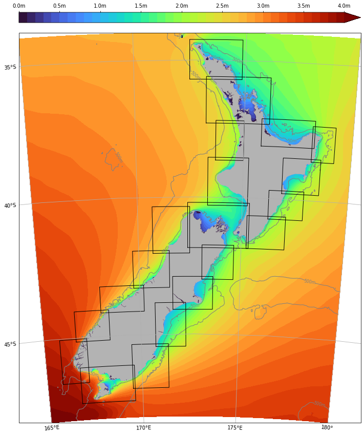
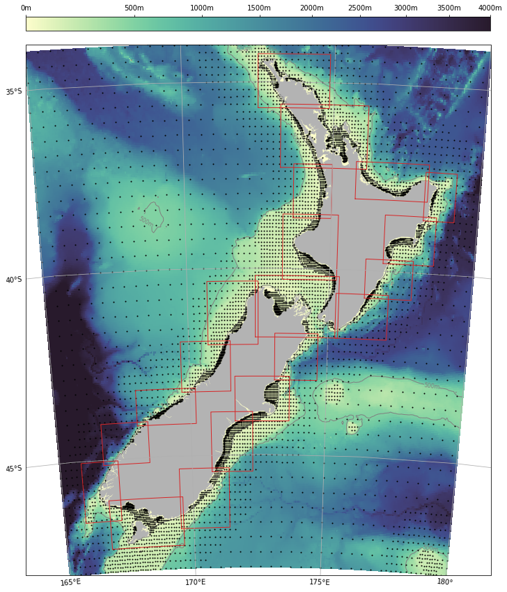
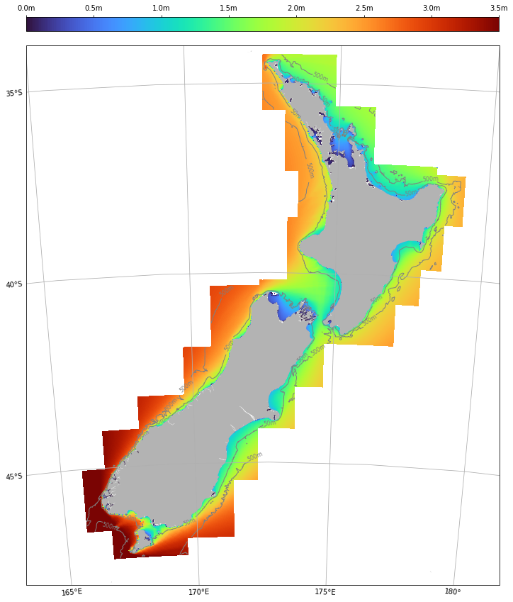
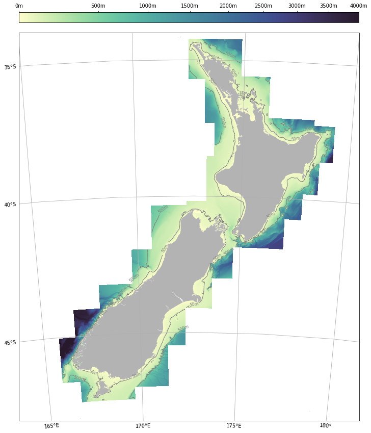
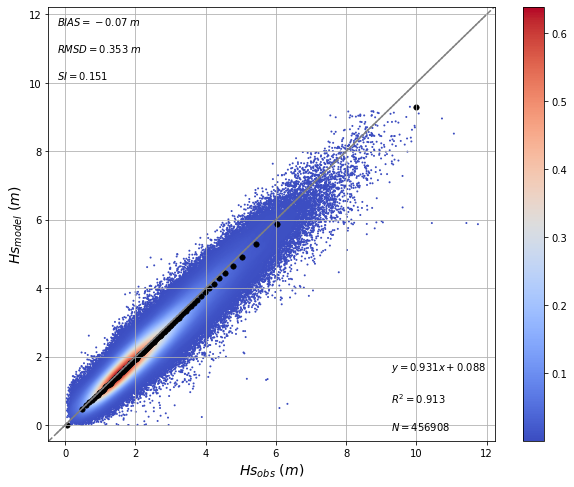
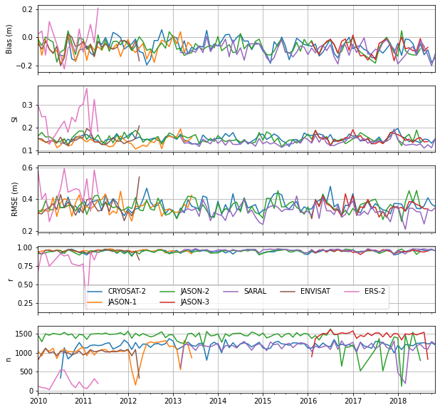

  

# Oceanum New Zealand 1km Multiscale ERA5 Wave Hindcast

**February 2025**

| | |
|---|---|
| **Model** | SWAN 41.31 |
| **Period** | Feb 1979 - Aug 2024 |
| **Spatial resolution** | 1 km (coastal) / 5 km (offshore) |
| **Temporal resolution** | 1 hourly |
| **Region** | 165E - 180E, 48S - 34S |
| **Forcings** | ERA5 winds, tidal currents, and Oceanum spectra |

---

## Dataset description

The New Zealand 1km multiscale wave hindcast provides high-resolution coastal wave data across the entire New Zealand coastline (Figure 1). The dataset employs a hierarchical modelling approach consisting of a parent 5 km resolution domain covering the New Zealand Exclusive Economic Zone, with 20 overlapping 1 km resolution nested domains targeting coastal regions around both the North and South Islands.

Wave spectra are computed over a 45+ year period between 1979 and present using the SWAN (Simulating WAves Nearshore) third-generation spectral wave model. The 1 km nested domains receive spectral boundary conditions from the parent 5 km domain, which in turn is forced by the <a href="https://ui.datamesh.oceanum.io/datasource/oceanum_wave_glob05_era5_v1_spec" target="_blank">Oceanum Global Wave Model</a>. Wind forcing is provided by <a href="https://www.ecmwf.int/en/forecasts/dataset/ecmwf-reanalysis-v5" target="_blank">ERA5 reanalysis</a> from the European Centre for Medium-Range Weather Forecasts. Tidal currents are prescribed from Oceanum's New Zealand 2 km tidal constituents, enabling accurate representation of wave-current interactions in shallow coastal waters. Bathymetry is derived from the <a href="https://www.gebco.net/data_and_products/gridded_bathymetry_data/" target="_blank">GEBCO 2024</a> global bathymetric grid.

The modelling setup employs the <a href="https://journals.ametsoc.org/view/journals/atot/29/9/jtech-d-11-00092_1.xml" target="_blank">ST6</a> source term parameterisations. Spectra are discretised into 36 directional bins and 31 frequency bins, covering a frequency range from 0.037 to 0.71 Hz with 10% logarithmic increments.

The gridded parameter data are aggregated into a multiscale archive which provides seamless data at 1 km resolution across the entire coastal area. When queried, the multiscale datasource fetches data from the 1 km nests where they are defined, and interpolates data from the 5 km parent domain elsewhere (Figure 1). A coastal-only variant is also available which returns data only from the 1 km domains without interpolation, providing more efficient access when offshore data is not required (Figure 2).

The dataset provides hourly estimates for key ocean wave parameters (Table 2) including spectral quantities integrated over the full spectrum and for spectral partitions. Partitions are defined from an 8-second split (sea/swell) and from the Watershed method, which identifies one wind-forced partition and up to three swell partitions. Frequency-direction wave spectra are available at sites distributed across the domain (Figure 1), with separate datasources for the 5 km parent domain and each of the 20 1 km nested domains.

This dataset is updated on demand.

<table>
<tr>
<td></td>
<td></td>
</tr>
</table>

**Figure 1.** Full multiscale domain. Left: Mean significant wave height with the 5 km parent domain providing offshore coverage and 20 overlapping 1 km nested domains (outlined in black) providing high-resolution coastal data. Right: Bathymetry and spectra output site locations with 1 km nested domain extents shown in red.

<table>
<tr>
<td></td>
<td></td>
</tr>
</table>

**Figure 2.** 1 km coastal domains only. Left: Mean significant wave height showing detailed nearshore wave transformation including sheltering, refraction, and shoaling effects. Right: Bathymetry at 1 km resolution across the coastal domains.

---

## Validation

The wave hindcast has been validated against satellite altimeter observations from the dataset of <a href="https://www.nature.com/articles/s41597-019-0083-9" target="_blank">Ribal and Young (2019)</a>. Figure 3 shows a density scatter plot comparing modelled significant wave height against satellite altimeter measurements across the domain, with quantile-quantile comparison shown by the black dots. The model demonstrates good agreement with observations, with a bias of -0.07 m, RMSD of 0.35 m, scatter index of 0.15, and R² of 0.91.

**Figure 3.** Density scatter plot comparing modelled significant wave height against satellite altimeter observations. Black dots show quantile-quantile comparison. Statistics shown include bias, RMSD, scatter index (SI), linear regression, and R².

Figure 4 shows the temporal evolution of validation statistics computed monthly against individual satellite missions. The consistent performance across different satellites and time periods demonstrates the robustness of the hindcast.

**Figure 4.** Monthly validation statistics against satellite altimeter missions. From top to bottom: bias, scatter index, RMSE, correlation coefficient, and number of collocated observations.

---

## Data description

**Table 1.** Data description.

| Field | Value |
|---|---|
| **Title** | Oceanum New Zealand 1km multiscale wave hindcast |
| **Institution** | <a href="https://oceanum.io" target="_blank">Oceanum</a> |
| **Access** | <a href="https://ui.datamesh.oceanum.io/" target="_blank">Oceanum Datamesh</a> |
| **Source** | <a href="https://swanmodel.sourceforge.io/" target="_blank">SWAN 41.31A</a> |
| **Source terms** | <a href="https://journals.ametsoc.org/view/journals/atot/29/9/jtech-d-11-00092_1.xml" target="_blank">ST6</a> |
| **Temporal coverage** | Feb 1979 - Updating (on demand) |
| **Temporal resolution** | 1 hourly |
| **Spatial coverage** | New Zealand EEZ (165E - 180E, 48S - 34S) |
| **Parent domain resolution** | 5 km (0.05 degree) |
| **Nested domain resolution** | 1 km (0.01 degree) |
| **Number of nested domains** | 20 |
| **Frequency discretisation** | 31 frequencies between 0.037 - 0.71 Hz at 10% logarithmic increments |
| **Direction resolution** | 10 deg |
| **Bathymetry** | <a href="https://www.gebco.net/data_and_products/gridded_bathymetry_data/" target="_blank">GEBCO 2024 Grid</a> |
| **Winds** | <a href="https://www.ecmwf.int/en/forecasts/dataset/ecmwf-reanalysis-v5" target="_blank">ERA5</a> |
| **Currents** | Oceanum New Zealand 2 km tidal constituents |
| **Boundary** | <a href="https://ui.datamesh.oceanum.io/datasource/oceanum_wave_glob05_era5_v1_spec" target="_blank">Oceanum global ERA5 wave hindcast spectra</a> |

### Linked Datamesh datasources

#### Multiscale Gridded Parameters

- <a href="https://ui.datamesh.oceanum.io/datasource/oceanum_wave_nz1km_multiscale_era5_param" target="_blank">Oceanum New Zealand multiscale ERA5 wave hindcast parameters</a> - Seamless 1 km data with 5 km interpolation offshore
- <a href="https://ui.datamesh.oceanum.io/datasource/oceanum_wave_nz1km_coastal_era5_param" target="_blank">Oceanum New Zealand coastal ERA5 1 km wave hindcast parameters</a> - 1 km coastal domains only (no offshore interpolation)

#### Wave Spectra

- <a href="https://ui.datamesh.oceanum.io/datasource/oceanum_wave_nz5km_era5_spec" target="_blank">Oceanum New Zealand 5 km ERA5 wave hindcast spectra</a> - Parent domain spectra

**1 km Nested Domain Spectra:**

| Domain | Datasource |
|---|---|
| nz01 | <a href="https://ui.datamesh.oceanum.io/datasource/oceanum_wave_nz1km_nz01_era5_spec" target="_blank">oceanum_wave_nz1km_nz01_era5_spec</a> |
| nz02 | <a href="https://ui.datamesh.oceanum.io/datasource/oceanum_wave_nz1km_nz02_era5_spec" target="_blank">oceanum_wave_nz1km_nz02_era5_spec</a> |
| nz03 | <a href="https://ui.datamesh.oceanum.io/datasource/oceanum_wave_nz1km_nz03_era5_spec" target="_blank">oceanum_wave_nz1km_nz03_era5_spec</a> |
| nz04 | <a href="https://ui.datamesh.oceanum.io/datasource/oceanum_wave_nz1km_nz04_era5_spec" target="_blank">oceanum_wave_nz1km_nz04_era5_spec</a> |
| nz05 | <a href="https://ui.datamesh.oceanum.io/datasource/oceanum_wave_nz1km_nz05_era5_spec" target="_blank">oceanum_wave_nz1km_nz05_era5_spec</a> |
| nz06 | <a href="https://ui.datamesh.oceanum.io/datasource/oceanum_wave_nz1km_nz06_era5_spec" target="_blank">oceanum_wave_nz1km_nz06_era5_spec</a> |
| nz07 | <a href="https://ui.datamesh.oceanum.io/datasource/oceanum_wave_nz1km_nz07_era5_spec" target="_blank">oceanum_wave_nz1km_nz07_era5_spec</a> |
| nz08 | <a href="https://ui.datamesh.oceanum.io/datasource/oceanum_wave_nz1km_nz08_era5_spec" target="_blank">oceanum_wave_nz1km_nz08_era5_spec</a> |
| nz09 | <a href="https://ui.datamesh.oceanum.io/datasource/oceanum_wave_nz1km_nz09_era5_spec" target="_blank">oceanum_wave_nz1km_nz09_era5_spec</a> |
| nz10 | <a href="https://ui.datamesh.oceanum.io/datasource/oceanum_wave_nz1km_nz10_era5_spec" target="_blank">oceanum_wave_nz1km_nz10_era5_spec</a> |
| nz11 | <a href="https://ui.datamesh.oceanum.io/datasource/oceanum_wave_nz1km_nz11_era5_spec" target="_blank">oceanum_wave_nz1km_nz11_era5_spec</a> |
| nz12 | <a href="https://ui.datamesh.oceanum.io/datasource/oceanum_wave_nz1km_nz12_era5_spec" target="_blank">oceanum_wave_nz1km_nz12_era5_spec</a> |
| nz13 | <a href="https://ui.datamesh.oceanum.io/datasource/oceanum_wave_nz1km_nz13_era5_spec" target="_blank">oceanum_wave_nz1km_nz13_era5_spec</a> |
| nz14 | <a href="https://ui.datamesh.oceanum.io/datasource/oceanum_wave_nz1km_nz14_era5_spec" target="_blank">oceanum_wave_nz1km_nz14_era5_spec</a> |
| nz15 | <a href="https://ui.datamesh.oceanum.io/datasource/oceanum_wave_nz1km_nz15_era5_spec" target="_blank">oceanum_wave_nz1km_nz15_era5_spec</a> |
| nz16 | <a href="https://ui.datamesh.oceanum.io/datasource/oceanum_wave_nz1km_nz16_era5_spec" target="_blank">oceanum_wave_nz1km_nz16_era5_spec</a> |
| nz17 | <a href="https://ui.datamesh.oceanum.io/datasource/oceanum_wave_nz1km_nz17_era5_spec" target="_blank">oceanum_wave_nz1km_nz17_era5_spec</a> |
| nz18 | <a href="https://ui.datamesh.oceanum.io/datasource/oceanum_wave_nz1km_nz18_era5_spec" target="_blank">oceanum_wave_nz1km_nz18_era5_spec</a> |
| nz19 | <a href="https://ui.datamesh.oceanum.io/datasource/oceanum_wave_nz1km_nz19_era5_spec" target="_blank">oceanum_wave_nz1km_nz19_era5_spec</a> |
| nz20 | <a href="https://ui.datamesh.oceanum.io/datasource/oceanum_wave_nz1km_nz20_era5_spec" target="_blank">oceanum_wave_nz1km_nz20_era5_spec</a> |

#### Related Datasets

- <a href="https://datasets.oceanum.io/oceanum_new_zealand_wave_hindcast.html" target="_blank">Oceanum New Zealand 5 km ERA5 wave hindcast</a> - Parent domain documentation

---

## Integrated parameters gridded output

Integrated wave parameters are stored hourly over the domain at the native model resolution. Table 2 describes long names and units of key gridded output parameters.

**Table 2.** Gridded output parameters.

| Variable | Long Name | Units |
|---|---|---|
| dpt | depth below sea surface | m |
| hs | significant height of wind and swell waves | m |
| hsea | significant height of wind waves | m |
| hswell | significant height of swell waves | m |
| tps | peak wave period | s |
| tpssea | peak period of wind waves | s |
| tpsswe | peak period of swell waves | s |
| tm01 | mean wave period (Tm0,1) | s |
| tm02 | mean wave period (Tm0,2) | s |
| dpm | mean wave direction | degree |
| dpmsea | mean direction of wind waves | degree |
| dpmswe | mean direction of swell waves | degree |
| dspr | directional spreading | degree |
| fspr | frequency spreading | - |
| phs0 | significant height of partition 0 (wind-sea) | m |
| phs1 | significant height of partition 1 (primary swell) | m |
| phs2 | significant height of partition 2 (secondary swell) | m |
| phs3 | significant height of partition 3 (tertiary swell) | m |
| ptp0 | peak period of partition 0 (wind-sea) | s |
| ptp1 | peak period of partition 1 (primary swell) | s |
| ptp2 | peak period of partition 2 (secondary swell) | s |
| ptp3 | peak period of partition 3 (tertiary swell) | s |
| pwl0 | wavelength of partition 0 (wind-sea) | m |
| pwl1 | wavelength of partition 1 (primary swell) | m |
| pwl2 | wavelength of partition 2 (secondary swell) | m |
| pwl3 | wavelength of partition 3 (tertiary swell) | m |
| pdir0 | direction of partition 0 (wind-sea) | degree |
| pdir1 | direction of partition 1 (primary swell) | degree |
| pdir2 | direction of partition 2 (secondary swell) | degree |
| pdir3 | direction of partition 3 (tertiary swell) | degree |
| pdspr0 | directional spread of partition 0 (wind-sea) | degree |
| pdspr1 | directional spread of partition 1 (primary swell) | degree |
| pdspr2 | directional spread of partition 2 (secondary swell) | degree |
| pdspr3 | directional spread of partition 3 (tertiary swell) | degree |

---

## Spectra output

Frequency-direction wave spectra are stored hourly at selected sites across the domain. Spectra are discretised into 36 directional bins (10 degree resolution) and 31 frequency bins (0.037 - 0.71 Hz at 10% logarithmic increments).

**Table 3.** Spectra output parameters.

| Variable | Long Name | Units |
|---|---|---|
| efth | sea surface wave variance spectral density | m² s / deg |
| lat | latitude | degrees_north |
| lon | longitude | degrees_east |
| freq | frequency | Hz |
| dir | direction | degree |
