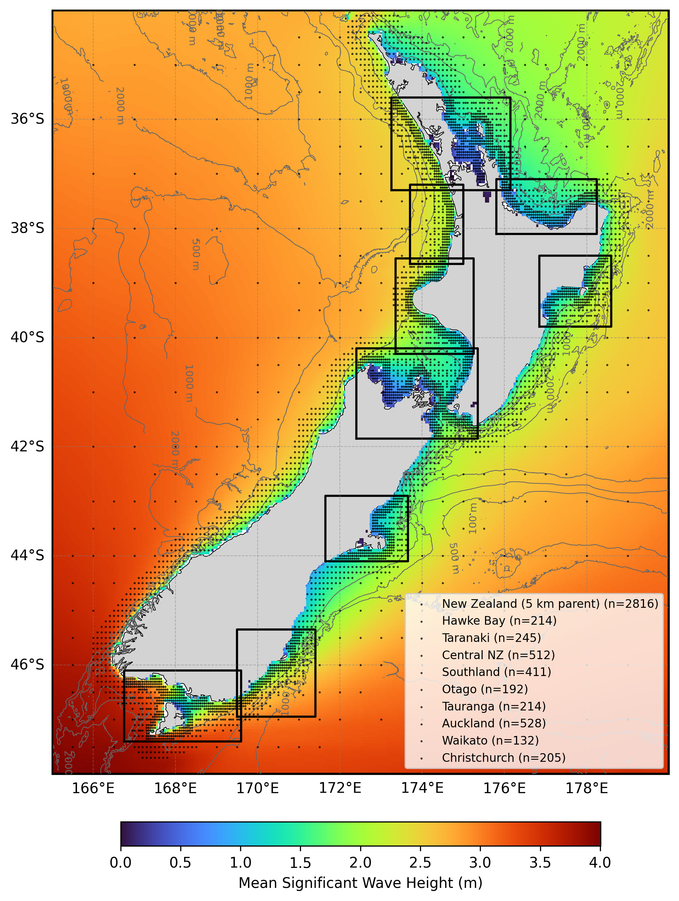
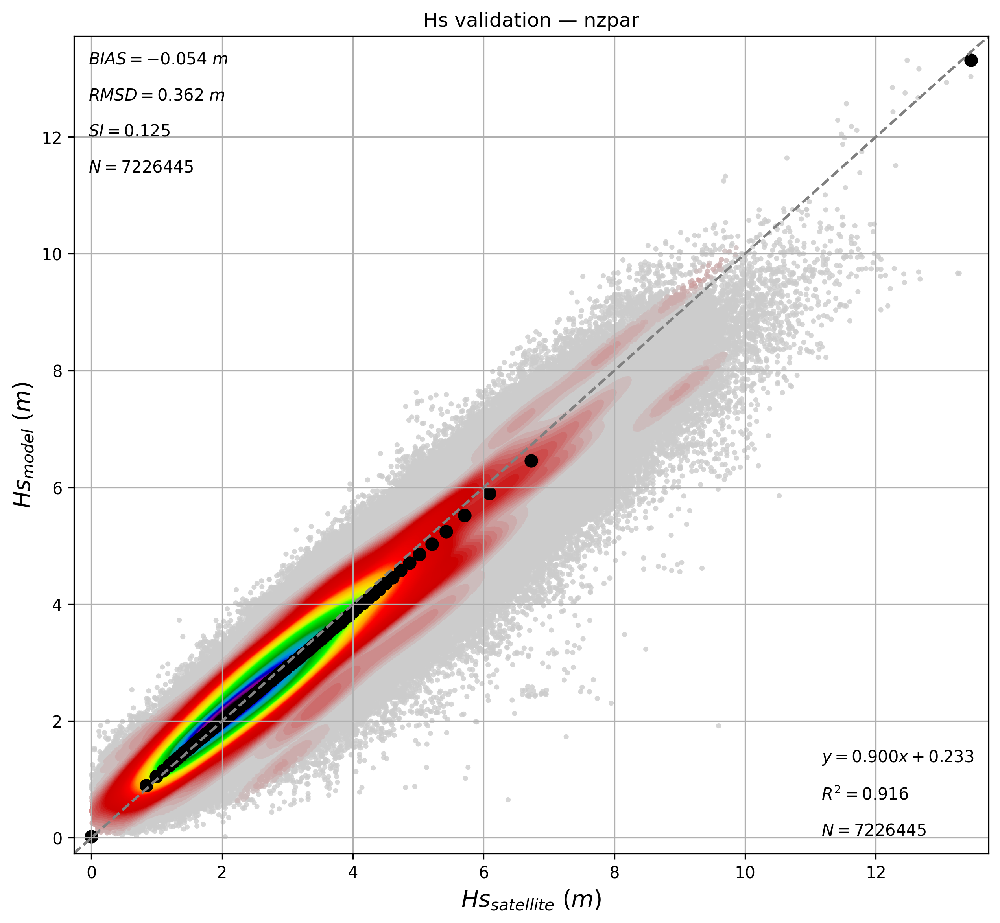
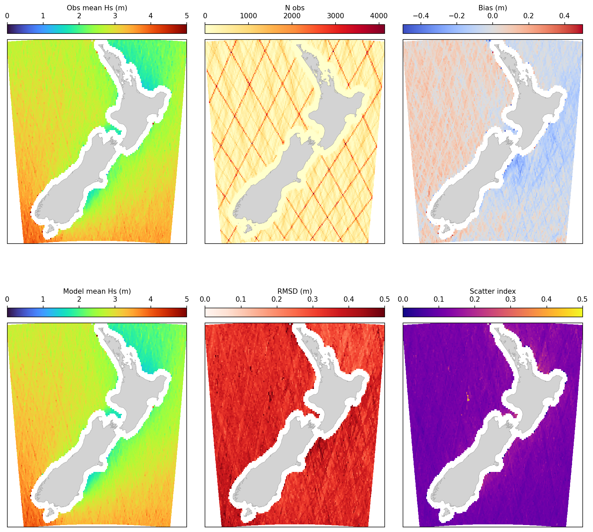

  

# Oceanum New Zealand ERA5 Wave Hindcast

**May 2026**

| | |
|---|---|
| **Model** | SWAN 41.31 |
| **Period** | Jan 1993 - Mar 2026 |
| **Spatial resolution** | 0.05 degree (~5 km) parent / 0.01 degree (~1 km) nested |
| **Temporal resolution** | 1 hourly |
| **Region** | 165E - 180E, 48S - 34S |
| **Forcings** | ERA5 winds, tidal currents, and Oceanum spectra |

---

## Dataset description

The New Zealand ERA5 wave hindcast provides high-resolution wave data across New Zealand's coastal waters using a hierarchical modelling approach (Figure 1). A parent domain at 5 km resolution covers the New Zealand Exclusive Economic Zone and adjacent Pacific and Southern Ocean waters from 165°E to 180°E and 48°S to 34°S, capturing the full New Zealand wave climate including Southern Ocean swell, Tasman Sea seas, and locally generated wind waves. Nine high-resolution nested domains at 1 km resolution target key coastal regions around both the North and South Islands: Hawke Bay, Taranaki, Central New Zealand (Cook Strait), Southland, Otago, Tauranga, Auckland, Waikato, and Christchurch. The dataset spans from January 1993 to March 2026 using the SWAN (Simulating WAves Nearshore) third-generation spectral wave model.

The parent domain is forced by <a href="https://www.ecmwf.int/en/forecasts/dataset/ecmwf-reanalysis-v5" target="_blank">ERA5 reanalysis</a> winds from the European Centre for Medium-Range Weather Forecasts, with ocean currents combining Oceanum's New Zealand 5 km tidal constituents and <a href="https://data.marine.copernicus.eu/product/GLOBAL_MULTIYEAR_PHY_001_030/description" target="_blank">Copernicus CMEMS</a> ocean reanalysis surface currents. Spectral boundary conditions for the parent domain are supplied by the <a href="https://ui.datamesh.oceanum.io/datasource/oceanum_wave_glob05_era5_v1_spec" target="_blank">Oceanum Global WW3 ERA5 wave model</a>; each 1 km nested domain receives spectral boundaries from the parent. The 1 km nested domains use Oceanum's New Zealand 2 km tidal constituents combined with the same CMEMS ocean reanalysis currents. Bathymetry for all domains is derived from the <a href="https://www.gebco.net/data_and_products/gridded_bathymetry_data/" target="_blank">GEBCO 2025</a> global bathymetric grid. The hindcast is calibrated against the satellite altimeter dataset of <a href="https://www.nature.com/articles/s41597-019-0083-9" target="_blank">Ribal and Young (2019)</a>.

The modelling setup employs the <a href="https://journals.ametsoc.org/view/journals/atot/29/9/jtech-d-11-00092_1.xml" target="_blank">ST6</a> source term parameterisations. Spectra are discretised into 36 directional bins and 32 frequency bins, covering a frequency range from 0.037 to 0.71 Hz with 10% logarithmic increments. All domains share the same spectral configuration. The parent domain features a 5 km (0.05 degree) regular grid; each nested domain features a 1 km (0.01 degree) regular grid.

The dataset provides hourly estimates for 38 ocean wave parameters (Table 2) including significant wave height, periods, directions, and spectral quantities integrated over the full spectrum and for spectral partitions. Partitions are defined from an 8-second sea/swell split and from the Watershed method, which identifies one wind-forced partition and up to three swell partitions. These data are stored over each domain at native resolution. Frequency-direction wave spectra are available at sites distributed across all domains (see Figure 1), with 2816 sites for the parent domain and between 132 and 528 sites for each nested domain.

**Figure 1.** Mean significant wave height from the New Zealand ERA5 wave hindcast parent domain (5 km). The bounding boxes of the 9 high-resolution nested domains (1 km) are outlined in blue. Spectra output site locations are shown by black dots (parent domain) and blue dots (nested domains). Depth contours are shown at 100 m, 500 m, 1000 m, and 2000 m.

---

## Validation

The wave hindcast has been validated against satellite altimeter observations from the dataset of <a href="https://www.nature.com/articles/s41597-019-0083-9" target="_blank">Ribal and Young (2019)</a>. Figure 2 shows a density scatter plot comparing modelled significant wave height against satellite altimeter measurements across the parent domain, with quantile-quantile comparison shown by the black dots. The model demonstrates good agreement with observations, with a bias of -0.04 m, RMSD of 0.35 m, scatter index of 0.12, and R² of 0.92 over 6,042,003 collocated observations.

**Figure 2.** Density scatter plot comparing modelled significant wave height against satellite altimeter observations for the New Zealand ERA5 wave hindcast parent domain. Black dots show quantile-quantile comparison. Statistics shown include bias, RMSD, scatter index (SI), linear regression, and R².

Figure 3 shows the spatial distribution of validation statistics computed against all available satellite passes across the domain, giving an indication of regional model performance.

**Figure 3.** Spatial validation statistics against satellite altimeter observations. Top row (left to right): observed mean significant wave height, number of collocated observations, and bias. Bottom row: modelled mean significant wave height, RMSD, and scatter index.

Additional interactive validation against satellite altimeter observations is available through the <a href="https://hindcast-satellite-validation-main-prod.apps.oceanum.io/" target="_blank">Oceanum Hindcast Satellite Validation App</a>, which provides density scatter plots, quantile comparisons, and statistical metrics at any location within the model domain.

---

## Data description

**Table 1.** Data description.

| Field | Value |
|---|---|
| **Title** | Oceanum New Zealand ERA5 wave hindcast |
| **Institution** | <a href="https://oceanum.io" target="_blank">Oceanum</a> |
| **Access** | <a href="https://ui.datamesh.oceanum.io/" target="_blank">Oceanum Datamesh</a> |
| **Source** | <a href="https://swanmodel.sourceforge.io/" target="_blank">SWAN 41.31A</a> |
| **Source terms** | <a href="https://journals.ametsoc.org/view/journals/atot/29/9/jtech-d-11-00092_1.xml" target="_blank">ST6</a> |
| **Temporal coverage** | 1993-01-01 to 2026-03-03 |
| **Temporal resolution** | Hourly |
| **Frequency discretisation** | 32 frequencies between 0.037 - 0.71 Hz at 10% logarithmic increments |
| **Direction resolution** | 10 deg |
| **Bathymetry** | <a href="https://www.gebco.net/data_and_products/gridded_bathymetry_data/" target="_blank">GEBCO 2025 Grid</a> |
| **Winds** | <a href="https://www.ecmwf.int/en/forecasts/dataset/ecmwf-reanalysis-v5" target="_blank">ERA5 reanalysis</a> |
| **Currents** | NZ tidal constituents + <a href="https://data.marine.copernicus.eu/product/GLOBAL_MULTIYEAR_PHY_001_030/description" target="_blank">Copernicus CMEMS</a> ocean reanalysis |
| **Boundary** | <a href="https://ui.datamesh.oceanum.io/datasource/oceanum_wave_glob05_era5_v1_spec" target="_blank">Oceanum Global WW3 ERA5 hourly wave spectra</a> (parent); parent domain spectra (nested domains) |

### Nested domains

**Table 2.** Nested domain overview.

| Domain | Region | Resolution | Bounds | Spectra sites |
|---|---|---|---|---|
| nzpar | New Zealand (parent) | 0.05° (~5 km) | 165–180°E, 48–34°S | 2816 |
| hbay | Hawke Bay | 0.01° (~1 km) | 176.85–178.60°E, 39.80–38.50°S | 214 |
| trki | Taranaki | 0.01° (~1 km) | 173.35–175.25°E, 40.30–38.55°S | 245 |
| cnz | Central New Zealand | 0.01° (~1 km) | 172.40–175.35°E, 41.85–40.20°S | 512 |
| sland | Southland | 0.01° (~1 km) | 166.75–169.60°E, 47.40–46.10°S | 411 |
| otago | Otago | 0.01° (~1 km) | 169.50–171.40°E, 46.95–45.35°S | 192 |
| taura | Tauranga | 0.01° (~1 km) | 175.80–178.25°E, 38.10–37.10°S | 214 |
| auckl | Auckland | 0.01° (~1 km) | 173.25–176.15°E, 37.30–35.60°S | 528 |
| waika | Waikato | 0.01° (~1 km) | 173.70–175.00°E, 38.65–37.20°S | 132 |
| christ | Christchurch | 0.01° (~1 km) | 171.65–173.65°E, 44.10–42.90°S | 205 |

### Linked Datamesh datasources

**Parent domain (5 km):**
- <a href="https://ui.datamesh.oceanum.io/datasource/oceanum_wave_nzpar_era5_grid" target="_blank">Oceanum New Zealand 5 km hourly wave parameters</a>
- <a href="https://ui.datamesh.oceanum.io/datasource/oceanum_wave_nzpar_era5_spec" target="_blank">Oceanum New Zealand 5 km hourly wave spectra</a>
- <a href="https://ui.datamesh.oceanum.io/datasource/oceanum_wave_nzpar_era5_gridstats" target="_blank">Oceanum New Zealand 5 km gridded wave statistics</a>

**Hawke Bay (1 km):**
- <a href="https://ui.datamesh.oceanum.io/datasource/oceanum_wave_hbay_era5_grid" target="_blank">Oceanum Hawke Bay 1 km hourly wave parameters</a>
- <a href="https://ui.datamesh.oceanum.io/datasource/oceanum_wave_hbay_era5_spec" target="_blank">Oceanum Hawke Bay 1 km hourly wave spectra</a>
- <a href="https://ui.datamesh.oceanum.io/datasource/oceanum_wave_hbay_era5_gridstats" target="_blank">Oceanum Hawke Bay 1 km gridded wave statistics</a>

**Taranaki (1 km):**
- <a href="https://ui.datamesh.oceanum.io/datasource/oceanum_wave_trki_era5_grid" target="_blank">Oceanum Taranaki 1 km hourly wave parameters</a>
- <a href="https://ui.datamesh.oceanum.io/datasource/oceanum_wave_trki_era5_spec" target="_blank">Oceanum Taranaki 1 km hourly wave spectra</a>
- <a href="https://ui.datamesh.oceanum.io/datasource/oceanum_wave_trki_era5_gridstats" target="_blank">Oceanum Taranaki 1 km gridded wave statistics</a>

**Central New Zealand (1 km):**
- <a href="https://ui.datamesh.oceanum.io/datasource/oceanum_wave_cnz_era5_grid" target="_blank">Oceanum Central New Zealand 1 km hourly wave parameters</a>
- <a href="https://ui.datamesh.oceanum.io/datasource/oceanum_wave_cnz_era5_spec" target="_blank">Oceanum Central New Zealand 1 km hourly wave spectra</a>
- <a href="https://ui.datamesh.oceanum.io/datasource/oceanum_wave_cnz_era5_gridstats" target="_blank">Oceanum Central New Zealand 1 km gridded wave statistics</a>

**Southland (1 km):**
- <a href="https://ui.datamesh.oceanum.io/datasource/oceanum_wave_sland_era5_grid" target="_blank">Oceanum Southland 1 km hourly wave parameters</a>
- <a href="https://ui.datamesh.oceanum.io/datasource/oceanum_wave_sland_era5_spec" target="_blank">Oceanum Southland 1 km hourly wave spectra</a>
- <a href="https://ui.datamesh.oceanum.io/datasource/oceanum_wave_sland_era5_gridstats" target="_blank">Oceanum Southland 1 km gridded wave statistics</a>

**Otago (1 km):**
- <a href="https://ui.datamesh.oceanum.io/datasource/oceanum_wave_otago_era5_grid" target="_blank">Oceanum Otago 1 km hourly wave parameters</a>
- <a href="https://ui.datamesh.oceanum.io/datasource/oceanum_wave_otago_era5_spec" target="_blank">Oceanum Otago 1 km hourly wave spectra</a>
- <a href="https://ui.datamesh.oceanum.io/datasource/oceanum_wave_otago_era5_gridstats" target="_blank">Oceanum Otago 1 km gridded wave statistics</a>

**Tauranga (1 km):**
- <a href="https://ui.datamesh.oceanum.io/datasource/oceanum_wave_taura_era5_grid" target="_blank">Oceanum Tauranga 1 km hourly wave parameters</a>
- <a href="https://ui.datamesh.oceanum.io/datasource/oceanum_wave_taura_era5_spec" target="_blank">Oceanum Tauranga 1 km hourly wave spectra</a>
- <a href="https://ui.datamesh.oceanum.io/datasource/oceanum_wave_taura_era5_gridstats" target="_blank">Oceanum Tauranga 1 km gridded wave statistics</a>

**Auckland (1 km):**
- <a href="https://ui.datamesh.oceanum.io/datasource/oceanum_wave_auckl_era5_grid" target="_blank">Oceanum Auckland 1 km hourly wave parameters</a>
- <a href="https://ui.datamesh.oceanum.io/datasource/oceanum_wave_auckl_era5_spec" target="_blank">Oceanum Auckland 1 km hourly wave spectra</a>
- <a href="https://ui.datamesh.oceanum.io/datasource/oceanum_wave_auckl_era5_gridstats" target="_blank">Oceanum Auckland 1 km gridded wave statistics</a>

**Waikato (1 km):**
- <a href="https://ui.datamesh.oceanum.io/datasource/oceanum_wave_waika_era5_grid" target="_blank">Oceanum Waikato 1 km hourly wave parameters</a>
- <a href="https://ui.datamesh.oceanum.io/datasource/oceanum_wave_waika_era5_spec" target="_blank">Oceanum Waikato 1 km hourly wave spectra</a>
- <a href="https://ui.datamesh.oceanum.io/datasource/oceanum_wave_waika_era5_gridstats" target="_blank">Oceanum Waikato 1 km gridded wave statistics</a>

**Christchurch (1 km):**
- <a href="https://ui.datamesh.oceanum.io/datasource/oceanum_wave_christ_era5_grid" target="_blank">Oceanum Christchurch 1 km hourly wave parameters</a>
- <a href="https://ui.datamesh.oceanum.io/datasource/oceanum_wave_christ_era5_spec" target="_blank">Oceanum Christchurch 1 km hourly wave spectra</a>
- <a href="https://ui.datamesh.oceanum.io/datasource/oceanum_wave_christ_era5_gridstats" target="_blank">Oceanum Christchurch 1 km gridded wave statistics</a>

---

## Gridded output parameters

Integrated wave parameters are stored hourly over each domain at the native model resolution. All domains provide the same 38 output parameters. Table 3 describes long names and units.

**Table 3.** Gridded output parameters.

*All parameters are defined on the `time`, `latitude` and `longitude` coordinates.*

| Variable | Long Name | Units |
|---|---|---|
| <a href="https://vocab.nerc.ac.uk/standard_name/sea_floor_depth_below_sea_surface/" target="_blank">depth</a> | depth below sea surface | m |
| <a href="https://vocab.nerc.ac.uk/standard_name/sea_surface_wave_from_direction_at_variance_spectral_density_maximum/" target="_blank">dpm</a> | mean direction at the spectral peak of wind and swell waves | degree |
| <a href="https://vocab.nerc.ac.uk/standard_name/sea_surface_wind_wave_from_direction_at_variance_spectral_density_maximum/" target="_blank">dpmsea</a> | mean direction at the spectral peak of wind waves below 8 seconds period | degree |
| <a href="https://vocab.nerc.ac.uk/standard_name/sea_surface_swell_wave_from_direction_at_variance_spectral_density_maximum/" target="_blank">dpmswe</a> | mean direction at the spectral peak of swell waves above 8 seconds period | degree |
| <a href="https://vocab.nerc.ac.uk/standard_name/sea_surface_wave_directional_spread/" target="_blank">dspr</a> | directional spreading of wind and swell waves | degree |
| fspr | normalised width of the frequency spectrum of wind and swell waves | - |
| <a href="https://vocab.nerc.ac.uk/standard_name/sea_surface_wave_significant_height/" target="_blank">hs</a> | significant height of wind and swell waves | m |
| <a href="https://vocab.nerc.ac.uk/standard_name/sea_surface_wind_wave_significant_height/" target="_blank">hsea</a> | significant height of wind waves below 8 seconds period | m |
| <a href="https://vocab.nerc.ac.uk/standard_name/sea_surface_swell_wave_significant_height/" target="_blank">hswe</a> | significant height of swell waves above 8 seconds period | m |
| <a href="https://vocab.nerc.ac.uk/standard_name/sea_surface_wind_wave_from_direction/" target="_blank">pdir0</a> | mean direction of wind waves | degree |
| <a href="https://vocab.nerc.ac.uk/standard_name/sea_surface_primary_swell_wave_from_direction/" target="_blank">pdir1</a> | mean direction of primary swell waves | degree |
| <a href="https://vocab.nerc.ac.uk/standard_name/sea_surface_secondary_swell_wave_from_direction/" target="_blank">pdir2</a> | mean direction of secondary swell waves | degree |
| <a href="https://vocab.nerc.ac.uk/standard_name/sea_surface_tertiary_swell_wave_from_direction/" target="_blank">pdir3</a> | mean direction of tertiary swell waves | degree |
| <a href="https://vocab.nerc.ac.uk/standard_name/sea_surface_wind_wave_directional_spread/" target="_blank">pdspr0</a> | directional spreading of wind waves | degree |
| <a href="https://vocab.nerc.ac.uk/standard_name/sea_surface_primary_swell_wave_directional_spread/" target="_blank">pdspr1</a> | directional spreading of primary swell waves | degree |
| <a href="https://vocab.nerc.ac.uk/standard_name/sea_surface_secondary_swell_wave_directional_spread/" target="_blank">pdspr2</a> | directional spreading of secondary swell waves | degree |
| <a href="https://vocab.nerc.ac.uk/standard_name/sea_surface_tertiary_swell_wave_directional_spread/" target="_blank">pdspr3</a> | directional spreading of tertiary swell waves | degree |
| <a href="https://vocab.nerc.ac.uk/standard_name/sea_surface_wind_wave_significant_height/" target="_blank">phs0</a> | sea surface wind wave significant height | m |
| <a href="https://vocab.nerc.ac.uk/standard_name/sea_surface_primary_swell_wave_significant_height/" target="_blank">phs1</a> | sea surface primary swell wave significant height | m |
| <a href="https://vocab.nerc.ac.uk/standard_name/sea_surface_secondary_swell_wave_significant_height/" target="_blank">phs2</a> | sea surface secondary swell wave significant height | m |
| <a href="https://vocab.nerc.ac.uk/standard_name/sea_surface_tertiary_swell_wave_significant_height/" target="_blank">phs3</a> | sea surface tertiary swell wave significant height | m |
| <a href="https://vocab.nerc.ac.uk/standard_name/sea_surface_wind_wave_period_at_variance_spectral_density_maximum/" target="_blank">ptp0</a> | sea surface wind wave period at variance spectral density maximum | s |
| <a href="https://vocab.nerc.ac.uk/standard_name/sea_surface_primary_swell_wave_period_at_variance_spectral_density_maximum/" target="_blank">ptp1</a> | sea surface primary swell wave period at variance spectral density maximum | s |
| <a href="https://vocab.nerc.ac.uk/standard_name/sea_surface_secondary_swell_wave_period_at_variance_spectral_density_maximum/" target="_blank">ptp2</a> | sea surface secondary swell wave period at variance spectral density maximum | s |
| <a href="https://vocab.nerc.ac.uk/standard_name/sea_surface_tertiary_swell_wave_period_at_variance_spectral_density_maximum/" target="_blank">ptp3</a> | sea surface tertiary swell wave period at variance spectral density maximum | s |
| pwlen0 | mean wavelength of wind waves | m |
| pwlen1 | mean wavelength of primary swell waves | m |
| pwlen2 | mean wavelength of secondary swell waves | m |
| pwlen3 | mean wavelength of tertiary swell waves | m |
| <a href="https://vocab.nerc.ac.uk/standard_name/sea_surface_wave_mean_period_from_variance_spectral_density_first_frequency_moment/" target="_blank">tm01</a> | mean absolute wave period from the first frequency moment | s |
| <a href="https://vocab.nerc.ac.uk/standard_name/sea_surface_wave_mean_period_from_variance_spectral_density_second_frequency_moment/" target="_blank">tm02</a> | mean absolute wave period from the second frequency moment | s |
| <a href="https://vocab.nerc.ac.uk/standard_name/sea_surface_wave_period_at_variance_spectral_density_maximum/" target="_blank">tps</a> | smooth relative peak wave period of wind and swell waves | s |
| <a href="https://vocab.nerc.ac.uk/standard_name/sea_surface_wind_wave_period_at_variance_spectral_density_maximum/" target="_blank">tpssea</a> | smooth relative peak wave period of wind waves below 8 seconds period | s |
| <a href="https://vocab.nerc.ac.uk/standard_name/sea_surface_swell_wave_period_at_variance_spectral_density_maximum/" target="_blank">tpsswe</a> | smooth relative peak wave period of swell waves above 8 seconds period | s |
| <a href="https://vocab.nerc.ac.uk/standard_name/eastward_sea_water_velocity/" target="_blank">xcur</a> | eastward component of tidal current velocity | m/s |
| <a href="https://vocab.nerc.ac.uk/standard_name/eastward_wind/" target="_blank">xwnd</a> | eastward component of wind velocity | m/s |
| <a href="https://vocab.nerc.ac.uk/standard_name/northward_sea_water_velocity/" target="_blank">ycur</a> | northward component of tidal current velocity | m/s |
| <a href="https://vocab.nerc.ac.uk/standard_name/northward_wind/" target="_blank">ywnd</a> | northward component of wind velocity | m/s |

---

## Spectra output

Frequency-direction wave spectra are stored hourly at selected sites across all domains. Spectra are discretised into 36 directional bins (10 degree resolution) and 32 frequency bins (0.037 - 0.71 Hz at 10% logarithmic increments).

**Table 4.** Spectra output parameters.

*Spectra are defined on the `time`, `site`, `freq` and `dir` coordinates; `lon` and `lat` are per-site data variables giving each site's location.*

| Variable | Long Name | Units |
|---|---|---|
| <a href="https://vocab.nerc.ac.uk/standard_name/sea_surface_wave_directional_variance_spectral_density/" target="_blank">efth</a> | sea surface wave variance spectral density | m² s / deg |
| <a href="https://vocab.nerc.ac.uk/standard_name/sea_floor_depth_below_sea_surface/" target="_blank">dpt</a> | water depth | m |
| <a href="https://vocab.nerc.ac.uk/standard_name/wind_speed/" target="_blank">wspd</a> | wind speed | m/s |
| <a href="https://vocab.nerc.ac.uk/standard_name/wind_from_direction/" target="_blank">wdir</a> | wind direction | degree |
| <a href="https://vocab.nerc.ac.uk/standard_name/latitude/" target="_blank">lat</a> | latitude | degrees_north |
| <a href="https://vocab.nerc.ac.uk/standard_name/longitude/" target="_blank">lon</a> | longitude | degrees_east |

---

## Gridded wave statistics

Gridded wave statistics are available for the parent domain and all nine nested domains. Statistics are computed over the full hindcast period and include long-term means, seasonal means, extremes, quantiles, and return period values. Table 5 describes the output variables.

**Table 5.** Gridded wave statistics output parameters.

| Variable | Long Name | Units | Dimensions |
|---|---|---|---|
| depth_mean | mean water depth | m | latitude, longitude |
| dpm_mean | mean peak wave direction | degree | latitude, longitude |
| dpm_modal_direction | modal peak wave direction | degree | latitude, longitude |
| dpm_modal_direction_season | seasonal modal peak wave direction | degree | season, latitude, longitude |
| hs_max | maximum significant wave height | m | latitude, longitude |
| hs_mean | mean significant wave height | m | latitude, longitude |
| hs_mean_season | seasonal mean significant wave height | m | season, latitude, longitude |
| hs_pcount | percentage of valid significant wave height values | % | latitude, longitude |
| hs_quantile | significant wave height quantiles | m | quantile, latitude, longitude |
| hs_rpv | significant wave height return period values | m | period, latitude, longitude |
| tp_max | maximum peak wave period | s | latitude, longitude |
| tp_mean | mean peak wave period | s | latitude, longitude |
| tp_mean_season | seasonal mean peak wave period | s | season, latitude, longitude |
| tp_quantile | peak wave period quantiles | s | quantile, latitude, longitude |
| wspd_mean | mean wind speed | m/s | latitude, longitude |
| xwnd_mean | mean eastward component of wind velocity | m/s | latitude, longitude |
| ywnd_mean | mean northward component of wind velocity | m/s | latitude, longitude |

---

www.oceanum.science
