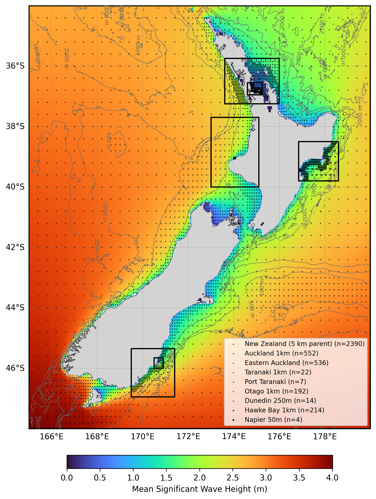

  

# Oceanum New Zealand Wave Forecast

**June 2026**

| | |
|---|---|
| **Model** | SWAN 41.31 |
| **Forecast horizon** | 7 days |
| **Spatial resolution** | 0.05 - 0.00025 degree (~5 km - 25 m) |
| **Temporal resolution** | 1 hourly |
| **Region** | 165E - 180E, 48S - 34S |
| **Forcings** | GFS/ECMWF winds and Oceanum spectra |
| **Update frequency** | 6-hourly (GFS) / 12-hourly (ECMWF) |

---

## Dataset description

The New Zealand wave forecast dataset provides operational wave predictions across New Zealand's coastal waters and the surrounding Southwest Pacific Ocean (Figure 1). The forecast system comprises a hierarchy of nested domains: a regional 5 km parent grid covering all of New Zealand, with higher-resolution child grids for Auckland (1 km), Eastern Auckland (200 m), Taranaki (1 km), Port Taranaki (25 m), Otago (1 km), Dunedin (250 m), Hawke Bay (1 km), and Napier (50 m). Wave forecasts are produced using the SWAN (Simulating WAves Nearshore) third-generation spectral wave model, with a 7-day forecast horizon. The system is run with two independent forcing configurations: a GFS-forced stack updated every 6 hours (00, 06, 12, 18 UTC) and an ECMWF-forced stack updated every 12 hours (00, 12 UTC).

Wind forcing is provided by either the <a href="https://www.ncep.noaa.gov/products/gfs/" target="_blank">NOAA GFS</a> global atmospheric model (6-hourly updates) or the <a href="https://www.ecmwf.int/en/forecasts/datasets/open-data" target="_blank">ECMWF IFS</a> global atmospheric model (12-hourly updates). Spectral boundary conditions are supplied by the Oceanum Global WW3 wave model forced with the respective wind source (GFS or ECMWF). Bathymetry is derived from the <a href="https://www.gebco.net/data_and_products/gridded_bathymetry_data/" target="_blank">GEBCO 2025</a> global bathymetric grid, supplemented by high-resolution survey data in selected coastal nests.

The modelling setup employs the <a href="https://journals.ametsoc.org/view/journals/atot/29/9/jtech-d-11-00092_1.xml" target="_blank">ST6</a> source term parameterisations. Spectra are discretised into 36 directional bins and 32 frequency bins, covering a frequency range from 0.037 to 0.71 Hz with 10% logarithmic increments. The parent grid features a 5 km (0.05 degree) resolution spanning New Zealand's Exclusive Economic Zone, with progressively finer nested grids for coastal applications.

The dataset provides hourly forecast estimates for key ocean wave parameters (Table 2) including spectral quantities integrated over the full spectrum and for spectral partitions. Partitions are defined from an 8-second split (sea/swell) and from the Watershed method, which identifies one wind-forced partition and up to three swell partitions. GFS-forced forecasts are archived for 30 days and ECMWF-forced forecasts for 7 days, and frequency-direction wave spectra are available at selected sites across all domains. Nowcast datasets are also available for both forcing configurations, constructed by retaining the most recent data from each forecast cycle to provide a continuous near-real-time historical record.

**Figure 1.** Mean significant wave height from the New Zealand ERA5 hindcast parent domain (used for forecast validation). The bounding boxes of all forecast nested domains are outlined in black. Spectra output site locations are shown by black dots (parent domain) and black dots (nested domains). Depth contours are shown at 100 m, 500 m, 1000 m, and 2000 m.

---

## Validation

The wave model physics and calibration have been validated against satellite altimeter observations for the corresponding hindcast domain. Validation results are available through the <a href="https://hindcast-satellite-validation-main-prod.apps.oceanum.io/" target="_blank">Oceanum Hindcast Satellite Validation App</a>, which provides density scatter plots, quantile comparisons, and statistical metrics for the New Zealand region.

---

## Data description

**Table 1.** Data description.

| Field | Value |
|---|---|
| **Title** | Oceanum New Zealand wave forecast |
| **Institution** | <a href="https://oceanum.io" target="_blank">Oceanum</a> |
| **Access** | <a href="https://ui.datamesh.oceanum.io/" target="_blank">Oceanum Datamesh</a> |
| **Source** | <a href="https://swanmodel.sourceforge.io/" target="_blank">SWAN 41.31A</a> |
| **Source terms** | <a href="https://journals.ametsoc.org/view/journals/atot/29/9/jtech-d-11-00092_1.xml" target="_blank">ST6</a> |
| **Forecast horizon** | 7 days |
| **Update frequency** | 6-hourly (GFS) / 12-hourly (ECMWF) |
| **Archive period** | 30 days (GFS) / 7 days (ECMWF) |
| **Temporal resolution** | 1 hourly |
| **Frequency discretisation** | 32 frequencies between 0.037 - 0.71 Hz at 10% logarithmic increments |
| **Direction resolution** | 10 deg |
| **Bathymetry** | <a href="https://www.gebco.net/data_and_products/gridded_bathymetry_data/" target="_blank">GEBCO 2025 Grid</a> |
| **Winds** | <a href="https://www.ncep.noaa.gov/products/gfs/" target="_blank">NOAA GFS</a> or <a href="https://www.ecmwf.int/en/forecasts/datasets/open-data" target="_blank">ECMWF IFS</a> |
| **Boundary** | Oceanum Global WW3 wave forecast (GFS or ECMWF forced) |

### Nested domains

| Domain | Resolution | Bounds | Spectra sites |
|--------|------------|--------|---------------|
| New Zealand | 0.05° (~5 km) | 165–180°E, 48–34°S | 2390 |
| Auckland | 0.01° (~1 km) | 173.60–176.00°E, 37.25–35.75°S | 552 |
| Eastern Auckland | 0.002° (~200 m) | 174.60–175.25°E, 36.95–36.55°S | - |
| Taranaki | 0.01° (~1 km) | 173.00–175.10°E, 40.00–37.70°S | 22 |
| Port Taranaki | 0.00025° (~25 m) | 174.000–174.070°E, 39.07–39.03°S | - |
| Otago | 0.01° (~1 km) | 169.50–171.40°E, 46.95–45.35°S | - |
| Dunedin | 0.0025° (~250 m) | 170.50–170.90°E, 46.00–45.65°S | - |
| Hawke Bay | 0.01° (~1 km) | 176.85–178.60°E, 39.80–38.50°S | 214 |
| Napier | 0.0005° (~50 m) | 176.87–176.96°E, 39.49–39.41°S | 4 |

### Linked Datamesh datasources

Each domain is available in both GFS-forced (6-hourly updates) and ECMWF-forced (12-hourly updates) configurations, with corresponding nowcast datasets providing a continuous near-real-time archive.

**New Zealand 5km:**
- <a href="https://ui.datamesh.oceanum.io/datasource/oceanum_wave_gfs_nz_grid" target="_blank">Oceanum New Zealand GFS wave forecast parameters</a>
- <a href="https://ui.datamesh.oceanum.io/datasource/oceanum_wave_gfs_nz_spec" target="_blank">Oceanum New Zealand GFS wave forecast spectra</a>
- <a href="https://ui.datamesh.oceanum.io/datasource/oceanum_wave_gfs_nz_grid_nowcast" target="_blank">Oceanum New Zealand GFS wave nowcast parameters</a>
- <a href="https://ui.datamesh.oceanum.io/datasource/oceanum_wave_gfs_nz_spec_nowcast" target="_blank">Oceanum New Zealand GFS wave nowcast spectra</a>
- <a href="https://ui.datamesh.oceanum.io/datasource/oceanum_wave_ec_nz_grid" target="_blank">Oceanum New Zealand ECMWF wave forecast parameters</a>
- <a href="https://ui.datamesh.oceanum.io/datasource/oceanum_wave_ec_nz_spec" target="_blank">Oceanum New Zealand ECMWF wave forecast spectra</a>
- <a href="https://ui.datamesh.oceanum.io/datasource/oceanum_wave_ec_nz_grid_nowcast" target="_blank">Oceanum New Zealand ECMWF wave nowcast parameters</a>
- <a href="https://ui.datamesh.oceanum.io/datasource/oceanum_wave_ec_nz_spec_nowcast" target="_blank">Oceanum New Zealand ECMWF wave nowcast spectra</a>

**Auckland 1km:**
- <a href="https://ui.datamesh.oceanum.io/datasource/oceanum_wave_gfs_akl1km_grid" target="_blank">Oceanum Auckland 1km GFS wave forecast parameters</a>
- <a href="https://ui.datamesh.oceanum.io/datasource/oceanum_wave_gfs_akl1km_spec" target="_blank">Oceanum Auckland 1km GFS wave forecast spectra</a>
- <a href="https://ui.datamesh.oceanum.io/datasource/oceanum_wave_gfs_akl1km_grid_nowcast" target="_blank">Oceanum Auckland 1km GFS wave nowcast parameters</a>
- <a href="https://ui.datamesh.oceanum.io/datasource/oceanum_wave_gfs_akl1km_spec_nowcast" target="_blank">Oceanum Auckland 1km GFS wave nowcast spectra</a>
- <a href="https://ui.datamesh.oceanum.io/datasource/oceanum_wave_ec_akl1km_grid" target="_blank">Oceanum Auckland 1km ECMWF wave forecast parameters</a>
- <a href="https://ui.datamesh.oceanum.io/datasource/oceanum_wave_ec_akl1km_spec" target="_blank">Oceanum Auckland 1km ECMWF wave forecast spectra</a>
- <a href="https://ui.datamesh.oceanum.io/datasource/oceanum_wave_ec_akl1km_grid_nowcast" target="_blank">Oceanum Auckland 1km ECMWF wave nowcast parameters</a>
- <a href="https://ui.datamesh.oceanum.io/datasource/oceanum_wave_ec_akl1km_spec_nowcast" target="_blank">Oceanum Auckland 1km ECMWF wave nowcast spectra</a>

**Eastern Auckland 200m:**
- <a href="https://ui.datamesh.oceanum.io/datasource/oceanum_wave_gfs_eakl_grid" target="_blank">Oceanum Eastern Auckland 200m GFS wave forecast parameters</a>
- <a href="https://ui.datamesh.oceanum.io/datasource/oceanum_wave_gfs_eakl_spec" target="_blank">Oceanum Eastern Auckland 200m GFS wave forecast spectra</a>
- <a href="https://ui.datamesh.oceanum.io/datasource/oceanum_wave_gfs_eakl_grid_nowcast" target="_blank">Oceanum Eastern Auckland 200m GFS wave nowcast parameters</a>
- <a href="https://ui.datamesh.oceanum.io/datasource/oceanum_wave_gfs_eakl_spec_nowcast" target="_blank">Oceanum Eastern Auckland 200m GFS wave nowcast spectra</a>
- <a href="https://ui.datamesh.oceanum.io/datasource/oceanum_wave_ec_eakl_grid" target="_blank">Oceanum Eastern Auckland 200m ECMWF wave forecast parameters</a>
- <a href="https://ui.datamesh.oceanum.io/datasource/oceanum_wave_ec_eakl_spec" target="_blank">Oceanum Eastern Auckland 200m ECMWF wave forecast spectra</a>
- <a href="https://ui.datamesh.oceanum.io/datasource/oceanum_wave_ec_eakl_grid_nowcast" target="_blank">Oceanum Eastern Auckland 200m ECMWF wave nowcast parameters</a>
- <a href="https://ui.datamesh.oceanum.io/datasource/oceanum_wave_ec_eakl_spec_nowcast" target="_blank">Oceanum Eastern Auckland 200m ECMWF wave nowcast spectra</a>

**Taranaki 1km:**
- <a href="https://ui.datamesh.oceanum.io/datasource/oceanum_wave_gfs_trki_grid" target="_blank">Oceanum Taranaki GFS wave forecast parameters</a>
- <a href="https://ui.datamesh.oceanum.io/datasource/oceanum_wave_gfs_trki_spec" target="_blank">Oceanum Taranaki GFS wave forecast spectra</a>
- <a href="https://ui.datamesh.oceanum.io/datasource/oceanum_wave_gfs_trki_grid_nowcast" target="_blank">Oceanum Taranaki GFS wave nowcast parameters</a>
- <a href="https://ui.datamesh.oceanum.io/datasource/oceanum_wave_gfs_trki_spec_nowcast" target="_blank">Oceanum Taranaki GFS wave nowcast spectra</a>
- <a href="https://ui.datamesh.oceanum.io/datasource/oceanum_wave_ec_trki_grid" target="_blank">Oceanum Taranaki ECMWF wave forecast parameters</a>
- <a href="https://ui.datamesh.oceanum.io/datasource/oceanum_wave_ec_trki_spec" target="_blank">Oceanum Taranaki ECMWF wave forecast spectra</a>
- <a href="https://ui.datamesh.oceanum.io/datasource/oceanum_wave_ec_trki_grid_nowcast" target="_blank">Oceanum Taranaki ECMWF wave nowcast parameters</a>
- <a href="https://ui.datamesh.oceanum.io/datasource/oceanum_wave_ec_trki_spec_nowcast" target="_blank">Oceanum Taranaki ECMWF wave nowcast spectra</a>

**Port Taranaki 25m:**
- <a href="https://ui.datamesh.oceanum.io/datasource/oceanum_wave_gfs_trkiport_grid" target="_blank">Oceanum Port Taranaki GFS wave forecast parameters</a>
- <a href="https://ui.datamesh.oceanum.io/datasource/oceanum_wave_gfs_trkiport_spec" target="_blank">Oceanum Port Taranaki GFS wave forecast spectra</a>
- <a href="https://ui.datamesh.oceanum.io/datasource/oceanum_wave_gfs_trkiport_grid_nowcast" target="_blank">Oceanum Port Taranaki GFS wave nowcast parameters</a>
- <a href="https://ui.datamesh.oceanum.io/datasource/oceanum_wave_gfs_trkiport_spec_nowcast" target="_blank">Oceanum Port Taranaki GFS wave nowcast spectra</a>
- <a href="https://ui.datamesh.oceanum.io/datasource/oceanum_wave_ec_trkiport_grid" target="_blank">Oceanum Port Taranaki ECMWF wave forecast parameters</a>
- <a href="https://ui.datamesh.oceanum.io/datasource/oceanum_wave_ec_trkiport_spec" target="_blank">Oceanum Port Taranaki ECMWF wave forecast spectra</a>
- <a href="https://ui.datamesh.oceanum.io/datasource/oceanum_wave_ec_trkiport_grid_nowcast" target="_blank">Oceanum Port Taranaki ECMWF wave nowcast parameters</a>
- <a href="https://ui.datamesh.oceanum.io/datasource/oceanum_wave_ec_trkiport_spec_nowcast" target="_blank">Oceanum Port Taranaki ECMWF wave nowcast spectra</a>

**Otago 1km:**
- <a href="https://ui.datamesh.oceanum.io/datasource/oceanum_wave_gfs_otg1km_grid" target="_blank">Oceanum Otago 1km GFS wave forecast parameters</a>
- <a href="https://ui.datamesh.oceanum.io/datasource/oceanum_wave_gfs_otg1km_spec" target="_blank">Oceanum Otago 1km GFS wave forecast spectra</a>
- <a href="https://ui.datamesh.oceanum.io/datasource/oceanum_wave_gfs_otg1km_grid_nowcast" target="_blank">Oceanum Otago 1km GFS wave nowcast parameters</a>
- <a href="https://ui.datamesh.oceanum.io/datasource/oceanum_wave_gfs_otg1km_spec_nowcast" target="_blank">Oceanum Otago 1km GFS wave nowcast spectra</a>
- <a href="https://ui.datamesh.oceanum.io/datasource/oceanum_wave_ec_otg1km_grid" target="_blank">Oceanum Otago 1km ECMWF wave forecast parameters</a>
- <a href="https://ui.datamesh.oceanum.io/datasource/oceanum_wave_ec_otg1km_spec" target="_blank">Oceanum Otago 1km ECMWF wave forecast spectra</a>
- <a href="https://ui.datamesh.oceanum.io/datasource/oceanum_wave_ec_otg1km_grid_nowcast" target="_blank">Oceanum Otago 1km ECMWF wave nowcast parameters</a>
- <a href="https://ui.datamesh.oceanum.io/datasource/oceanum_wave_ec_otg1km_spec_nowcast" target="_blank">Oceanum Otago 1km ECMWF wave nowcast spectra</a>

**Dunedin 250m:**
- <a href="https://ui.datamesh.oceanum.io/datasource/oceanum_wave_gfs_dnd250m_grid" target="_blank">Oceanum Dunedin 250m GFS wave forecast parameters</a>
- <a href="https://ui.datamesh.oceanum.io/datasource/oceanum_wave_gfs_dnd250m_spec" target="_blank">Oceanum Dunedin 250m GFS wave forecast spectra</a>
- <a href="https://ui.datamesh.oceanum.io/datasource/oceanum_wave_gfs_dnd250m_grid_nowcast" target="_blank">Oceanum Dunedin 250m GFS wave nowcast parameters</a>
- <a href="https://ui.datamesh.oceanum.io/datasource/oceanum_wave_gfs_dnd250m_spec_nowcast" target="_blank">Oceanum Dunedin 250m GFS wave nowcast spectra</a>
- <a href="https://ui.datamesh.oceanum.io/datasource/oceanum_wave_ec_dnd250m_grid" target="_blank">Oceanum Dunedin 250m ECMWF wave forecast parameters</a>
- <a href="https://ui.datamesh.oceanum.io/datasource/oceanum_wave_ec_dnd250m_spec" target="_blank">Oceanum Dunedin 250m ECMWF wave forecast spectra</a>
- <a href="https://ui.datamesh.oceanum.io/datasource/oceanum_wave_ec_dnd250m_grid_nowcast" target="_blank">Oceanum Dunedin 250m ECMWF wave nowcast parameters</a>
- <a href="https://ui.datamesh.oceanum.io/datasource/oceanum_wave_ec_dnd250m_spec_nowcast" target="_blank">Oceanum Dunedin 250m ECMWF wave nowcast spectra</a>

**Hawke Bay 1km:**
- <a href="https://ui.datamesh.oceanum.io/datasource/oceanum_wave_gfs_hbay_grid" target="_blank">Oceanum Hawke Bay 1km GFS wave forecast parameters</a>
- <a href="https://ui.datamesh.oceanum.io/datasource/oceanum_wave_gfs_hbay_spec" target="_blank">Oceanum Hawke Bay 1km GFS wave forecast spectra</a>
- <a href="https://ui.datamesh.oceanum.io/datasource/oceanum_wave_gfs_hbay_grid_nowcast" target="_blank">Oceanum Hawke Bay 1km GFS wave nowcast parameters</a>
- <a href="https://ui.datamesh.oceanum.io/datasource/oceanum_wave_gfs_hbay_spec_nowcast" target="_blank">Oceanum Hawke Bay 1km GFS wave nowcast spectra</a>
- <a href="https://ui.datamesh.oceanum.io/datasource/oceanum_wave_ec_hbay_grid" target="_blank">Oceanum Hawke Bay 1km ECMWF wave forecast parameters</a>
- <a href="https://ui.datamesh.oceanum.io/datasource/oceanum_wave_ec_hbay_spec" target="_blank">Oceanum Hawke Bay 1km ECMWF wave forecast spectra</a>
- <a href="https://ui.datamesh.oceanum.io/datasource/oceanum_wave_ec_hbay_grid_nowcast" target="_blank">Oceanum Hawke Bay 1km ECMWF wave nowcast parameters</a>
- <a href="https://ui.datamesh.oceanum.io/datasource/oceanum_wave_ec_hbay_spec_nowcast" target="_blank">Oceanum Hawke Bay 1km ECMWF wave nowcast spectra</a>

**Napier 50m:**
- <a href="https://ui.datamesh.oceanum.io/datasource/oceanum_wave_gfs_napier_grid" target="_blank">Oceanum Napier 50m GFS wave forecast parameters</a>
- <a href="https://ui.datamesh.oceanum.io/datasource/oceanum_wave_gfs_napier_spec" target="_blank">Oceanum Napier 50m GFS wave forecast spectra</a>
- <a href="https://ui.datamesh.oceanum.io/datasource/oceanum_wave_gfs_napier_grid_nowcast" target="_blank">Oceanum Napier 50m GFS wave nowcast parameters</a>
- <a href="https://ui.datamesh.oceanum.io/datasource/oceanum_wave_gfs_napier_spec_nowcast" target="_blank">Oceanum Napier 50m GFS wave nowcast spectra</a>
- <a href="https://ui.datamesh.oceanum.io/datasource/oceanum_wave_ec_napier_grid" target="_blank">Oceanum Napier 50m ECMWF wave forecast parameters</a>
- <a href="https://ui.datamesh.oceanum.io/datasource/oceanum_wave_ec_napier_spec" target="_blank">Oceanum Napier 50m ECMWF wave forecast spectra</a>
- <a href="https://ui.datamesh.oceanum.io/datasource/oceanum_wave_ec_napier_grid_nowcast" target="_blank">Oceanum Napier 50m ECMWF wave nowcast parameters</a>
- <a href="https://ui.datamesh.oceanum.io/datasource/oceanum_wave_ec_napier_spec_nowcast" target="_blank">Oceanum Napier 50m ECMWF wave nowcast spectra</a>

---

## Gridded output parameters

Integrated wave parameters are stored hourly over the domain at the native model resolution. Table 2 describes the gridded output parameters.

**Table 2.** Gridded output parameters.

| Variable | Long Name | Units |
|---|---|---|
| depth | depth below sea surface | m |
| hs | significant height of wind and swell waves | m |
| hs_sea | significant height of wind waves | m |
| hs_sw | significant height of swell waves | m |
| tps | smooth relative peak wave period of wind and swell waves | s |
| tps_sea | smooth relative peak wave period of wind waves | s |
| tps_sw | smooth relative peak wave period of swell waves | s |
| dpm | mean direction at the spectral peak of wind and swell waves | degree |
| dpm_sea | mean direction at the spectral peak of wind waves | degree |
| dpm_sw | mean direction at the spectral peak of swell waves | degree |
| tm01 | mean wave period based on first moment | s |
| tm02 | mean wave period based on second moment | s |
| dspr | directional spreading | degree |
| fspr | frequency spreading | - |
| phs0 | significant wave height of partition 0 (wind-forced) | m |
| phs1 | significant wave height of partition 1 (swell) | m |
| phs2 | significant wave height of partition 2 (swell) | m |
| phs3 | significant wave height of partition 3 (swell) | m |
| ptp0 | peak period of partition 0 (wind-forced) | s |
| ptp1 | peak period of partition 1 (swell) | s |
| ptp2 | peak period of partition 2 (swell) | s |
| ptp3 | peak period of partition 3 (swell) | s |
| pdir0 | peak direction of partition 0 (wind-forced) | degree |
| pdir1 | peak direction of partition 1 (swell) | degree |
| pdir2 | peak direction of partition 2 (swell) | degree |
| pdir3 | peak direction of partition 3 (swell) | degree |
| xwnd | eastward component of wind velocity | m/s |
| ywnd | northward component of wind velocity | m/s |

---

## Spectra output

Frequency-direction wave spectra are stored hourly at selected sites across all domains with spectra output: 2390 sites in the New Zealand 5 km parent domain, 552 in the Auckland 1 km domain, 22 in the Taranaki 1 km domain, 214 in the Hawke Bay 1 km domain, and 4 in the Napier 50 m domain. Spectra are discretised into 36 directional bins (10 degree resolution) and 32 frequency bins (0.037 - 0.71 Hz at 10% logarithmic increments).

**Table 3.** Spectra output parameters.

| Variable | Long Name | Units |
|---|---|---|
| efth | sea surface wave variance spectral density | m² s / deg |
| lat | latitude | degrees_north |
| lon | longitude | degrees_east |
| freq | frequency | Hz |
| dir | direction | degree |

---

www.oceanum.science
