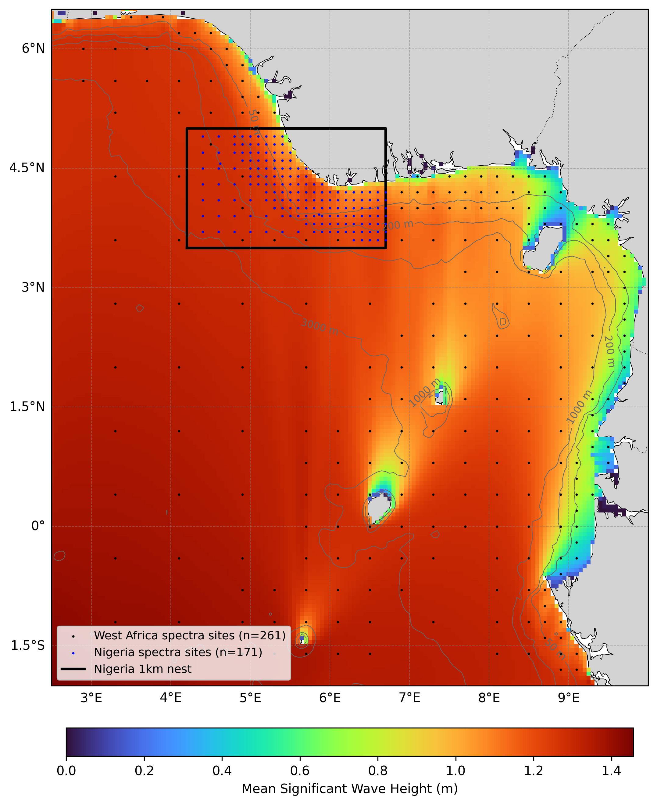

  

# Oceanum Nigeria ECMWF Wave Forecast

**February 2025**

| | |
|---|---|
| **Model** | SWAN 41.31 |
| **Forecast horizon** | 7 days |
| **Spatial resolution** | 0.05 degree (~5 km) to 0.01 degree (~1 km) |
| **Temporal resolution** | 1 hourly |
| **Region** | 2.5E - 10E, 2S - 6.5N |
| **Forcings** | ECMWF winds and Oceanum spectra |
| **Update frequency** | 12-hourly (00, 12 UTC) |

---

## Dataset description

The Nigeria wave forecast dataset provides operational wave predictions across the Gulf of Guinea and Nigerian coastal waters (Figure 1). Wave forecasts are produced using the SWAN (Simulating WAves Nearshore) third-generation spectral wave model, with a 7-day forecast horizon and 12-hourly updates (00, 12 UTC).

Wind forcing is provided by <a href="https://www.ecmwf.int/en/forecasts/datasets/open-data" target="_blank">ECMWF IFS Open Data</a>. Spectral boundary conditions are supplied by the Oceanum Global WW3 ECMWF wave forecast. Bathymetry is derived from <a href="https://www.gebco.net/data_and_products/gridded_bathymetry_data/" target="_blank">GEBCO 2025</a>.

The modelling setup employs the <a href="https://journals.ametsoc.org/view/journals/atot/29/9/jtech-d-11-00092_1.xml" target="_blank">ST6</a> source term parameterisations. Spectra are discretised into 36 directional bins and 32 frequency bins, covering a frequency range from 0.037 to 0.71 Hz with 10% logarithmic increments. The model features a two-level nesting structure:

- **West Africa 5 km** (0.05°): Regional parent domain covering 2.5E-10E, 2S-6.5N
- **Nigeria 1 km** (0.01°): High-resolution nest covering 4.2E-6.7E, 3.5N-5N

The dataset provides hourly forecast estimates for key ocean wave parameters (Table 2) including spectral quantities integrated over the full spectrum and for spectral partitions. Partitions are defined from an 8-second split (sea/swell) and from the Watershed method. Forecasts are archived for 30 days, and frequency-direction wave spectra are available at selected sites. Nowcast datasets are also available for the Nigeria 1 km domain, constructed by retaining the most recent data from each forecast cycle to provide a continuous near-real-time historical record.

**Figure 1.** Mean significant wave height (Hs) over the West Africa forecast domain.

---

## Validation

The wave model physics and calibration follow the same approach validated against satellite altimeter observations for Oceanum's West Africa hindcast domains. The ST6 source term parameterisation has been extensively validated for tropical Atlantic swell and locally generated wind wave conditions.

---

## Data description

**Table 1.** Data description.

| Field | Value |
|---|---|
| **Title** | Oceanum Nigeria wave forecast |
| **Institution** | <a href="https://oceanum.io" target="_blank">Oceanum</a> |
| **Access** | <a href="https://ui.datamesh.oceanum.io/" target="_blank">Oceanum Datamesh</a> |
| **Source** | <a href="https://swanmodel.sourceforge.io/" target="_blank">SWAN 41.31A</a> |
| **Source terms** | <a href="https://journals.ametsoc.org/view/journals/atot/29/9/jtech-d-11-00092_1.xml" target="_blank">ST6</a> |
| **Forecast horizon** | 7 days |
| **Update frequency** | 12-hourly (00, 12 UTC) |
| **Archive period** | 30 days |
| **Temporal resolution** | 1 hourly |
| **Spatial coverage (5km)** | [2.5E, 2S, 10E, 6.5N] at 0.05 degree |
| **Spatial coverage (1km)** | [4.2E, 3.5N, 6.7E, 5N] at 0.01 degree |
| **Frequency discretisation** | 32 frequencies between 0.037 - 0.71 Hz at 10% logarithmic increments |
| **Direction resolution** | 10 deg |
| **Bathymetry** | <a href="https://www.gebco.net/data_and_products/gridded_bathymetry_data/" target="_blank">GEBCO 2025</a> |
| **Winds** | <a href="https://www.ecmwf.int/en/forecasts/datasets/open-data" target="_blank">ECMWF IFS</a> |
| **Boundary** | Oceanum Global WW3 ECMWF wave forecast |

### Linked Datamesh datasources

#### Forecasts

**West Africa 5 km:**
- <a href="https://ui.datamesh.oceanum.io/datasource/oceanum_wave_ec_wafr5km_grid" target="_blank">Oceanum West Africa 5 km ECMWF wave forecast parameters</a>
- <a href="https://ui.datamesh.oceanum.io/datasource/oceanum_wave_ec_wafr5km_spec" target="_blank">Oceanum West Africa 5 km ECMWF wave forecast spectra</a>

**Nigeria 1 km:**
- <a href="https://ui.datamesh.oceanum.io/datasource/oceanum_wave_ec_nga1km_grid" target="_blank">Oceanum Nigeria 1 km ECMWF wave forecast parameters</a>
- <a href="https://ui.datamesh.oceanum.io/datasource/oceanum_wave_ec_nga1km_spec" target="_blank">Oceanum Nigeria 1 km ECMWF wave forecast spectra</a>

#### Nowcasts (continuous near-real-time archive)

**Nigeria 1 km:**
- <a href="https://ui.datamesh.oceanum.io/datasource/oceanum_wave_ec_nga1km_grid_nowcast" target="_blank">Oceanum Nigeria 1 km ECMWF wave nowcast parameters</a>
- <a href="https://ui.datamesh.oceanum.io/datasource/oceanum_wave_ec_nga1km_spec_nowcast" target="_blank">Oceanum Nigeria 1 km ECMWF wave nowcast spectra</a>

---

## Integrated parameters gridded output

Integrated wave parameters are stored hourly over the domain at the native model resolution. Table 2 describes long names and units of the gridded output parameters.

**Table 2.** Gridded output parameters.

| Variable | Long Name | Units |
|---|---|---|
| depth | depth below sea surface | m |
| dpm | mean direction at the spectral peak of wind and swell waves | degree |
| dpmsea | mean direction at the spectral peak of wind waves below 8 seconds period | degree |
| dpmswe | mean direction at the spectral peak of swell waves above 8 seconds period | degree |
| dspr | directional spreading of wind and swell waves | degree |
| hs | significant height of wind and swell waves | m |
| hsea | significant height of wind waves under 8 seconds period | m |
| hswe | significant height of swell waves above 8 seconds period | m |
| tm01 | mean wave period based on first moment | s |
| tm02 | mean wave period based on second moment | s |
| tps | peak period of wind and swell waves | s |
| tpssea | peak period of wind waves below 8 seconds period | s |
| tpsswe | peak period of swell waves above 8 seconds period | s |
| uwnd | eastward wind component at 10m | m/s |
| vwnd | northward wind component at 10m | m/s |

---

www.oceanum.science
