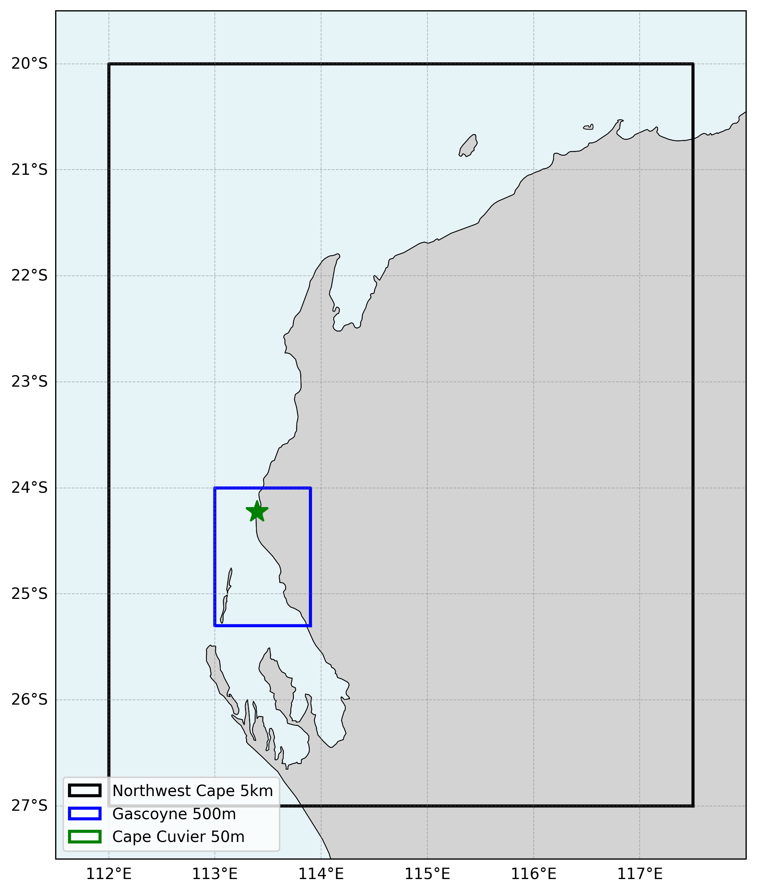

  

# Oceanum Northwest Cape Wave Forecast

**February 2025**

| | |
|---|---|
| **Model** | SWAN 41.31 |
| **Forecast horizon** | 7 days |
| **Spatial resolution** | 0.05 degree (~5 km) to 0.0005 degree (~50 m) |
| **Temporal resolution** | 1 hourly |
| **Region** | 112E - 117.5E, 27S - 20S |
| **Forcings** | GFS/ECMWF winds, Mercator/TPXO currents, and Oceanum spectra |
| **Update frequency** | 6-hourly (GFS) / 12-hourly (ECMWF) |

---

## Dataset description

The Northwest Cape wave forecast dataset provides operational wave predictions across the Northwest Cape region of Western Australia (Figure 1). The domain encompasses the Exmouth Gulf, Ningaloo Reef, and extends south to Cape Cuvier. Wave forecasts are produced using the SWAN (Simulating WAves Nearshore) third-generation spectral wave model, with a 7-day forecast horizon.

Two forcing configurations are available: <a href="https://www.ncep.noaa.gov/products/gfs/" target="_blank">NOAA GFS</a> updated every 6 hours (00, 06, 12, 18 UTC) and <a href="https://www.ecmwf.int/en/forecasts/datasets/open-data" target="_blank">ECMWF IFS</a> updated every 12 hours (00, 12 UTC). Ocean currents are prescribed from a combination of Mercator global ocean analysis and TPXO9 tidal atlas to capture both mesoscale circulation and tidal currents. Spectral boundary conditions are supplied by the Oceanum Global WW3 wave forecast forced with the respective wind source. Bathymetry is derived from the Australian Bathymetry and Topography 2024 250m grid.

The modelling setup employs the <a href="https://journals.ametsoc.org/view/journals/atot/29/9/jtech-d-11-00092_1.xml" target="_blank">ST6</a> source term parameterisations. Spectra are discretised into 36 directional bins and 32 frequency bins, covering a frequency range from 0.037 to 0.71 Hz with 10% logarithmic increments. The model features a three-level nesting structure:

- **Northwest Cape 5 km** (0.05°): Regional parent domain covering 112E-117.5E, 27S-20S
- **Gascoyne 500 m** (0.005°): Intermediate nest covering 113E-113.9E, 25.3S-24S
- **Cape Cuvier 50 m** (0.0005°): Ultra-high resolution nest covering 113.36E-113.435E, 24.25S-24.2S

The dataset provides hourly forecast estimates for key ocean wave parameters (Table 2) including spectral quantities integrated over the full spectrum and for spectral partitions. Partitions are defined from an 8-second split (sea/swell) and from the Watershed method, which identifies one wind-forced partition and up to two swell partitions. Forecasts are archived for 30 days, and frequency-direction wave spectra are available at selected sites in the Cape Cuvier 50 m domain. Nowcast datasets are also available for the Cape Cuvier domain, constructed by retaining the most recent data from each forecast cycle to provide a continuous near-real-time historical record.

**Figure 1.** Northwest Cape wave forecast domain extent showing the parent 5 km domain, intermediate Gascoyne 500 m domain, and nested Cape Cuvier 50 m domain.

---

## Validation

The wave model physics and calibration follow the same approach validated against satellite altimeter observations for Oceanum's Australian regional hindcast domains. The ST6 source term parameterisation has been extensively validated for Southern Ocean swell and tropical cyclone conditions affecting the Northwest Cape region.

---

## Data description

**Table 1.** Data description.

| Field | Value |
|---|---|
| **Title** | Oceanum Northwest Cape wave forecast |
| **Institution** | <a href="https://oceanum.io" target="_blank">Oceanum</a> |
| **Access** | <a href="https://ui.datamesh.oceanum.io/" target="_blank">Oceanum Datamesh</a> |
| **Source** | <a href="https://swanmodel.sourceforge.io/" target="_blank">SWAN 41.31A</a> |
| **Source terms** | <a href="https://journals.ametsoc.org/view/journals/atot/29/9/jtech-d-11-00092_1.xml" target="_blank">ST6</a> |
| **Forecast horizon** | 7 days |
| **Update frequency** | 6-hourly (GFS) / 12-hourly (ECMWF) |
| **Archive period** | 30 days |
| **Temporal resolution** | 1 hourly |
| **Spatial coverage (5km)** | [112E, 27S, 117.5E, 20S] at 0.05 degree |
| **Spatial coverage (500m)** | [113E, 25.3S, 113.9E, 24S] at 0.005 degree |
| **Spatial coverage (50m)** | [113.36E, 24.25S, 113.435E, 24.2S] at 0.0005 degree |
| **Frequency discretisation** | 32 frequencies between 0.037 - 0.71 Hz at 10% logarithmic increments |
| **Direction resolution** | 10 deg |
| **Bathymetry** | Australian Bathymetry and Topography 2024 250m Grid |
| **Winds** | <a href="https://www.ncep.noaa.gov/products/gfs/" target="_blank">NOAA GFS</a> / <a href="https://www.ecmwf.int/en/forecasts/datasets/open-data" target="_blank">ECMWF IFS</a> |
| **Currents** | <a href="https://data.marine.copernicus.eu/" target="_blank">Mercator Global Ocean Analysis</a> + <a href="https://www.tpxo.net/" target="_blank">TPXO9 Atlas</a> |
| **Boundary** | Oceanum Global WW3 wave forecast (GFS or ECMWF forced) |

### Linked Datamesh datasources

#### GFS-forced (6-hourly updates)

**Northwest Cape 5 km:**
- <a href="https://ui.datamesh.oceanum.io/datasource/oceanum_wave_gfs_nwcape5km_grid" target="_blank">Oceanum Northwest Cape 5 km GFS wave forecast parameters</a>

**Gascoyne 500 m:**
- <a href="https://ui.datamesh.oceanum.io/datasource/oceanum_wave_gfs_gascoy500m_grid" target="_blank">Oceanum Gascoyne 500 m GFS wave forecast parameters</a>

**Cape Cuvier 50 m:**
- <a href="https://ui.datamesh.oceanum.io/datasource/oceanum_wave_gfs_cuvier50m_grid" target="_blank">Oceanum Cape Cuvier 50 m GFS wave forecast parameters</a>
- <a href="https://ui.datamesh.oceanum.io/datasource/oceanum_wave_gfs_cuvier50m_spec" target="_blank">Oceanum Cape Cuvier 50 m GFS wave forecast spectra</a>

#### ECMWF-forced (12-hourly updates)

**Northwest Cape 5 km:**
- <a href="https://ui.datamesh.oceanum.io/datasource/oceanum_wave_ec_nwcape5km_grid" target="_blank">Oceanum Northwest Cape 5 km ECMWF wave forecast parameters</a>

**Gascoyne 500 m:**
- <a href="https://ui.datamesh.oceanum.io/datasource/oceanum_wave_ec_gascoy500m_grid" target="_blank">Oceanum Gascoyne 500 m ECMWF wave forecast parameters</a>

**Cape Cuvier 50 m:**
- <a href="https://ui.datamesh.oceanum.io/datasource/oceanum_wave_ec_cuvier50m_grid" target="_blank">Oceanum Cape Cuvier 50 m ECMWF wave forecast parameters</a>
- <a href="https://ui.datamesh.oceanum.io/datasource/oceanum_wave_ec_cuvier50m_spec" target="_blank">Oceanum Cape Cuvier 50 m ECMWF wave forecast spectra</a>

#### Nowcasts (continuous near-real-time archive)

**Cape Cuvier 50 m GFS:**
- <a href="https://ui.datamesh.oceanum.io/datasource/oceanum_wave_gfs_cuvier50m_grid_nowcast" target="_blank">Oceanum Cape Cuvier 50 m GFS wave nowcast parameters</a>
- <a href="https://ui.datamesh.oceanum.io/datasource/oceanum_wave_gfs_cuvier50m_spec_nowcast" target="_blank">Oceanum Cape Cuvier 50 m GFS wave nowcast spectra</a>

**Cape Cuvier 50 m ECMWF:**
- <a href="https://ui.datamesh.oceanum.io/datasource/oceanum_wave_ec_cuvier50m_grid_nowcast" target="_blank">Oceanum Cape Cuvier 50 m ECMWF wave nowcast parameters</a>
- <a href="https://ui.datamesh.oceanum.io/datasource/oceanum_wave_ec_cuvier50m_spec_nowcast" target="_blank">Oceanum Cape Cuvier 50 m ECMWF wave nowcast spectra</a>

---

## Integrated parameters gridded output

Integrated wave parameters are stored hourly over the domain at the native model resolution. Table 2 describes long names and units of the 21 gridded output parameters, including one wind-forced partition and two swell partitions from the Watershed method.

**Table 2.** Gridded output parameters.

| Variable | Long Name | Units |
|---|---|---|
| depth | depth below sea surface | m |
| dpm | mean direction at the spectral peak of wind and swell waves | degree |
| dpmsea | mean direction at the spectral peak of wind waves below 8 seconds period | degree |
| dpmswe | mean direction at the spectral peak of swell waves above 8 seconds period | degree |
| dspr | directional spreading of wind and swell waves | degree |
| fspr | normalised width of the frequency spectrum of wind and swell waves | - |
| hs | significant height of wind and swell waves | m |
| hsea | significant height of wind waves under 8 seconds period | m |
| hswe | significant height of swell waves above 8 seconds period | m |
| pdir0 | mean direction of wind waves (partition 0) | degree |
| pdir1 | mean direction of primary swell waves (partition 1) | degree |
| pdir2 | mean direction of secondary swell waves (partition 2) | degree |
| pdspr0 | directional spreading of wind waves (partition 0) | degree |
| pdspr1 | directional spreading of primary swell waves (partition 1) | degree |
| pdspr2 | directional spreading of secondary swell waves (partition 2) | degree |
| phs0 | significant height of wind waves (partition 0) | m |
| phs1 | significant height of primary swell waves (partition 1) | m |
| phs2 | significant height of secondary swell waves (partition 2) | m |
| ptp0 | peak period of wind waves (partition 0) | s |
| ptp1 | peak period of primary swell waves (partition 1) | s |
| ptp2 | peak period of secondary swell waves (partition 2) | s |
| pwlen0 | mean wavelength of wind waves (partition 0) | m |
| pwlen1 | mean wavelength of primary swell waves (partition 1) | m |
| pwlen2 | mean wavelength of secondary swell waves (partition 2) | m |
| tm01 | mean wave period based on first moment | s |
| tm02 | mean wave period based on second moment | s |
| tps | peak period of wind and swell waves | s |
| tpssea | peak period of wind waves below 8 seconds period | s |
| tpsswe | peak period of swell waves above 8 seconds period | s |
| uwnd | eastward wind component at 10m | m/s |
| vwnd | northward wind component at 10m | m/s |

---

www.oceanum.science
