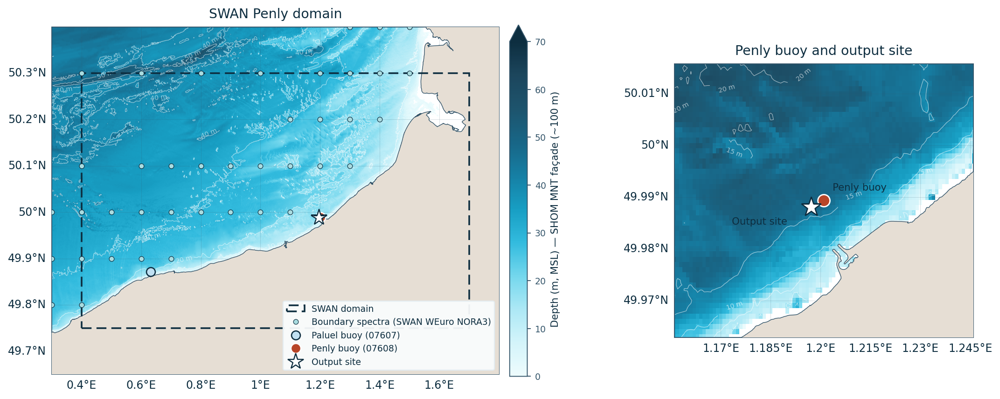
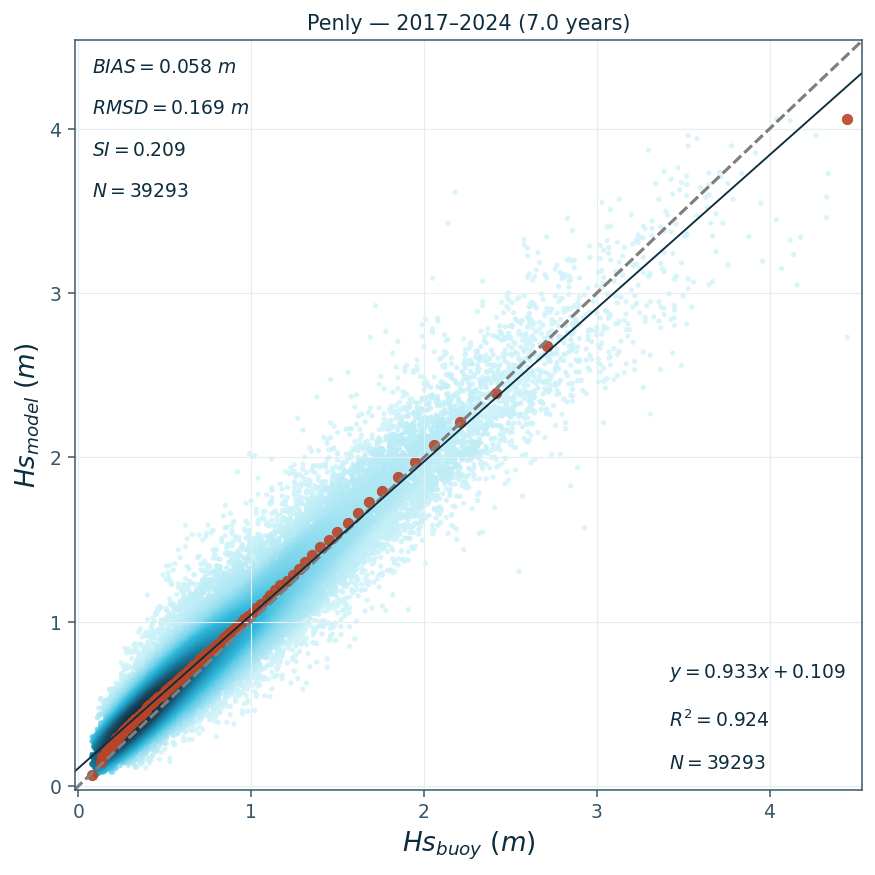
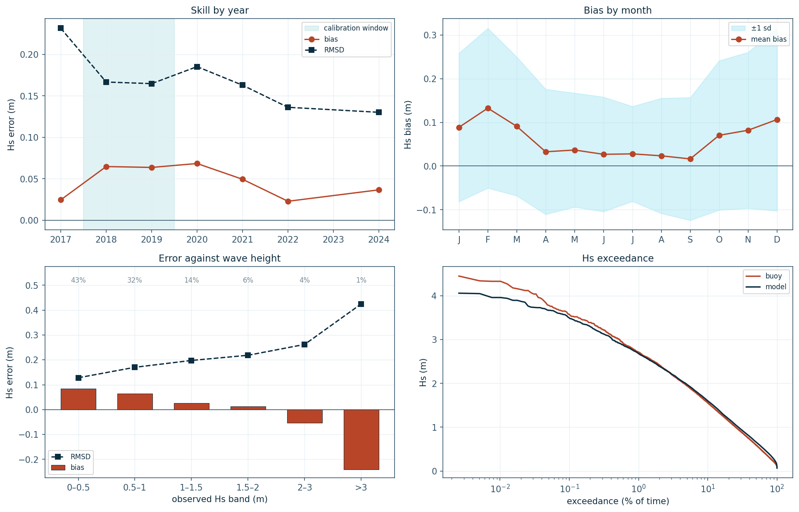

  

# Oceanum Penly NORA3 Wave Hindcast

<strong>July 2026</strong>

| | |
|---|---|
| **Model** | SWAN 41.31 |
| **Period** | Feb 1979 - Jul 2025 |
| **Spatial resolution** | 0.005 degree (~500 m) |
| **Temporal resolution** | 1 hourly |
| **Region** | 0.4E - 1.7E, 49.75N - 50.3N |
| **Forcings** | NORA3 winds, tidal currents/levels, and Oceanum spectra |

---

## Dataset description

The Penly NORA3 wave hindcast dataset provides high-resolution wave parameters for the Normandy coast of the eastern English Channel, France (Figure 1). The domain extends from 0.4°E to 1.7°E and from 49.75°N to 50.3°N, covering the chalk-cliff coastline between Fécamp and the Somme estuary, the nearshore waters off the Penly power station, and the adjacent open Channel waters to the north and west. This is a macrotidal, fetch-limited environment in which the wave climate is set largely by short-period wind seas generated within the Channel and southern North Sea. Wave spectra are computed over a 46-year period between February 1979 and July 2025 using the SWAN (Simulating WAves Nearshore) third-generation spectral wave model.

Wind forcing is provided by the <a href="https://thredds.met.no/thredds/catalog/nora3/catalog.html" target="_blank">NORA3 reanalysis</a> from the Norwegian Meteorological Institute, which resolves coastal wind patterns considerably better than global reanalyses, with ERA5 gap-filling where NORA3 is unavailable. The model is run with both time-varying water levels and depth-averaged tidal currents from the <a href="https://www.tpxo.net/global" target="_blank">TPXO9-atlas</a> global tide model, so that wave-current interaction and the tidal change in water depth are represented explicitly. Bathymetry is taken from the <a href="https://data.shom.fr/" target="_blank">SHOM MNT HOMONIM</a> ~100 m coastal product, referenced to mean sea level. Spectral boundary conditions are supplied around the full perimeter of the domain by the <a href="https://ui.datamesh.oceanum.io/datasource/oceanum_wave_weuro_nora3_v1_spec" target="_blank">Oceanum Western Europe NORA3 wave hindcast</a>.

The modelling setup employs the <a href="https://journals.ametsoc.org/view/journals/atot/29/9/jtech-d-11-00092_1.xml" target="_blank">ST6</a> source term parameterisations, with Collins bottom friction and swell dissipation active for this shallow, mixed sea-swell environment. Spectra are discretised into 36 directional bins and 32 frequency bins, covering a frequency range from 0.037 to 0.71 Hz with 10% logarithmic increments. The model runs on a regular 261 x 111 grid at 0.005 degree (~500 m) resolution, fine enough to resolve refraction and shoaling over the offshore banks and the nearshore depth gradient that controls conditions at the coast.

The dataset provides hourly estimates for wave parameters (Table 3) including spectral quantities integrated over the full spectrum and for sea and swell components split at an 8-second period, together with the wind and tidal current fields used to force the model. These data are stored over the entire grid at native resolution. Additionally, frequency-direction wave spectra are available at 4 output sites within the domain, including a site adjacent to the Penly wave buoy (Figure 1). The dataset supports coastal engineering design, metocean assessment, offshore renewable energy resource evaluation, navigation and marine operations planning along the Normandy coast.

**Figure 1.** Penly hindcast domain and SHOM MNT bathymetry, with the boundary spectra nodes taken from the Oceanum Western Europe NORA3 hindcast, the CANDHIS Penly and Paluel wave buoys, and the model output site. Right: the Penly buoy and the nearest spectra output site, 330 m apart.

---

## Validation

The production hindcast has been validated against the full archived record of the <a href="https://candhis.cerema.fr/" target="_blank">CANDHIS</a> wave buoy 07608 at Penly, moored in approximately 11 m of water 1.6 km offshore of the power station. The nearest model output site lies 330 m west-south-west of the buoy. The comparison uses the spectral significant wave height Hm0, which shares its definition with the SWAN `hs` output, with each model hour matched to the nearest buoy record within 15 minutes. Table 1 summarises the resulting error statistics over the 39,293 colocated hourly pairs spanning November 2017 to November 2024.

**Table 1.** Production hindcast significant wave height statistics against the full CANDHIS Penly buoy record.

| Buoy | Record | Pairs | Bias (m) | RMSD (m) | SI | MAD (m) | r | Slope |
|---|---|---|---|---|---|---|---|---|
| Penly (CANDHIS 07608) | Nov 2017 - Nov 2024 | 39,293 | +0.058 | 0.169 | 0.209 | 0.126 | 0.961 | 0.933 |

**Figure 2.** Modelled against observed significant wave height at the Penly buoy over the full seven-year record, coloured by point density. The black line is the least-squares fit, the dashed line 1:1, and the orange markers the quantile-quantile distribution.

The model configuration was tuned on 2018-2019 only, and its skill is stable well outside that window: annual bias remains between +0.023 and +0.068 m and correlation between 0.92 and 0.97 across every year with meaningful buoy coverage (Figure 3). Two residual patterns are worth noting for users. The bias is seasonal, reaching around +0.13 m in February against near zero in late summer, tracking the seasonal change in wave climate rather than any single condition. The error also changes sign with wave height: the small waves that make up around 75% of the record are slightly over-predicted, while the largest waves are under-predicted, with the modelled and observed exceedance distributions tracking each other closely below about 3 m and separating above it.

**Figure 3.** Hindcast skill at the Penly buoy. Clockwise from top left: stability year by year with the calibration window shaded; the seasonal cycle of the bias; the modelled and observed significant wave height exceedance distributions; and the error against wave height, labelled with each band's share of the record.

The wider Western Europe NORA3 model that supplies the boundary conditions can additionally be validated against satellite altimeter observations using the <a href="https://hindcast-satellite-validation-main-prod.apps.oceanum.io/" target="_blank">Oceanum Hindcast Satellite Validation App</a>.

Observations used in this validation are from the <a href="https://candhis.cerema.fr/" target="_blank">CANDHIS</a> national in-situ wave measurement database (buoy 07608, Penly), operated by <a href="https://www.cerema.fr/" target="_blank">Cerema</a> and distributed under the <a href="https://www.etalab.gouv.fr/licence-ouverte-open-licence/" target="_blank">Etalab open licence</a>.

---

## Data description

**Table 2.** Data description.

| Field | Value |
|---|---|
| **Title** | Oceanum Penly NORA3 wave hindcast |
| **Institution** | <a href="https://oceanum.io" target="_blank">Oceanum</a> |
| **Access** | <a href="https://ui.datamesh.oceanum.io/" target="_blank">Oceanum Datamesh</a> |
| **Source** | <a href="https://swanmodel.sourceforge.io/" target="_blank">SWAN 41.31A</a> |
| **Source terms** | <a href="https://journals.ametsoc.org/view/journals/atot/29/9/jtech-d-11-00092_1.xml" target="_blank">ST6</a> |
| **Temporal coverage** | 1979-02-01 to 2025-07-01 |
| **Temporal resolution** | 1 hourly |
| **Spatial coverage** | [0.4E, 49.75N, 1.7E, 50.3N] at 0.005 degree |
| **Spectra output sites** | 4 |
| **Frequency discretisation** | 32 frequencies between 0.037 - 0.71 Hz at 10% logarithmic increments |
| **Direction resolution** | 10 deg |
| **Bathymetry** | <a href="https://data.shom.fr/" target="_blank">SHOM MNT HOMONIM</a> (~100 m), referenced to mean sea level |
| **Winds** | <a href="https://thredds.met.no/thredds/catalog/nora3/catalog.html" target="_blank">NORA3 Reanalysis</a> (with ERA5 gap-filling) |
| **Currents** | <a href="https://www.tpxo.net/global" target="_blank">TPXO9-atlas</a> (tidal currents) |
| **Water levels** | <a href="https://www.tpxo.net/global" target="_blank">TPXO9-atlas</a> (tidal levels) |
| **Boundary** | <a href="https://ui.datamesh.oceanum.io/datasource/oceanum_wave_weuro_nora3_v1_spec" target="_blank">Oceanum Western Europe NORA3 hourly wave spectra</a> |

### Linked Datamesh datasources

- <a href="https://ui.datamesh.oceanum.io/datasource/oceanum_wave_penly_nora3_v1_grid" target="_blank">Oceanum Penly NORA3 500 m hourly wave parameters</a>
- <a href="https://ui.datamesh.oceanum.io/datasource/oceanum_wave_penly_nora3_v1_spec" target="_blank">Oceanum Penly NORA3 500 m hourly wave spectra</a>

---

## Integrated parameters gridded output

Integrated wave parameters are stored hourly over the domain at the native model resolution. Table 3 describes long names and units of all 15 gridded output parameters, including the sea and swell components split at an 8-second period and the wind and tidal current forcing fields.

**Table 3.** Gridded output parameters.

*Variable names link to the corresponding <a href="https://vocab.nerc.ac.uk/standard_name/" target="_blank">NERC Vocabulary Server</a> standard name where available. All parameters are defined on the `time`, `latitude` and `longitude` coordinates.*

| Variable | Long Name | Units |
|---|---|---|
| <a href="https://vocab.nerc.ac.uk/standard_name/sea_floor_depth_below_mean_sea_level/" target="_blank">botl</a> | depth below mean sea level | m |
| <a href="https://vocab.nerc.ac.uk/standard_name/sea_floor_depth_below_sea_surface/" target="_blank">depth</a> | depth below sea surface | m |
| <a href="https://vocab.nerc.ac.uk/standard_name/sea_surface_wave_from_direction_at_variance_spectral_density_maximum/" target="_blank">dpm</a> | mean direction at the spectral peak of wind and swell waves | degree |
| <a href="https://vocab.nerc.ac.uk/standard_name/sea_surface_wave_directional_spread/" target="_blank">dspr</a> | directional spreading of wind and swell waves | degree |
| fspr | normalised width of the frequency spectrum of wind and swell waves | - |
| <a href="https://vocab.nerc.ac.uk/standard_name/sea_surface_wave_significant_height/" target="_blank">hs</a> | significant height of wind and swell waves | m |
| <a href="https://vocab.nerc.ac.uk/standard_name/sea_surface_wind_wave_significant_height/" target="_blank">hsea</a> | significant height of wind waves under 8 seconds period | m |
| <a href="https://vocab.nerc.ac.uk/standard_name/sea_surface_swell_wave_significant_height/" target="_blank">hswe</a> | significant height of swell waves above 8 seconds period | m |
| <a href="https://vocab.nerc.ac.uk/standard_name/sea_surface_wave_mean_period_from_variance_spectral_density_first_frequency_moment/" target="_blank">tm01</a> | mean absolute wave period of wind and swell waves from the first frequency moment | s |
| <a href="https://vocab.nerc.ac.uk/standard_name/sea_surface_wave_mean_period_from_variance_spectral_density_second_frequency_moment/" target="_blank">tm02</a> | mean absolute wave period of wind and swell waves from the second frequency moment | s |
| <a href="https://vocab.nerc.ac.uk/standard_name/sea_surface_wave_period_at_variance_spectral_density_maximum/" target="_blank">tps</a> | smooth relative peak wave period of wind and swell waves | s |
| <a href="https://vocab.nerc.ac.uk/standard_name/eastward_sea_water_velocity/" target="_blank">xcur</a> | eastward component of tidal current velocity | m/s |
| <a href="https://vocab.nerc.ac.uk/standard_name/eastward_wind/" target="_blank">xwnd</a> | eastward component of wind velocity | m/s |
| <a href="https://vocab.nerc.ac.uk/standard_name/northward_sea_water_velocity/" target="_blank">ycur</a> | northward component of tidal current velocity | m/s |
| <a href="https://vocab.nerc.ac.uk/standard_name/northward_wind/" target="_blank">ywnd</a> | northward component of wind velocity | m/s |

---

## Spectra output

Frequency-direction wave spectra are stored hourly at the spectra output sites within the domain. Table 4 describes the spectra output variables, using the exact variable names served by Datamesh.

**Table 4.** Spectra output variables.

*Variable names link to the corresponding <a href="https://vocab.nerc.ac.uk/standard_name/" target="_blank">NERC Vocabulary Server</a> standard name where available. Spectra are defined on the `time`, `site`, `freq` and `dir` coordinates; `lon` and `lat` are per-site data variables giving each site's location.*

| Variable | Long Name | Units |
|---|---|---|
| <a href="https://vocab.nerc.ac.uk/standard_name/sea_surface_wave_directional_variance_spectral_density/" target="_blank">efth</a> | sea surface wave variance spectral density | m² s / deg |
| <a href="https://vocab.nerc.ac.uk/standard_name/sea_floor_depth_below_sea_surface/" target="_blank">dpt</a> | water depth | m |
| <a href="https://vocab.nerc.ac.uk/standard_name/wind_speed/" target="_blank">wspd</a> | wind speed | m/s |
| <a href="https://vocab.nerc.ac.uk/standard_name/wind_from_direction/" target="_blank">wdir</a> | wind direction | degree |
| <a href="https://vocab.nerc.ac.uk/standard_name/latitude/" target="_blank">lat</a> | latitude | degrees_north |
| <a href="https://vocab.nerc.ac.uk/standard_name/longitude/" target="_blank">lon</a> | longitude | degrees_east |

---

www.oceanum.science
