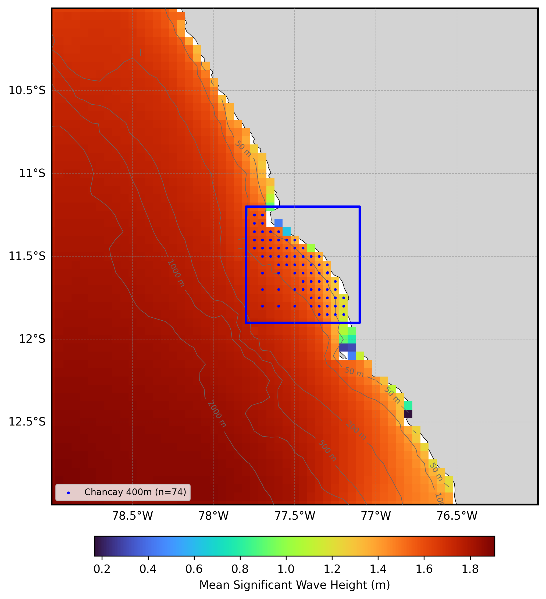

  

# Oceanum Peru ERA5 Wave Hindcast

**February 2025**

| | |
|---|---|
| **Model** | SWAN 41.31 |
| **Period** | Feb 1979 - Updating |
| **Spatial resolution** | 0.05 degree (Lima), 0.004 degree (Chancay) |
| **Temporal resolution** | 1 hourly |
| **Region** | 79W - 76W, 13S - 10S |
| **Forcings** | ERA5 winds and Oceanum spectra |

---

## Dataset description

The Peru wave hindcast dataset provides a detailed account of ocean wave parameters along the central Peruvian coast, covering the Lima metropolitan region and the port of Chancay (Figure 1). Wave spectra are computed over a 45+ year period between 1979 and present using the SWAN (Simulating WAves Nearshore) third-generation spectral wave model. The model is driven by inputs from the Oceanum Global Wave Model for spectral boundaries and <a href="https://www.ecmwf.int/en/forecasts/dataset/ecmwf-reanalysis-v5" target="_blank">ERA5 reanalysis winds</a> from the European Centre for Medium-Range Weather Forecasts. Bathymetry is derived from the <a href="https://www.gebco.net/data_and_products/gridded_bathymetry_data/gebco_2024/" target="_blank">GEBCO 2024</a> global bathymetric grid.

The modelling setup employs the <a href="https://journals.ametsoc.org/view/journals/atot/29/9/jtech-d-11-00092_1.xml" target="_blank">ST6</a> source term parameterisations. Spectra are discretised into 36 directional bins and 32 frequency bins, covering a frequency range from 0.037 to 0.71 Hz with 10% logarithmic increments. The parent domain features a regular grid with 5 km (0.05 degree) resolution covering the central Peruvian coast from approximately 10°S to 13°S. A higher-resolution nested domain provides detailed wave information for the Chancay port area:

- **Chancay (400 m)**: High-resolution domain covering the Chancay port and surrounding coastal waters

The dataset provides hourly estimates for ocean wave parameters (Table 2) including significant wave height, peak period, and mean direction for the full spectrum and sea/swell partitions. These data are stored over the entire grid at native resolution. Additionally, frequency-direction wave spectra are available at 74 sites for Chancay (see Figure 1).

**Figure 1.** Mean significant wave height from the Peru hindcast domain. The locations of 2D spectra hourly output are shown by the dots. The black box indicates the Lima 5km domain extent, and the blue box indicates the Chancay 400m nest. Depth contours are shown at 50m, 100m, 200m, 500m, 1000m, and 2000m.

---

## Validation

The wave hindcast can be validated against satellite altimeter observations using the <a href="https://hindcast-satellite-validation-main-prod.apps.oceanum.io/" target="_blank">Oceanum Hindcast Satellite Validation App</a>. This interactive tool allows users to compare modelled significant wave height against satellite altimeter measurements at any location within the model domain, providing density scatter plots, quantile comparisons, and statistical metrics.

---

## Data description

**Table 1.** Data description.

| Field | Value |
|---|---|
| **Title** | Oceanum Peru wave hindcast |
| **Institution** | <a href="https://oceanum.io" target="_blank">Oceanum</a> |
| **Access** | <a href="https://ui.datamesh.oceanum.io/" target="_blank">Oceanum Datamesh</a> |
| **Source** | <a href="https://swanmodel.sourceforge.io/" target="_blank">SWAN 41.31A</a> |
| **Source terms** | <a href="https://journals.ametsoc.org/view/journals/atot/29/9/jtech-d-11-00092_1.xml" target="_blank">ST6</a> |
| **Temporal coverage** | 1979-02-01 to present (updating) |
| **Temporal resolution** | Hourly |
| **Spatial coverage (Lima)** | [79W, 13S, 76W, 10S] at 0.05 degree |
| **Spatial coverage (Chancay)** | [77.8W, 11.9S, 77.1W, 11.2S] at 0.004 degree |
| **Spectra output sites (Chancay)** | 74 |
| **Frequency discretisation** | 32 frequencies between 0.037 - 0.71 Hz at 10% logarithmic increments |
| **Direction resolution** | 10 deg |
| **Bathymetry** | <a href="https://www.gebco.net/data_and_products/gridded_bathymetry_data/gebco_2024/" target="_blank">GEBCO 2024</a> |
| **Winds** | <a href="https://www.ecmwf.int/en/forecasts/dataset/ecmwf-reanalysis-v5" target="_blank">ERA5 Reanalysis</a> |
| **Boundary** | <a href="https://ui.datamesh.oceanum.io/datasource/oceanum_wave_glob05_era5_v1_spec" target="_blank">Oceanum Global WW3 ERA5 hourly wave spectra</a> |

### Linked Datamesh datasources

#### Lima (5 km)

- <a href="https://ui.datamesh.oceanum.io/datasource/oceanum_wave_lima_era5_grid" target="_blank">Oceanum Lima 5 km hourly wave parameters</a>
- <a href="https://ui.datamesh.oceanum.io/datasource/oceanum_wave_lima_era5_gridstats" target="_blank">Oceanum Lima 5 km gridded wave statistics</a>

#### Chancay (400 m)

- <a href="https://ui.datamesh.oceanum.io/datasource/oceanum_wave_chancay_era5_grid" target="_blank">Oceanum Chancay 400 m hourly wave parameters</a>
- <a href="https://ui.datamesh.oceanum.io/datasource/oceanum_wave_chancay_era5_spec" target="_blank">Oceanum Chancay 400 m hourly wave spectra</a>

---

## Integrated parameters gridded output

Integrated wave parameters are stored hourly over the domain at the native model resolution. Table 2 describes long names and units of the 15 gridded output parameters.

**Table 2.** Gridded output parameters.

| Variable | Long Name | Units |
|---|---|---|
| depth | depth below sea surface | m |
| dpm | mean direction at the spectral peak of wind and swell waves | degree |
| dpmsea | mean direction at the spectral peak of wind waves below 8 seconds period | degree |
| dpmswe | mean direction at the spectral peak of swell waves above 8 seconds period | degree |
| hs | significant height of wind and swell waves | m |
| hsea | significant height of wind waves under 8 seconds period | m |
| hswe | significant height of swell waves above 8 seconds period | m |
| tm01 | mean absolute wave period of wind and swell waves from the first frequency moment | s |
| tm02 | mean absolute wave period of wind and swell waves from the second frequency moment | s |
| tps | smooth relative peak wave period of wind and swell waves | s |
| tpssea | smooth relative peak wave period of wind waves below 8 seconds period | s |
| tpsswe | smooth relative peak wave period of swell waves above 8 seconds period | s |
| xwnd | eastward component of wind velocity | m/s |
| ywnd | northward component of wind velocity | m/s |

---

www.oceanum.science
