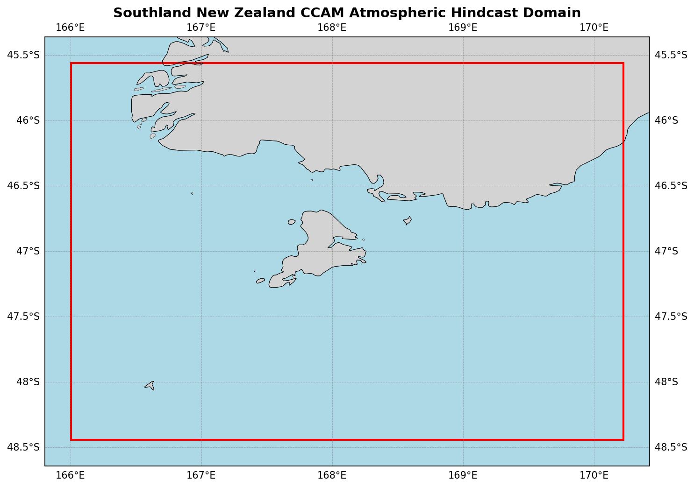

  

# Oceanum Southland New Zealand CCAM Atmospheric Hindcast

**February 2025**

| | |
|---|---|
| **Model** | CCAM |
| **Period** | Jan 2010 - Jan 2020 |
| **Spatial resolution** | 0.04 degree (~4 km) |
| **Temporal resolution** | 1 hourly |
| **Region** | 166.00E - 170.23E, 48.44S - 45.56S |
| **Forcing** | ERA5 reanalysis |

---

## Dataset description

The Southland New Zealand CCAM atmospheric hindcast provides high-resolution meteorological data over the Southland region of New Zealand's South Island (Figure 1). The domain encompasses Southland, Otago, and the surrounding coastal waters including Foveaux Strait and Stewart Island. This region experiences some of New Zealand's most challenging weather conditions, with strong westerly winds modified by the Southern Alps and complex interactions between maritime and continental air masses.

The dataset is produced using the <a href="https://www.ccrc.unsw.edu.au/ccam" target="_blank">Conformal Cubic Atmospheric Model (CCAM)</a>, a variable-resolution global atmospheric model developed by CSIRO. CCAM employs dynamical downscaling to simulate climate and weather at fine spatial resolutions while maintaining interaction with global circulation patterns. The model is forced by <a href="https://www.ecmwf.int/en/forecasts/dataset/ecmwf-reanalysis-v5" target="_blank">ERA5 reanalysis</a> from the European Centre for Medium-Range Weather Forecasts, providing consistent and accurate large-scale atmospheric forcing.

The 4 km resolution enables accurate representation of Southland's terrain and its influence on local atmospheric processes. Key features captured include the effects of the Southern Alps on westerly airflow, Foveaux Strait wind dynamics, orographic precipitation patterns, and the interaction between polar and mid-latitude weather systems. The model provides atmospheric variables at two height levels (10m and 150m), suitable for surface and boundary layer applications.

The dataset provides hourly estimates for a comprehensive suite of atmospheric variables (Table 2) including wind components, temperature, humidity, pressure fields, cloud properties, and precipitation. This dataset is suitable for applications including wind resource assessment, renewable energy planning, air quality modelling, and as atmospheric forcing for regional ocean and wave models such as the Oceanum Southland wave hindcast.

**Figure 1.** Southland New Zealand CCAM atmospheric hindcast domain extent. The model covers Southland, Otago, Foveaux Strait, and Stewart Island at 4km resolution.

---

## Data description

**Table 1.** Data description.

| Field | Value |
|---|---|
| **Title** | Oceanum Southland New Zealand CCAM atmospheric hindcast |
| **Institution** | <a href="https://oceanum.io" target="_blank">Oceanum</a> |
| **Access** | <a href="https://ui.datamesh.oceanum.io/" target="_blank">Oceanum Datamesh</a> |
| **Source** | <a href="https://www.ccrc.unsw.edu.au/ccam" target="_blank">CCAM (Conformal Cubic Atmospheric Model)</a> |
| **Temporal coverage** | 2010-01-01 to 2020-01-01 |
| **Temporal resolution** | 1 hourly |
| **Spatial coverage** | [166.00E, 48.44S, 170.23E, 45.56S] at 0.04 degree (~4 km) |
| **Vertical levels** | 10m, 150m |
| **Forcing** | <a href="https://www.ecmwf.int/en/forecasts/dataset/ecmwf-reanalysis-v5" target="_blank">ERA5 reanalysis</a> |

### Linked Datamesh datasources

- <a href="https://ui.datamesh.oceanum.io/datasource/oceanum_meteo_southland_nz_ccam_v1" target="_blank">Oceanum Southland NZ CCAM meteo hindcast</a>

---

## Output parameters

Atmospheric variables are stored hourly over the domain at the native model resolution. Table 2 describes the key output parameters.

**Table 2.** Output parameters.

| Variable | Long Name | Units |
|---|---|---|
| cbas_ave | average cloud base | sigma |
| cfrac | cloud fraction | - |
| clt | total cloud cover | % |
| hus | water vapour mixing ratio | kg/kg |
| huss | screen mixing ratio | kg/kg |
| orog | surface height | m |
| pr | precipitation | kg/m²/s |
| prc | convective precipitation | kg/m²/s |
| press | air pressure | hPa |
| prhmax | maximum hourly precip rate | kg/m²/s |
| prmax | maximum precipitation rate in a timestep | kg/m²/s |
| ps | surface pressure | Pa |
| psl | mean sea level pressure | Pa |
| rgn_ave | LW net at ground | W/m² |
| rh | relative humidity | % |
| rlds | LW downwelling at ground | W/m² |
| rsds | SW downwelling at ground | W/m² |
| sgn_ave | SW net at ground | W/m² |
| ta | air temperature | K |
| td | dew point temperature | K |
| theta | potential air temperature | K |
| ts | surface temperature | K |
| tsea | sea surface temperature | K |
| u10max | x-component max 10m wind | m/s |
| ua | zonal wind | m/s |
| uas | x-component 10m wind | m/s |
| va | meridional wind | m/s |
| vas | y-component 10m wind | m/s |
| zmla | PBL depth | m |
| zolnd | surface roughness | m |

---

www.oceanum.science
