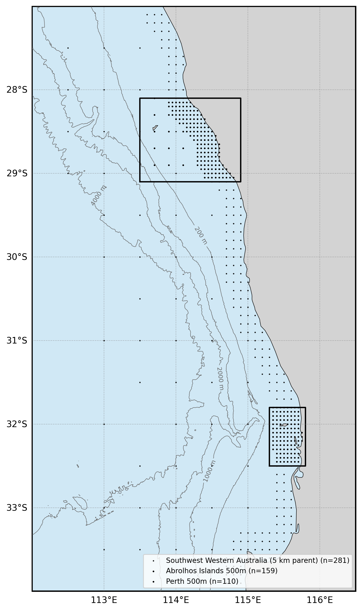
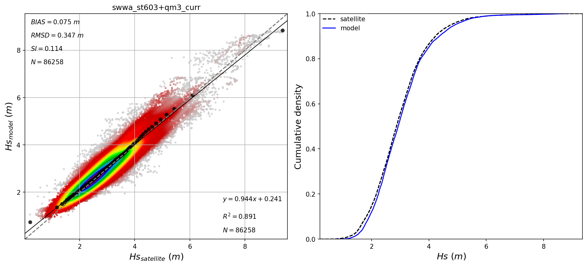
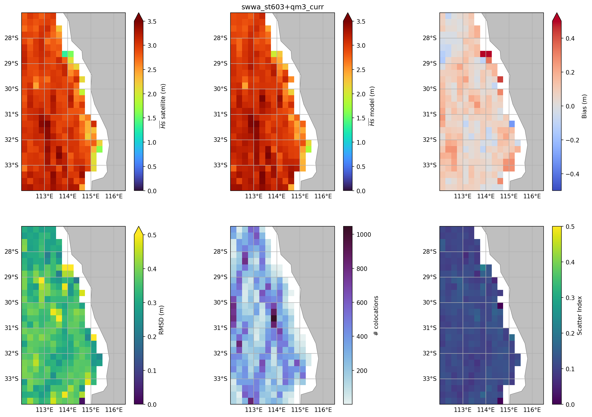

  

# Oceanum Southwest Western Australia Wave Forecast

**May 2026**

| | |
|---|---|
| **Model** | SWAN 41.31 |
| **Forecast horizon** | 7 days |
| **Spatial resolution** | 0.05 degree (~5 km) to 0.005 degree (~500 m) |
| **Temporal resolution** | 1 hourly |
| **Region** | 112E - 116.5E, 34S - 27S |
| **Forcings** | GFS/ECMWF winds, Mercator/TPXO9 currents, and Oceanum spectra |
| **Update frequency** | 6-hourly (GFS) / 12-hourly (ECMWF) |

---

## Dataset description

The Southwest Western Australia wave forecast dataset provides operational wave predictions across the southwestern and west coast of Western Australia (Figure 1). The domain extends from south of Cape Leeuwin and the Southern Ocean in the south, northward past the Margaret River region, Perth, Geraldton, the Abrolhos Islands, and into the waters of Shark Bay, encompassing some of Western Australia's most dynamic coastal environments. Wave forecasts are produced using the SWAN (Simulating WAves Nearshore) third-generation spectral wave model, with a 7-day forecast horizon.

Two forcing configurations are available: <a href="https://www.ncep.noaa.gov/products/gfs/" target="_blank">NOAA GFS</a> updated every 6 hours (00, 06, 12, 18 UTC) and <a href="https://www.ecmwf.int/en/forecasts/datasets/open-data" target="_blank">ECMWF IFS</a> updated every 12 hours (00, 12 UTC). Ocean currents are prescribed from a combination of Mercator global ocean analysis and TPXO9 tidal atlas to capture both mesoscale circulation and tidal currents. Spectral boundary conditions are supplied by the Oceanum Global WW3 wave forecast forced with the respective wind source. Bathymetry is derived from the Australian Bathymetry and Topography 2024 250m grid.

The modelling setup employs the <a href="https://journals.ametsoc.org/view/journals/atot/29/9/jtech-d-11-00092_1.xml" target="_blank">ST6</a> source term parameterisations. Spectra are discretised into 36 directional bins and 32 frequency bins, covering a frequency range from 0.037 to 0.71 Hz with 10% logarithmic increments. The model features a two-level nesting structure:

- **Southwest Western Australia 5 km** (0.05°): Regional parent domain covering 112–116.5°E, 34–27°S
- **Abrolhos Islands 500 m** (0.005°): High-resolution nest covering 113.5–114.9°E, 29.1–28.1°S
- **Perth 500 m** (0.005°): High-resolution nest covering 115.3–115.8°E, 32.5–31.8°S

The dataset provides hourly forecast estimates for key ocean wave parameters (Table 2) including spectral quantities integrated over the full spectrum and for spectral partitions. Partitions are defined from an 8-second split (sea/swell) and from the Watershed method, which identifies one wind-forced partition and up to three swell partitions. Forecasts are archived for 30 days, and frequency-direction wave spectra are available at selected sites across all domains. Nowcast datasets are also available, constructed by retaining the most recent data from each forecast cycle to provide a continuous near-real-time historical record.

**Figure 1.** Southwest Western Australia wave forecast domain extent. The bounding boxes of the Abrolhos Islands 500 m and Perth 500 m nested domains are outlined in black. Spectra output site locations are shown by black dots (281 sites in the parent domain, 159 sites in the Abrolhos Islands domain, and 110 sites in the Perth domain). Depth contours are shown at 200 m, 1000 m, 2000 m, and 4000 m.

---

## Validation

The wave model has been validated against satellite altimeter observations for the Southwest Western Australia domain. Figure 2 shows a density scatter plot comparing modelled significant wave height against satellite measurements, together with a cumulative distribution function comparison. The model shows good agreement with observations, with a bias of 0.06 m, RMSD of 0.37 m, scatter index of 0.12, and R² of 0.88 over 86,258 collocated observations.

**Figure 2.** Left: density scatter plot comparing modelled significant wave height against satellite altimeter observations for the Southwest Western Australia domain. Statistics shown include bias, RMSD, scatter index (SI), linear regression, and R². Right: cumulative distribution function comparison between satellite observations (dashed blue) and model (solid orange).

Figure 3 shows the spatial distribution of validation statistics across the domain.

**Figure 3.** Spatial validation statistics against satellite altimeter observations. Top row (left to right): observed mean significant wave height, modelled mean significant wave height, and bias. Bottom row: RMSD, number of collocated observations, and scatter index.

---

## Data description

**Table 1.** Data description.

| Field | Value |
|---|---|
| **Title** | Oceanum Southwest Western Australia wave forecast |
| **Institution** | <a href="https://oceanum.io" target="_blank">Oceanum</a> |
| **Access** | <a href="https://ui.datamesh.oceanum.io/" target="_blank">Oceanum Datamesh</a> |
| **Source** | <a href="https://swanmodel.sourceforge.io/" target="_blank">SWAN 41.31A</a> |
| **Source terms** | <a href="https://journals.ametsoc.org/view/journals/atot/29/9/jtech-d-11-00092_1.xml" target="_blank">ST6</a> |
| **Forecast horizon** | 7 days |
| **Update frequency** | 6-hourly (GFS) / 12-hourly (ECMWF) |
| **Archive period** | 30 days |
| **Temporal resolution** | 1 hourly |
| **Spatial coverage (5km)** | [112E, 34S, 116.5E, 27S] at 0.05 degree |
| **Spatial coverage (500m Abrolhos)** | [113.5E, 29.1S, 114.9E, 28.1S] at 0.005 degree |
| **Spatial coverage (500m Perth)** | [115.3E, 32.5S, 115.8E, 31.8S] at 0.005 degree |
| **Spectra sites (5km)** | 281 |
| **Spectra sites (500m Abrolhos)** | 159 |
| **Spectra sites (500m Perth)** | 110 |
| **Frequency discretisation** | 32 frequencies between 0.037 - 0.71 Hz at 10% logarithmic increments |
| **Direction resolution** | 10 deg |
| **Bathymetry** | Australian Bathymetry and Topography 2024 250m Grid |
| **Winds** | <a href="https://www.ncep.noaa.gov/products/gfs/" target="_blank">NOAA GFS</a> / <a href="https://www.ecmwf.int/en/forecasts/datasets/open-data" target="_blank">ECMWF IFS</a> |
| **Currents** | <a href="https://data.marine.copernicus.eu/" target="_blank">Mercator Global Ocean Analysis</a> + <a href="https://www.tpxo.net/" target="_blank">TPXO9 Atlas</a> |
| **Boundary** | Oceanum Global WW3 wave forecast (GFS or ECMWF forced) |

### Nested domains

| Domain | Resolution | Bounds | Spectra sites |
|--------|------------|--------|---------------|
| Southwest Western Australia | 0.05° (~5 km) | 112–116.5°E, 34–27°S | 281 |
| Abrolhos Islands | 0.005° (~500 m) | 113.5–114.9°E, 29.1–28.1°S | 159 |
| Perth | 0.005° (~500 m) | 115.3–115.8°E, 32.5–31.8°S | 110 |

### Linked Datamesh datasources

#### GFS-forced (6-hourly updates)

**Southwest Western Australia 5 km:**
- <a href="https://ui.datamesh.oceanum.io/datasource/oceanum_wave_gfs_swwa5km_grid" target="_blank">Oceanum Southwest Western Australia 5 km GFS wave forecast parameters</a>
- <a href="https://ui.datamesh.oceanum.io/datasource/oceanum_wave_gfs_swwa5km_spec" target="_blank">Oceanum Southwest Western Australia 5 km GFS wave forecast spectra</a>
- <a href="https://ui.datamesh.oceanum.io/datasource/oceanum_wave_gfs_swwa5km_grid_nowcast" target="_blank">Oceanum Southwest Western Australia 5 km GFS wave nowcast parameters</a>
- <a href="https://ui.datamesh.oceanum.io/datasource/oceanum_wave_gfs_swwa5km_spec_nowcast" target="_blank">Oceanum Southwest Western Australia 5 km GFS wave nowcast spectra</a>

**Abrolhos Islands 500 m:**
- <a href="https://ui.datamesh.oceanum.io/datasource/oceanum_wave_gfs_abrol500m_grid" target="_blank">Oceanum Abrolhos Islands 500 m GFS wave forecast parameters</a>
- <a href="https://ui.datamesh.oceanum.io/datasource/oceanum_wave_gfs_abrol500m_spec" target="_blank">Oceanum Abrolhos Islands 500 m GFS wave forecast spectra</a>
- <a href="https://ui.datamesh.oceanum.io/datasource/oceanum_wave_gfs_abrol500m_grid_nowcast" target="_blank">Oceanum Abrolhos Islands 500 m GFS wave nowcast parameters</a>
- <a href="https://ui.datamesh.oceanum.io/datasource/oceanum_wave_gfs_abrol500m_spec_nowcast" target="_blank">Oceanum Abrolhos Islands 500 m GFS wave nowcast spectra</a>

**Perth 500 m:**
- <a href="https://ui.datamesh.oceanum.io/datasource/oceanum_wave_gfs_perth500m_grid" target="_blank">Oceanum Perth 500 m GFS wave forecast parameters</a>
- <a href="https://ui.datamesh.oceanum.io/datasource/oceanum_wave_gfs_perth500m_spec" target="_blank">Oceanum Perth 500 m GFS wave forecast spectra</a>
- <a href="https://ui.datamesh.oceanum.io/datasource/oceanum_wave_gfs_perth500m_grid_nowcast" target="_blank">Oceanum Perth 500 m GFS wave nowcast parameters</a>
- <a href="https://ui.datamesh.oceanum.io/datasource/oceanum_wave_gfs_perth500m_spec_nowcast" target="_blank">Oceanum Perth 500 m GFS wave nowcast spectra</a>

#### ECMWF-forced (12-hourly updates)

**Southwest Western Australia 5 km:**
- <a href="https://ui.datamesh.oceanum.io/datasource/oceanum_wave_ec_swwa5km_grid" target="_blank">Oceanum Southwest Western Australia 5 km ECMWF wave forecast parameters</a>
- <a href="https://ui.datamesh.oceanum.io/datasource/oceanum_wave_ec_swwa5km_spec" target="_blank">Oceanum Southwest Western Australia 5 km ECMWF wave forecast spectra</a>
- <a href="https://ui.datamesh.oceanum.io/datasource/oceanum_wave_ec_swwa5km_grid_nowcast" target="_blank">Oceanum Southwest Western Australia 5 km ECMWF wave nowcast parameters</a>
- <a href="https://ui.datamesh.oceanum.io/datasource/oceanum_wave_ec_swwa5km_spec_nowcast" target="_blank">Oceanum Southwest Western Australia 5 km ECMWF wave nowcast spectra</a>

**Abrolhos Islands 500 m:**
- <a href="https://ui.datamesh.oceanum.io/datasource/oceanum_wave_ec_abrol500m_grid" target="_blank">Oceanum Abrolhos Islands 500 m ECMWF wave forecast parameters</a>
- <a href="https://ui.datamesh.oceanum.io/datasource/oceanum_wave_ec_abrol500m_spec" target="_blank">Oceanum Abrolhos Islands 500 m ECMWF wave forecast spectra</a>
- <a href="https://ui.datamesh.oceanum.io/datasource/oceanum_wave_ec_abrol500m_grid_nowcast" target="_blank">Oceanum Abrolhos Islands 500 m ECMWF wave nowcast parameters</a>
- <a href="https://ui.datamesh.oceanum.io/datasource/oceanum_wave_ec_abrol500m_spec_nowcast" target="_blank">Oceanum Abrolhos Islands 500 m ECMWF wave nowcast spectra</a>

**Perth 500 m:**
- <a href="https://ui.datamesh.oceanum.io/datasource/oceanum_wave_ec_perth500m_grid" target="_blank">Oceanum Perth 500 m ECMWF wave forecast parameters</a>
- <a href="https://ui.datamesh.oceanum.io/datasource/oceanum_wave_ec_perth500m_spec" target="_blank">Oceanum Perth 500 m ECMWF wave forecast spectra</a>
- <a href="https://ui.datamesh.oceanum.io/datasource/oceanum_wave_ec_perth500m_grid_nowcast" target="_blank">Oceanum Perth 500 m ECMWF wave nowcast parameters</a>
- <a href="https://ui.datamesh.oceanum.io/datasource/oceanum_wave_ec_perth500m_spec_nowcast" target="_blank">Oceanum Perth 500 m ECMWF wave nowcast spectra</a>

---

## Integrated parameters gridded output

Integrated wave parameters are stored hourly over the domain at the native model resolution. Table 2 describes long names and units of the 38 gridded output parameters, including one wind-forced partition and up to three swell partitions from the Watershed method.

**Table 2.** Gridded output parameters.

*All parameters are defined on the `time`, `latitude` and `longitude` coordinates.*

| Variable | Long Name | Units |
|---|---|---|
| depth | depth below sea surface | m |
| dpm | mean direction at the spectral peak of wind and swell waves | degree |
| dpmsea | mean direction at the spectral peak of wind waves below 8 seconds period | degree |
| dpmswe | mean direction at the spectral peak of swell waves above 8 seconds period | degree |
| dspr | directional spreading of wind and swell waves | degree |
| fspr | normalised width of the frequency spectrum of wind and swell waves | - |
| hs | significant height of wind and swell waves | m |
| hsea | significant height of wind waves under 8 seconds period | m |
| hswe | significant height of swell waves above 8 seconds period | m |
| pdir0 | mean direction of wind waves (partition 0) | degree |
| pdir1 | mean direction of primary swell waves (partition 1) | degree |
| pdir2 | mean direction of secondary swell waves (partition 2) | degree |
| pdir3 | mean direction of tertiary swell waves (partition 3) | degree |
| pdspr0 | directional spreading of wind waves (partition 0) | degree |
| pdspr1 | directional spreading of primary swell waves (partition 1) | degree |
| pdspr2 | directional spreading of secondary swell waves (partition 2) | degree |
| pdspr3 | directional spreading of tertiary swell waves (partition 3) | degree |
| phs0 | significant height of wind waves (partition 0) | m |
| phs1 | significant height of primary swell waves (partition 1) | m |
| phs2 | significant height of secondary swell waves (partition 2) | m |
| phs3 | significant height of tertiary swell waves (partition 3) | m |
| ptp0 | peak period of wind waves (partition 0) | s |
| ptp1 | peak period of primary swell waves (partition 1) | s |
| ptp2 | peak period of secondary swell waves (partition 2) | s |
| ptp3 | peak period of tertiary swell waves (partition 3) | s |
| pwlen0 | mean wavelength of wind waves (partition 0) | m |
| pwlen1 | mean wavelength of primary swell waves (partition 1) | m |
| pwlen2 | mean wavelength of secondary swell waves (partition 2) | m |
| pwlen3 | mean wavelength of tertiary swell waves (partition 3) | m |
| tm01 | mean wave period based on first moment | s |
| tm02 | mean wave period based on second moment | s |
| tps | peak period of wind and swell waves | s |
| tpssea | peak period of wind waves below 8 seconds period | s |
| tpsswe | peak period of swell waves above 8 seconds period | s |
| xwnd | eastward wind component at 10m | m/s |
| ywnd | northward wind component at 10m | m/s |
| xcur | eastward ocean current component | m/s |
| ycur | northward ocean current component | m/s |

---

## Spectra output

Frequency-direction wave spectra are stored hourly at selected sites across all domains: 281 sites in the Southwest Western Australia 5 km parent domain, 159 sites in the Abrolhos Islands 500 m domain, and 110 sites in the Perth 500 m domain. Spectra are discretised into 36 directional bins (10 degree resolution) and 32 frequency bins (0.037 - 0.71 Hz at 10% logarithmic increments).

**Table 3.** Spectra output parameters.

*Spectra are defined on the `time`, `site`, `freq` and `dir` coordinates; `lon` and `lat` are per-site data variables giving each site's location.*

| Variable | Long Name | Units |
|---|---|---|
| efth | sea surface wave variance spectral density | m² s / deg |
| dpt | water depth | m |
| wspd | wind speed | m/s |
| wdir | wind direction | degree |
| lat | latitude | degrees_north |
| lon | longitude | degrees_east |

---

www.oceanum.science
