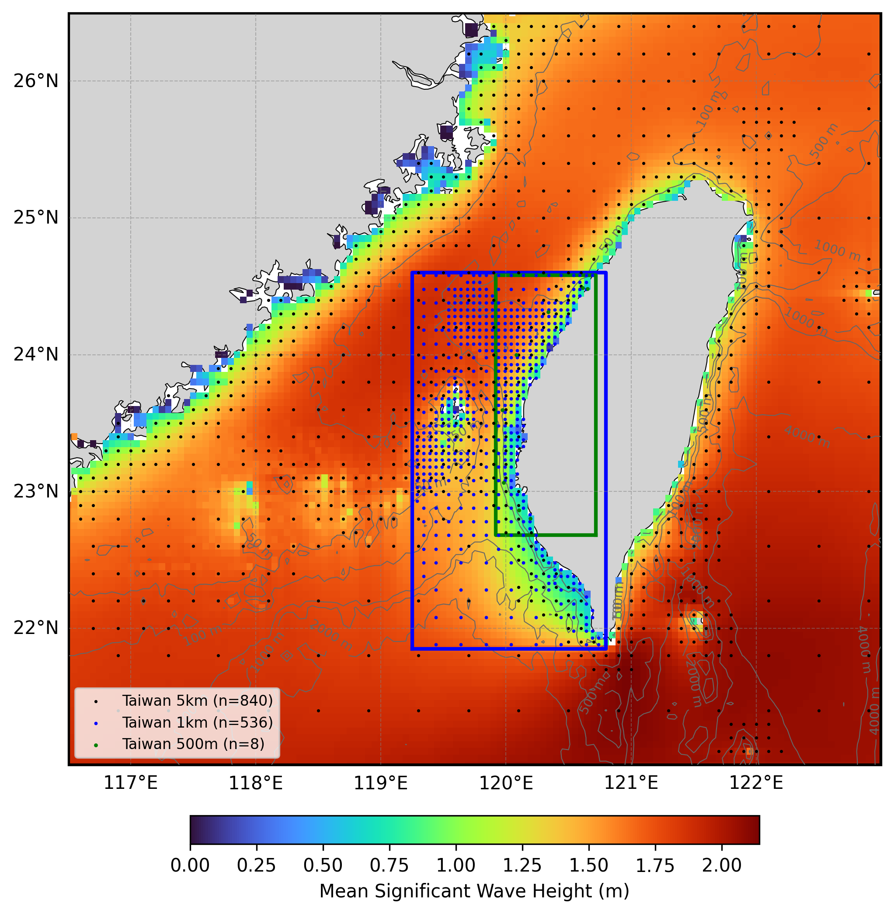

  

# Oceanum Taiwan ERA5 Wave Hindcast

**February 2025**

| | |
|---|---|
| **Model** | SWAN 41.31 |
| **Period** | Jan 1993 - Updating |
| **Spatial resolution** | 5 km / 1 km / 500 m / 100 m |
| **Temporal resolution** | 1 hourly |
| **Region** | 116.5E - 123E, 21N - 26.5N |
| **Forcings** | ERA5 winds, TPXO9/Glorys currents, and Oceanum spectra |

---

## Dataset description

The Taiwan wave hindcast dataset provides a detailed account of ocean wave parameters across the waters surrounding Taiwan (Figure 1). The domain encompasses the Taiwan Strait, the East China Sea to the north, the Philippine Sea to the east, and the South China Sea to the south. This region experiences a complex wave climate influenced by the East Asian monsoon system, typhoons, and the interaction between different sea basins. Wave spectra are computed over a 30+ year period between 1993 and present using the SWAN (Simulating WAves Nearshore) third-generation spectral wave model. The model is driven by inputs from the Oceanum Global Wave Model for spectral boundaries and <a href="https://www.ecmwf.int/en/forecasts/dataset/ecmwf-reanalysis-v5" target="_blank">ERA5 reanalysis winds</a> from the European Centre for Medium-Range Weather Forecasts. Wave-current interactions are included through coupling with tidal currents from <a href="https://www.tpxo.net/global/tpxo9-atlas" target="_blank">TPXO9 Atlas</a> merged with ocean currents from <a href="https://data.marine.copernicus.eu/product/GLOBAL_MULTIYEAR_PHY_001_030/description" target="_blank">Glorys reanalysis</a>. Bathymetry is derived from the <a href="https://www.gebco.net/data_and_products/gridded_bathymetry_data/gebco_2024/" target="_blank">GEBCO 2024</a> global bathymetric grid.

The modelling setup employs the <a href="https://journals.ametsoc.org/view/journals/atot/29/9/jtech-d-11-00092_1.xml" target="_blank">ST6</a> source term parameterisations. Spectra are discretised into 36 directional bins and 32 frequency bins, covering a frequency range from 0.037 to 0.71 Hz with 10% logarithmic increments. The model features a multi-resolution nested grid system:

- **Taiwan 5 km**: Parent domain covering the entire Taiwan region at 0.05 degree resolution
- **Taiwan 1 km**: Intermediate nest covering western Taiwan coastal waters at ~1 km resolution
- **Taiwan 500 m**: High-resolution nest covering the central western coast at 500 m resolution
- **Tungxiao 100 m**: Very high-resolution nest for the Tungxiao offshore wind farm area
- **Yongxin 100 m**: Very high-resolution nest for the Yongxin offshore wind farm area

The dataset provides hourly estimates for an extensive array of ocean wave parameters (Table 2) including spectral quantities integrated over the full spectrum and for spectral partitions (defined from an 8-second split and from the Watershed method). These data are stored over the entire grid at native resolution. Additionally, frequency-direction wave spectra are available at multiple sites across all domains (see Figure 1).

**Figure 1.** Mean significant wave height from the Taiwan hindcast domain. The locations of 2D spectra hourly output are shown by the dots. The black box indicates the Taiwan 5km domain extent, the blue box indicates the Taiwan 1km nest, and the green box indicates the Taiwan 500m nest. Depth contours are shown at 50m, 100m, 500m, 1000m, 2000m, and 4000m.

---

## Validation

The wave hindcast can be validated against satellite altimeter observations using the <a href="https://hindcast-satellite-validation-main-prod.apps.oceanum.io/" target="_blank">Oceanum Hindcast Satellite Validation App</a>. This interactive tool allows users to compare modelled significant wave height against satellite altimeter measurements at any location within the model domain, providing density scatter plots, quantile comparisons, and statistical metrics.

---

## Data description

**Table 1.** Data description.

| Field | Value |
|---|---|
| **Title** | Oceanum Taiwan ERA5 wave hindcast |
| **Institution** | <a href="https://oceanum.io" target="_blank">Oceanum</a> |
| **Access** | <a href="https://ui.datamesh.oceanum.io/" target="_blank">Oceanum Datamesh</a> |
| **Source** | <a href="https://swanmodel.sourceforge.io/" target="_blank">SWAN 41.31A</a> |
| **Source terms** | <a href="https://journals.ametsoc.org/view/journals/atot/29/9/jtech-d-11-00092_1.xml" target="_blank">ST6</a> |
| **Temporal coverage** | 1993-01-01 to present (updating) |
| **Temporal resolution** | 1 hourly |
| **Spatial coverage (5km)** | [116.5E, 21N, 123E, 26.5N] at 0.05 degree |
| **Spatial coverage (1km)** | [119.25E, 21.85N, 120.8E, 24.6N] at ~0.01 degree |
| **Spatial coverage (500m)** | [119.92E, 22.68N, 120.72E, 24.58N] at 0.005 degree |
| **Spatial coverage (Tungxiao 100m)** | [120.58E, 24.43N, 120.7E, 24.53N] at 0.001 degree |
| **Spatial coverage (Yongxin 100m)** | [120.07E, 22.77N, 120.23E, 22.9N] at 0.001 degree |
| **Spectra output sites** | 840 (5km) + 536 (1km) + 8 (500m) + 4 (100m nests) |
| **Frequency discretisation** | 32 frequencies between 0.037 - 0.71 Hz at 10% logarithmic increments |
| **Direction resolution** | 10 deg |
| **Bathymetry** | <a href="https://www.gebco.net/data_and_products/gridded_bathymetry_data/gebco_2024/" target="_blank">GEBCO 2024/2025 Grid</a> |
| **Winds** | <a href="https://www.ecmwf.int/en/forecasts/dataset/ecmwf-reanalysis-v5" target="_blank">ERA5 Reanalysis</a> |
| **Currents** | <a href="https://www.tpxo.net/global/tpxo9-atlas" target="_blank">TPXO9 Atlas</a> + <a href="https://data.marine.copernicus.eu/product/GLOBAL_MULTIYEAR_PHY_001_030/description" target="_blank">Glorys Reanalysis</a> |
| **Boundary** | <a href="https://ui.datamesh.oceanum.io/datasource/oceanum_wave_glob05_era5_v1_spec" target="_blank">Oceanum Global WW3 ERA5 hourly wave spectra</a> |

### Linked Datamesh datasources

#### Taiwan 5 km

- <a href="https://ui.datamesh.oceanum.io/datasource/oceanum_wave_twan5km_era5_grid" target="_blank">Oceanum Taiwan 5 km hourly wave parameters</a>
- <a href="https://ui.datamesh.oceanum.io/datasource/oceanum_wave_twan5km_era5_spec" target="_blank">Oceanum Taiwan 5 km hourly wave spectra</a>
- <a href="https://ui.datamesh.oceanum.io/datasource/oceanum_wave_twan5km_era5_gridstats" target="_blank">Oceanum Taiwan 5 km gridded wave statistics</a>

#### Taiwan 1 km

- <a href="https://ui.datamesh.oceanum.io/datasource/oceanum_wave_twan1km_era5_grid" target="_blank">Oceanum Taiwan 1 km hourly wave parameters</a>
- <a href="https://ui.datamesh.oceanum.io/datasource/oceanum_wave_twan1km_era5_spec" target="_blank">Oceanum Taiwan 1 km hourly wave spectra</a>
- <a href="https://ui.datamesh.oceanum.io/datasource/oceanum_wave_twan1km_era5_gridstats" target="_blank">Oceanum Taiwan 1 km gridded wave statistics</a>

#### Taiwan 500 m

- <a href="https://ui.datamesh.oceanum.io/datasource/oceanum_wave_twan500m_era5_grid" target="_blank">Oceanum Taiwan 500 m hourly wave parameters</a>
- <a href="https://ui.datamesh.oceanum.io/datasource/oceanum_wave_twan500m_era5_spec" target="_blank">Oceanum Taiwan 500 m hourly wave spectra</a>

#### Tungxiao 100 m

- <a href="https://ui.datamesh.oceanum.io/datasource/oceanum_wave_tung100m_era5_grid" target="_blank">Oceanum Tungxiao 100 m hourly wave parameters</a>
- <a href="https://ui.datamesh.oceanum.io/datasource/oceanum_wave_tung100m_era5_spec" target="_blank">Oceanum Tungxiao 100 m hourly wave spectra</a>

#### Yongxin 100 m

- <a href="https://ui.datamesh.oceanum.io/datasource/oceanum_wave_yong100m_era5_grid" target="_blank">Oceanum Yongxin 100 m hourly wave parameters</a>
- <a href="https://ui.datamesh.oceanum.io/datasource/oceanum_wave_yong100m_era5_spec" target="_blank">Oceanum Yongxin 100 m hourly wave spectra</a>

---

## Integrated parameters gridded output

Integrated wave parameters are stored hourly over the domain at the native model resolution. Table 2 describes long names and units of the gridded output parameters for the 5km and 1km domains, including one wind-forced partition and three swell partitions from the Watershed method.

**Table 2.** Gridded output parameters (5km/1km domains).

| Variable | Long Name | Units |
|---|---|---|
| depth | depth below sea surface | m |
| dpm | mean direction at the spectral peak of wind and swell waves | degree |
| dpmsea | mean direction at the spectral peak of wind waves below 8 seconds period | degree |
| dpmswe | mean direction at the spectral peak of swell waves above 8 seconds period | degree |
| dspr | directional spreading of wind and swell waves | degree |
| fspr | normalised width of the frequency spectrum of wind and swell waves | - |
| hs | significant height of wind and swell waves | m |
| hsea | significant height of wind waves under 8 seconds period | m |
| hswe | significant height of swell waves above 8 seconds period | m |
| pdir0 | mean direction of wind waves (partition 0) | degree |
| pdir1 | mean direction of primary swell waves (partition 1) | degree |
| pdir2 | mean direction of secondary swell waves (partition 2) | degree |
| pdir3 | mean direction of tertiary swell waves (partition 3) | degree |
| pdspr0 | directional spreading of wind waves (partition 0) | degree |
| pdspr1 | directional spreading of primary swell waves (partition 1) | degree |
| pdspr2 | directional spreading of secondary swell waves (partition 2) | degree |
| pdspr3 | directional spreading of tertiary swell waves (partition 3) | degree |
| phs0 | significant height of wind waves (partition 0) | m |
| phs1 | significant height of primary swell waves (partition 1) | m |
| phs2 | significant height of secondary swell waves (partition 2) | m |
| phs3 | significant height of tertiary swell waves (partition 3) | m |
| ptp0 | peak period of wind waves (partition 0) | s |
| ptp1 | peak period of primary swell waves (partition 1) | s |
| ptp2 | peak period of secondary swell waves (partition 2) | s |
| ptp3 | peak period of tertiary swell waves (partition 3) | s |
| pwlen0 | mean wavelength of wind waves (partition 0) | m |
| pwlen1 | mean wavelength of primary swell waves (partition 1) | m |
| pwlen2 | mean wavelength of secondary swell waves (partition 2) | m |
| pwlen3 | mean wavelength of tertiary swell waves (partition 3) | m |
| tm01 | mean absolute wave period of wind and swell waves from the first frequency moment | s |
| tm02 | mean absolute wave period of wind and swell waves from the second frequency moment | s |
| tps | smooth relative peak wave period of wind and swell waves | s |
| tpssea | smooth relative peak wave period of wind waves below 8 seconds period | s |
| tpsswe | smooth relative peak wave period of swell waves above 8 seconds period | s |
| ucur | eastward component of current velocity | m/s |
| vcur | northward component of current velocity | m/s |
| xwnd | eastward component of wind velocity | m/s |
| ywnd | northward component of wind velocity | m/s |

---

www.oceanum.science
