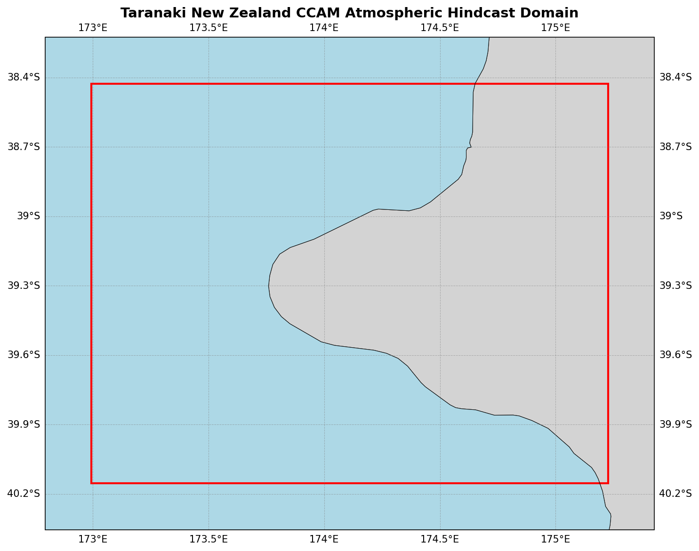

  

# Oceanum Taranaki New Zealand CCAM Atmospheric Hindcast

**February 2025**

| | |
|---|---|
| **Model** | CCAM |
| **Period** | Jan 2010 - Jan 2020 |
| **Spatial resolution** | 0.01 degree (~1 km) |
| **Temporal resolution** | 1 hourly |
| **Region** | 172.99E - 175.23E, 40.15S - 38.43S |
| **Forcing** | ERA5 reanalysis |

---

## Dataset description

The Taranaki New Zealand CCAM atmospheric hindcast provides very high-resolution meteorological data over the Taranaki region of New Zealand's North Island (Figure 1). The domain encompasses the Taranaki peninsula including Mount Taranaki (Egmont), the surrounding coastal waters of the North and South Taranaki Bights, and extends inland to capture the complex terrain interactions. Mount Taranaki's isolated volcanic cone (2,518 m) creates distinctive local wind patterns that are well-resolved at this resolution.

The dataset is produced using the <a href="https://www.ccrc.unsw.edu.au/ccam" target="_blank">Conformal Cubic Atmospheric Model (CCAM)</a>, a variable-resolution global atmospheric model developed by CSIRO. CCAM employs dynamical downscaling to simulate climate and weather at fine spatial resolutions while maintaining interaction with global circulation patterns. The model is forced by <a href="https://www.ecmwf.int/en/forecasts/dataset/ecmwf-reanalysis-v5" target="_blank">ERA5 reanalysis</a> from the European Centre for Medium-Range Weather Forecasts, providing consistent and accurate large-scale atmospheric forcing.

The very high 1 km resolution enables detailed representation of Mount Taranaki's volcanic cone and its significant influence on local wind patterns. Key features captured include flow separation around the mountain, lee effects and wake turbulence, thermally-driven circulations (anabatic and katabatic winds), and orographic cloud formation. The model provides atmospheric variables at three height levels (10m, 80m, and 150m), enabling vertical profiling relevant for wind energy applications.

The dataset provides hourly estimates for a comprehensive suite of atmospheric variables (Table 2) including wind components at multiple heights, temperature, humidity, pressure fields, cloud properties, precipitation, and solar radiation (DNI). This dataset is particularly suitable for wind and solar resource assessment, renewable energy planning, and as atmospheric forcing for regional ocean and wave models.

**Figure 1.** Taranaki New Zealand CCAM atmospheric hindcast domain extent. The model covers the Taranaki peninsula and surrounding waters at 1km resolution.

---

## Data description

**Table 1.** Data description.

| Field | Value |
|---|---|
| **Title** | Oceanum Taranaki New Zealand CCAM atmospheric hindcast |
| **Institution** | <a href="https://oceanum.io" target="_blank">Oceanum</a> |
| **Access** | <a href="https://ui.datamesh.oceanum.io/" target="_blank">Oceanum Datamesh</a> |
| **Source** | <a href="https://www.ccrc.unsw.edu.au/ccam" target="_blank">CCAM (Conformal Cubic Atmospheric Model)</a> |
| **Temporal coverage** | 2010-01-01 to 2020-01-01 |
| **Temporal resolution** | 1 hourly |
| **Spatial coverage** | [172.99E, 40.15S, 175.23E, 38.43S] at 0.01 degree (~1 km) |
| **Vertical levels** | 10m, 80m, 150m |
| **Forcing** | <a href="https://www.ecmwf.int/en/forecasts/dataset/ecmwf-reanalysis-v5" target="_blank">ERA5 reanalysis</a> |

### Linked Datamesh datasources

- <a href="https://ui.datamesh.oceanum.io/datasource/oceanum_meteo_taranaki_nz_ccam_v1" target="_blank">Oceanum Taranaki NZ CCAM meteo hindcast</a>

---

## Output parameters

Atmospheric variables are stored hourly over the domain at the native model resolution. Table 2 describes the key output parameters.

**Table 2.** Output parameters.

| Variable | Long Name | Units |
|---|---|---|
| cfrac | cloud fraction | - |
| clh | high cloud cover | % |
| cll | low cloud cover | % |
| clm | mid cloud cover | % |
| clt | total cloud cover | % |
| dni | direct normal irradiance | W/m² |
| hus | water vapour mixing ratio | kg/kg |
| huss | screen mixing ratio | kg/kg |
| orog | surface height | m |
| pr | precipitation | kg/m²/s |
| prc | convective precipitation | kg/m²/s |
| press | air pressure | hPa |
| prmax | maximum precipitation rate in a timestep | kg/m²/s |
| ps | surface pressure | Pa |
| psl | mean sea level pressure | Pa |
| rlds | LW downwelling at ground | W/m² |
| rnet | net radiation at surface | W/m² |
| rsds | SW downwelling at ground | W/m² |
| sgn_ave | SW net at ground | W/m² |
| ta | air temperature | K |
| td | dew point temperature | K |
| ts | surface temperature | K |
| tsea | sea surface temperature | K |
| u10max | x-component max 10m wind | m/s |
| ua | zonal wind | m/s |
| uas | x-component 10m wind | m/s |
| va | meridional wind | m/s |
| vas | y-component 10m wind | m/s |
| zg | geopotential height | m |
| zmla | PBL depth | m |
| zolnd | surface roughness | m |

---

www.oceanum.science
