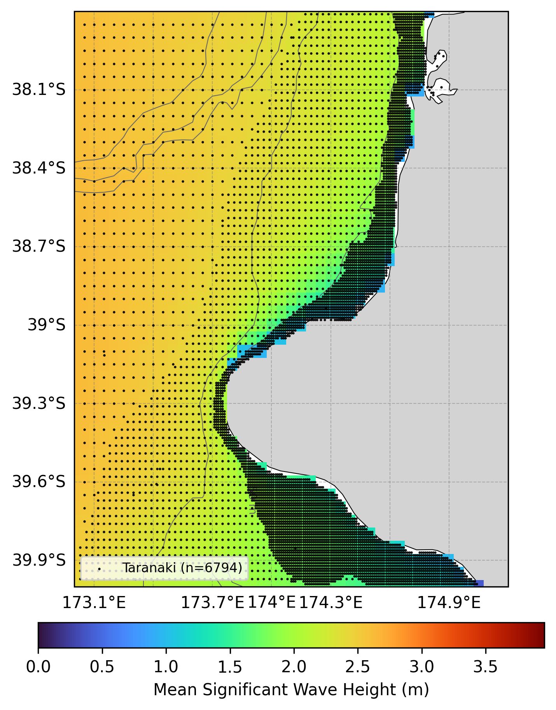

# Oceanum Taranaki Wave Hindcast Specification

**February 2025**

| | |
|---|---|
| **Model** | SWAN 41.31 |
| **Period** | Feb 1979 - Updating |
| **Spatial resolution** | 1 km (0.01 degree) |
| **Temporal resolution** | 3 hourly |
| **Region** | 173E - 175.2E, 40S - 37.8S |
| **Forcings** | ERA5 winds and Oceanum spectra |

---

## Dataset description

The Taranaki wave hindcast dataset provides a detailed account of ocean wave parameters across the Taranaki Bight and surrounding waters on the west coast of New Zealand's North Island (Figure 1). This region is characterised by the prominent Taranaki peninsula and Mount Taranaki, which influence local wind patterns and coastal wave dynamics. The area is exposed to energetic swell from the Tasman Sea and Southern Ocean, making it an important region for coastal engineering, port operations, and offshore energy development. Wave spectra are computed over a 45+ year period between 1979 and present using the SWAN (Simulating WAves Nearshore) third-generation spectral wave model. The model is driven by inputs from the <a href="https://ui.datamesh.oceanum.io/datasource/oceanum_wave_nz_era5_v1_spec" target="_blank">Oceanum New Zealand Wave Model</a> for spectral boundaries and <a href="https://www.ecmwf.int/en/forecasts/dataset/ecmwf-reanalysis-v5" target="_blank">ERA5 reanalysis winds</a> from the European Centre for Medium-Range Weather Forecasts. Bathymetry is derived from the <a href="https://www.gebco.net/data_and_products/gridded_bathymetry_data/" target="_blank">GEBCO 2020</a> global bathymetric grid.

The modelling setup employs the <a href="https://journals.ametsoc.org/view/journals/atot/29/9/jtech-d-11-00092_1.xml" target="_blank">ST6</a> source term parameterisations. Spectra are discretised into 36 directional bins and 32 frequency bins, covering a frequency range from 0.037 to 0.71 Hz with 10% logarithmic increments. The model features a regular grid with a 1 km (0.01 degree) resolution, providing detailed wave information for the Taranaki coastal region.

The dataset provides 3-hourly estimates for an extensive array of ocean wave parameters (Table 2) including spectral quantities integrated over the full spectrum and for spectral partitions. Partitions are defined from an 8-second split (sea/swell) and from the Watershed method, which identifies one wind-forced partition and up to three swell partitions. These data are stored over the entire grid at native resolution. Additionally, frequency-direction wave spectra are available at 6794 sites distributed across the domain (see Figure 1).

**Figure 1.** Mean significant wave height from the Taranaki hindcast domain. The locations of 2D spectra 3-hourly output are shown by the black dots. Depth contours are shown at 50m, 100m, 200m, 500m, and 1000m.

---

## Validation

The wave hindcast can be validated against satellite altimeter observations using the <a href="https://hindcast-satellite-validation-main-prod.apps.oceanum.io/" target="_blank">Oceanum Hindcast Satellite Validation App</a>. This interactive tool allows users to compare modelled significant wave height against satellite altimeter measurements at any location within the model domain, providing density scatter plots, quantile comparisons, and statistical metrics.

---

## Data description

**Table 1.** Data description.

| Field | Value |
|---|---|
| **Title** | Oceanum Taranaki wave hindcast |
| **Institution** | <a href="https://oceanum.io" target="_blank">Oceanum</a> |
| **Access** | <a href="https://ui.datamesh.oceanum.io/" target="_blank">Oceanum Datamesh</a> |
| **Source** | <a href="https://swanmodel.sourceforge.io/" target="_blank">SWAN 41.31A</a> |
| **Source terms** | <a href="https://journals.ametsoc.org/view/journals/atot/29/9/jtech-d-11-00092_1.xml" target="_blank">ST6</a> |
| **Temporal coverage** | 1979-02-01 to present (updating) |
| **Temporal resolution** | 3 hourly |
| **Spatial coverage** | [173E, 40S, 175.2E, 37.8S] at 0.01 degree |
| **Spectra output sites** | 6794 |
| **Frequency discretisation** | 32 frequencies between 0.037 - 0.71 Hz at 10% logarithmic increments |
| **Direction resolution** | 10 deg |
| **Bathymetry** | <a href="https://www.gebco.net/data_and_products/gridded_bathymetry_data/" target="_blank">GEBCO 2020 Grid</a> |
| **Winds** | <a href="https://www.ecmwf.int/en/forecasts/dataset/ecmwf-reanalysis-v5" target="_blank">ERA5 Reanalysis</a> |
| **Boundary** | <a href="https://ui.datamesh.oceanum.io/datasource/oceanum_wave_nz_era5_v1_spec" target="_blank">Oceanum New Zealand 5 km 3-hourly wave spectra</a> |

### Linked Datamesh datasources

- <a href="https://ui.datamesh.oceanum.io/datasource/oceanum_wave_trki_era5_v1_grid" target="_blank">Oceanum Taranaki 1 km 3-hourly wave parameters</a>
- <a href="https://ui.datamesh.oceanum.io/datasource/oceanum_wave_trki_era5_v1_spec" target="_blank">Oceanum Taranaki 1 km 3-hourly wave spectra</a>

---

## Integrated parameters gridded output

Integrated wave parameters are stored 3-hourly over the domain at the native model resolution. Table 2 describes long names and units of the 39 gridded output parameters, including one wind-forced partition and three swell partitions from the Watershed method.

**Table 2.** Gridded output parameters.

| Variable | Long Name | Units |
|---|---|---|
| botlev | bottom level below mean sea level | m |
| depth | depth below sea surface | m |
| dpm | mean direction at the spectral peak of wind and swell waves | degree |
| dpmsea | mean direction at the spectral peak of wind waves below 8 seconds period | degree |
| dpmswe | mean direction at the spectral peak of swell waves above 8 seconds period | degree |
| dspr | directional spreading of wind and swell waves | degree |
| fspr | normalised width of the frequency spectrum of wind and swell waves | - |
| hs | significant height of wind and swell waves | m |
| hsea | significant height of wind waves under 8 seconds period | m |
| hswe | significant height of swell waves above 8 seconds period | m |
| pdir0 | mean direction of wind waves (partition 0) | degree |
| pdir1 | mean direction of primary swell waves (partition 1) | degree |
| pdir2 | mean direction of secondary swell waves (partition 2) | degree |
| pdir3 | mean direction of tertiary swell waves (partition 3) | degree |
| pdspr0 | directional spreading of wind waves (partition 0) | degree |
| pdspr1 | directional spreading of primary swell waves (partition 1) | degree |
| pdspr2 | directional spreading of secondary swell waves (partition 2) | degree |
| pdspr3 | directional spreading of tertiary swell waves (partition 3) | degree |
| phs0 | significant height of wind waves (partition 0) | m |
| phs1 | significant height of primary swell waves (partition 1) | m |
| phs2 | significant height of secondary swell waves (partition 2) | m |
| phs3 | significant height of tertiary swell waves (partition 3) | m |
| ptp0 | peak period of wind waves (partition 0) | s |
| ptp1 | peak period of primary swell waves (partition 1) | s |
| ptp2 | peak period of secondary swell waves (partition 2) | s |
| ptp3 | peak period of tertiary swell waves (partition 3) | s |
| pwlen0 | mean wavelength of wind waves (partition 0) | m |
| pwlen1 | mean wavelength of primary swell waves (partition 1) | m |
| pwlen2 | mean wavelength of secondary swell waves (partition 2) | m |
| pwlen3 | mean wavelength of tertiary swell waves (partition 3) | m |
| qb | fraction of breaking waves | - |
| tm01 | mean absolute wave period of wind and swell waves from the first frequency moment | s |
| tm02 | mean absolute wave period of wind and swell waves from the second frequency moment | s |
| tps | smooth relative peak wave period of wind and swell waves | s |
| tpssea | smooth relative peak wave period of wind waves below 8 seconds period | s |
| tpsswe | smooth relative peak wave period of swell waves above 8 seconds period | s |
| xwnd | eastward component of wind velocity | m/s |
| ywnd | northward component of wind velocity | m/s |

---

www.oceanum.science
