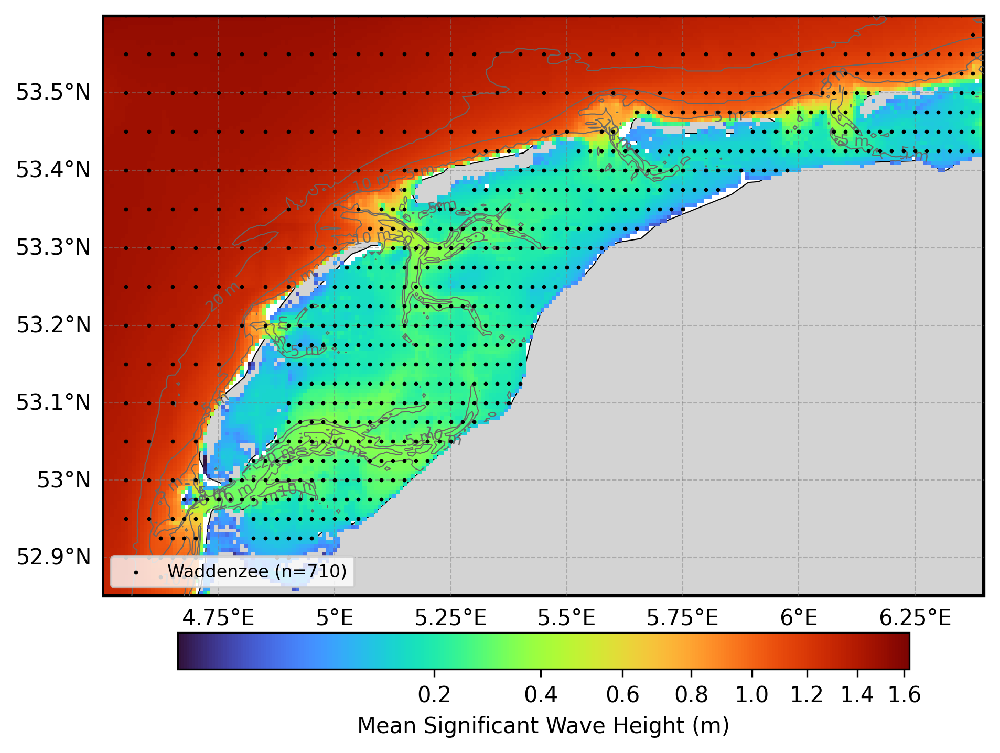
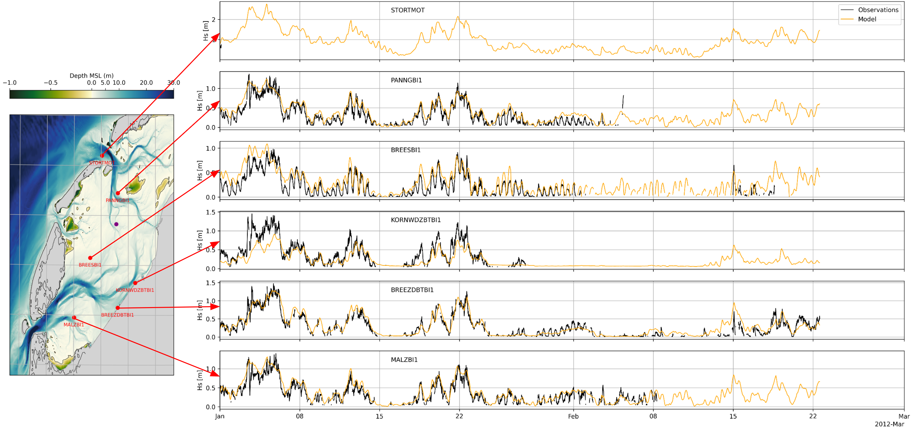

# Oceanum Waddenzee NORA3 Wave Hindcast Specification

**February 2025**

| | |
|---|---|
| **Model** | SWAN 41.31 |
| **Period** | Jan 1993 - Jan 2025 |
| **Spatial resolution** | 500 m (0.008° x 0.005°) |
| **Temporal resolution** | 1 hourly |
| **Region** | 4.5E - 6.4E, 52.85N - 53.6N |
| **Forcings** | NORA3 winds, calibrated water levels/currents, and Oceanum spectra |

---

## Dataset description

The Waddenzee NORA3 wave hindcast dataset provides high-resolution wave parameters for the Wadden Sea, a unique shallow tidal flat system along the Dutch and German North Sea coast (Figure 1). The Wadden Sea is characterised by extensive intertidal flats, barrier islands, and complex bathymetry that creates challenging conditions for wave modelling. Wave spectra are computed over a 30+ year period between 1993 and present using the SWAN (Simulating WAves Nearshore) third-generation spectral wave model.

This hindcast is distinguished by several specialized features for accurate shallow water wave modelling:

- **High-resolution NORA3 winds**: The <a href="https://thredds.met.no/thredds/catalog/nora3/catalog.html" target="_blank">NORA3 reanalysis</a> from the Norwegian Meteorological Institute provides superior representation of coastal wind patterns compared to global reanalyses, with ERA5 gap-filling where needed.
- **Calibrated water levels**: Water levels combine tidal constituents from the Oceanum Waddenzee tide model with bias-corrected sea surface height from <a href="https://data.marine.copernicus.eu/product/GLOBAL_MULTIYEAR_PHY_001_030" target="_blank">Glorys reanalysis</a>, providing accurate representation of tidal modulation critical for shallow water wave dynamics.
- **Tidal currents**: Current velocities merge tidal constituents with Glorys reanalysis currents to capture wave-current interactions.
- **High-resolution bathymetry**: Bathymetry is derived from 20m resolution data from <a href="https://viewer.openearth.nl/ihm-viewer/?layers=148390258&layerNames=Bathymetry%20Netherlands%20-%20coastal%20and%20trellis%20bearings%2020%20mtr.&folders=85223017,85223036,crITziq3QgqEU-fjGDU2ow" target="_blank">OpenEarth</a>, combined with GEBCO in areas where local data was unavailable. This captures the complex tidal flat morphology essential for accurate shallow water wave modelling.

Spectral boundaries are provided by the <a href="https://ui.datamesh.oceanum.io/datasource/oceanum_wave_weuro_nora3_v1_spec" target="_blank">Oceanum Western Europe NORA3 Wave Model</a>. The modelling setup employs the <a href="https://journals.ametsoc.org/view/journals/atot/29/9/jtech-d-11-00092_1.xml" target="_blank">ST6</a> source term parameterisations. Spectra are discretised into 36 directional bins and 43 frequency bins, covering a frequency range from 0.037 to 2.03 Hz with 10% logarithmic increments. The extended frequency range captures the short-period wind waves characteristic of fetch-limited shallow seas. The model features a high-resolution grid with approximately 500m resolution (0.008° x 0.005°).

The dataset provides hourly estimates for wave parameters (Table 2) including spectral quantities integrated over the full spectrum and for spectral partitions from the Watershed method. These data are stored over the entire grid at native resolution. Additionally, frequency-direction wave spectra are available at 710 sites distributed across the domain (see Figure 1).

**Figure 1.** Mean significant wave height from the Waddenzee NORA3 hindcast domain. The locations of 2D spectra hourly output are shown by the black dots. Depth contours are shown at 5m, 10m, 20m, and 50m.

---

## Validation

The wave hindcast has been validated against in-situ wave observations from buoys within the Wadden Sea (Figure 2). The validation demonstrates good agreement between modelled and observed significant wave height across multiple stations, capturing both the magnitude and temporal variability of wave conditions in this complex shallow water environment.

**Figure 2.** Validation of modelled significant wave height (black) against observations (orange) at multiple stations within the Wadden Sea for January-February 2012. Station locations are shown on the map (left).

---

## Data description

**Table 1.** Data description.

| Field | Value |
|---|---|
| **Title** | Oceanum Waddenzee NORA3 wave hindcast |
| **Institution** | <a href="https://oceanum.io" target="_blank">Oceanum</a> |
| **Access** | <a href="https://ui.datamesh.oceanum.io/" target="_blank">Oceanum Datamesh</a> |
| **Source** | <a href="https://swanmodel.sourceforge.io/" target="_blank">SWAN 41.31A</a> |
| **Source terms** | <a href="https://journals.ametsoc.org/view/journals/atot/29/9/jtech-d-11-00092_1.xml" target="_blank">ST6</a> |
| **Temporal coverage** | 1993-01-01 to 2025-01-01 |
| **Temporal resolution** | 1 hourly |
| **Spatial coverage** | [4.5E, 52.85N, 6.4E, 53.6N] at 0.008° x 0.005° |
| **Spectra output sites** | 710 |
| **Frequency discretisation** | 43 frequencies between 0.037 - 2.03 Hz at 10% logarithmic increments |
| **Direction resolution** | 10 deg |
| **Bathymetry** | <a href="https://viewer.openearth.nl/ihm-viewer/?layers=148390258" target="_blank">OpenEarth 20m</a> + GEBCO |
| **Winds** | <a href="https://thredds.met.no/thredds/catalog/nora3/catalog.html" target="_blank">NORA3 Reanalysis</a> (with ERA5 gap-filling) |
| **Currents** | Oceanum Waddenzee Tide + Glorys reanalysis |
| **Water levels** | Oceanum Waddenzee Tide + Glorys reanalysis (bias-corrected) |
| **Boundary** | <a href="https://ui.datamesh.oceanum.io/datasource/oceanum_wave_weuro_nora3_v1_spec" target="_blank">Oceanum Western Europe NORA3 hourly wave spectra</a> |

### Linked Datamesh datasources

- <a href="https://ui.datamesh.oceanum.io/datasource/oceanum_wave_waddenzee_nora3_v1_grid" target="_blank">Oceanum Waddenzee NORA3 500m hourly wave parameters</a>
- <a href="https://ui.datamesh.oceanum.io/datasource/oceanum_wave_waddenzee_nora3_v1_spec" target="_blank">Oceanum Waddenzee NORA3 500m hourly wave spectra</a>

---

## Integrated parameters gridded output

Integrated wave parameters are stored hourly over the domain at the native model resolution. Table 2 describes long names and units of the 24 gridded output parameters, including one wind-forced partition and one swell partition from the Watershed method.

**Table 2.** Gridded output parameters.

| Variable | Long Name | Units |
|---|---|---|
| botlev | bottom level below mean sea level | m |
| depth | depth below sea surface | m |
| dpm | mean direction at the spectral peak of wind and swell waves | degree |
| dspr | directional spreading of wind and swell waves | degree |
| fspr | normalised width of the frequency spectrum of wind and swell waves | - |
| hs | significant height of wind and swell waves | m |
| pdir0 | mean direction of wind waves (partition 0) | degree |
| pdir1 | mean direction of primary swell waves (partition 1) | degree |
| pdspr0 | directional spreading of wind waves (partition 0) | degree |
| pdspr1 | directional spreading of primary swell waves (partition 1) | degree |
| phs0 | significant height of wind waves (partition 0) | m |
| phs1 | significant height of primary swell waves (partition 1) | m |
| ptp0 | peak period of wind waves (partition 0) | s |
| ptp1 | peak period of primary swell waves (partition 1) | s |
| pwlen0 | mean wavelength of wind waves (partition 0) | m |
| pwlen1 | mean wavelength of primary swell waves (partition 1) | m |
| tm01 | mean absolute wave period of wind and swell waves from the first frequency moment | s |
| tm02 | mean absolute wave period of wind and swell waves from the second frequency moment | s |
| tps | smooth relative peak wave period of wind and swell waves | s |
| ucur | eastward component of current velocity | m/s |
| vcur | northward component of current velocity | m/s |
| xwnd | eastward component of wind velocity | m/s |
| ywnd | northward component of wind velocity | m/s |

---

www.oceanum.science
