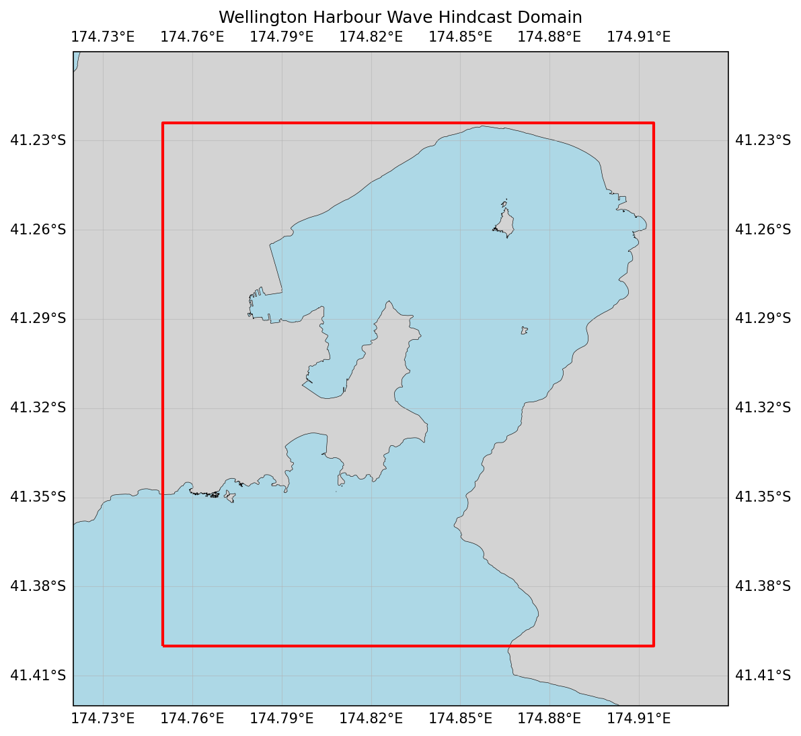

  

# Oceanum Wellington Harbour CLIFLO Wave Hindcast

**February 2025**

| | |
|---|---|
| **Model** | SWAN 41.31 |
| **Period** | Feb 1979 - Jan 2018 |
| **Spatial resolution** | 0.0005 degree (~50 m) |
| **Temporal resolution** | 1 hourly |
| **Region** | 174.75E - 174.915E, 41.4S - 41.224S |
| **Forcings** | CLIFLO winds, tidal currents, and Oceanum spectra |

---

## Dataset description

The Wellington Harbour wave hindcast dataset provides an ultra-high resolution account of ocean wave parameters across Wellington Harbour and adjacent Cook Strait waters (Figure 1). The domain encompasses the complete harbour basin including Evans Bay, Lambton Harbour, and the entrance channel connecting to Cook Strait. Wave spectra are computed over a 39-year period between 1979 and 2018 using the SWAN (Simulating WAves Nearshore) third-generation spectral wave model. This specialised hindcast is designed for detailed harbour-scale applications requiring accurate representation of local wind effects and wave-current interactions.

The model is driven by homogenised and gap-filled wind observations from the <a href="https://cliflo.niwa.co.nz/" target="_blank">NIWA CLIFLO</a> network, providing high-quality historical atmospheric forcing based on New Zealand's weather station network. Tidal currents and water levels are prescribed from Oceanum's high-resolution Wellington tidal model, enabling accurate representation of wave-current interactions in the harbour entrance and channels. Spectral boundary conditions are supplied by the <a href="https://ui.datamesh.oceanum.io/datasource/oceanum_wave_nz_era5_v1_spec" target="_blank">Oceanum New Zealand ERA5 wave spectra</a> to ensure realistic representation of Cook Strait swell propagation into the harbour. Bathymetry is derived from GEBCO 2022 supplemented with local LiDAR surveys for improved nearshore accuracy.

The modelling setup employs the <a href="https://journals.ametsoc.org/view/journals/atot/29/9/jtech-d-11-00092_1.xml" target="_blank">ST6</a> source term parameterisations. Spectra are discretised into 36 directional bins and 42 frequency bins, covering a frequency range from 0.037 to 1.98 Hz with 10% logarithmic increments. The model features a regular grid with an ultra-high 50 m (0.0005 degree) resolution, capturing detailed wave transformation processes within the harbour.

The dataset provides hourly estimates for key ocean wave parameters (Table 2) including significant wave height, peak period, and mean direction. These data are stored over the entire grid at native resolution. This ultra-high resolution gridded dataset is particularly suitable for detailed port and harbour design, coastal infrastructure planning, nearshore wave climate characterisation, and engineering assessments for Wellington Harbour operations and surrounding coastal areas.

**Figure 1.** Wellington Harbour wave hindcast domain extent with land mask. The model covers Wellington Harbour and adjacent Cook Strait waters at 50m resolution.

---

## Data description

**Table 1.** Data description.

| Field | Value |
|---|---|
| **Title** | Oceanum Wellington Harbour CLIFLO wave hindcast |
| **Institution** | <a href="https://oceanum.io" target="_blank">Oceanum</a> |
| **Access** | <a href="https://ui.datamesh.oceanum.io/" target="_blank">Oceanum Datamesh</a> |
| **Source** | <a href="https://swanmodel.sourceforge.io/" target="_blank">SWAN 41.31A</a> |
| **Source terms** | <a href="https://journals.ametsoc.org/view/journals/atot/29/9/jtech-d-11-00092_1.xml" target="_blank">ST6</a> |
| **Temporal coverage** | 1979-02-01 to 2018-01-01 |
| **Temporal resolution** | 1 hourly |
| **Spatial coverage** | [174.75E, 41.4S, 174.915E, 41.224S] at 0.0005 degree |
| **Frequency discretisation** | 42 frequencies between 0.037 - 1.98 Hz at 10% logarithmic increments |
| **Direction resolution** | 10 deg |
| **Bathymetry** | <a href="https://www.gebco.net/data_and_products/gridded_bathymetry_data/" target="_blank">GEBCO 2022</a> + local LiDAR surveys |
| **Winds** | <a href="https://cliflo.niwa.co.nz/" target="_blank">NIWA CLIFLO</a> homogenised and gap-filled observations |
| **Tides** | Oceanum Wellington 50m tidal constituents |
| **Boundary** | <a href="https://ui.datamesh.oceanum.io/datasource/oceanum_wave_nz_era5_v1_spec" target="_blank">Oceanum New Zealand ERA5 hourly wave spectra</a> |

### Linked Datamesh datasources

- <a href="https://ui.datamesh.oceanum.io/datasource/oceanum_wave_welt_cliflo_v1_grid" target="_blank">Oceanum Wellington Harbour 50m hourly wave parameters</a>

---

## Gridded output parameters

Integrated wave parameters are stored hourly over the domain at the native model resolution. Table 2 describes the gridded output parameters.

**Table 2.** Gridded output parameters.

*All parameters are defined on the `time`, `latitude` and `longitude` coordinates.*

| Variable | Long Name | Units |
|---|---|---|
| <a href="https://vocab.nerc.ac.uk/standard_name/sea_floor_depth_below_sea_surface/" target="_blank">depth</a> | depth below sea surface | m |
| <a href="https://vocab.nerc.ac.uk/standard_name/sea_surface_wave_significant_height/" target="_blank">hs</a> | significant height of wind and swell waves | m |
| <a href="https://vocab.nerc.ac.uk/standard_name/sea_surface_wave_period_at_variance_spectral_density_maximum/" target="_blank">tps</a> | smooth relative peak wave period of wind and swell waves | s |
| <a href="https://vocab.nerc.ac.uk/standard_name/sea_surface_wave_from_direction_at_variance_spectral_density_maximum/" target="_blank">dpm</a> | mean direction at the spectral peak of wind and swell waves | degree |
| <a href="https://vocab.nerc.ac.uk/standard_name/eastward_wind/" target="_blank">xwnd</a> | eastward component of wind velocity | m/s |
| <a href="https://vocab.nerc.ac.uk/standard_name/northward_wind/" target="_blank">ywnd</a> | northward component of wind velocity | m/s |
| <a href="https://vocab.nerc.ac.uk/standard_name/eastward_sea_water_velocity/" target="_blank">xcur</a> | eastward component of tidal current velocity | m/s |
| <a href="https://vocab.nerc.ac.uk/standard_name/northward_sea_water_velocity/" target="_blank">ycur</a> | northward component of tidal current velocity | m/s |

---

## Spectra output

Frequency-direction wave spectra are stored hourly at the spectra output sites within the domain. Table 3 describes the spectra output variables, using the exact variable names served by Datamesh.

**Table 3.** Spectra output variables.

*Spectra are defined on the `time`, `site`, `freq` and `dir` coordinates; `lon` and `lat` are per-site data variables giving each site's location.*

| Variable | Long Name | Units |
|---|---|---|
| <a href="https://vocab.nerc.ac.uk/standard_name/sea_surface_wave_directional_variance_spectral_density/" target="_blank">efth</a> | sea surface wave variance spectral density | m² s / deg |
| <a href="https://vocab.nerc.ac.uk/standard_name/sea_floor_depth_below_sea_surface/" target="_blank">dpt</a> | water depth | m |
| <a href="https://vocab.nerc.ac.uk/standard_name/wind_speed/" target="_blank">wspd</a> | wind speed | m/s |
| <a href="https://vocab.nerc.ac.uk/standard_name/wind_from_direction/" target="_blank">wdir</a> | wind direction | degree |
| <a href="https://vocab.nerc.ac.uk/standard_name/latitude/" target="_blank">lat</a> | latitude | degrees_north |
| <a href="https://vocab.nerc.ac.uk/standard_name/longitude/" target="_blank">lon</a> | longitude | degrees_east |

---

www.oceanum.science
