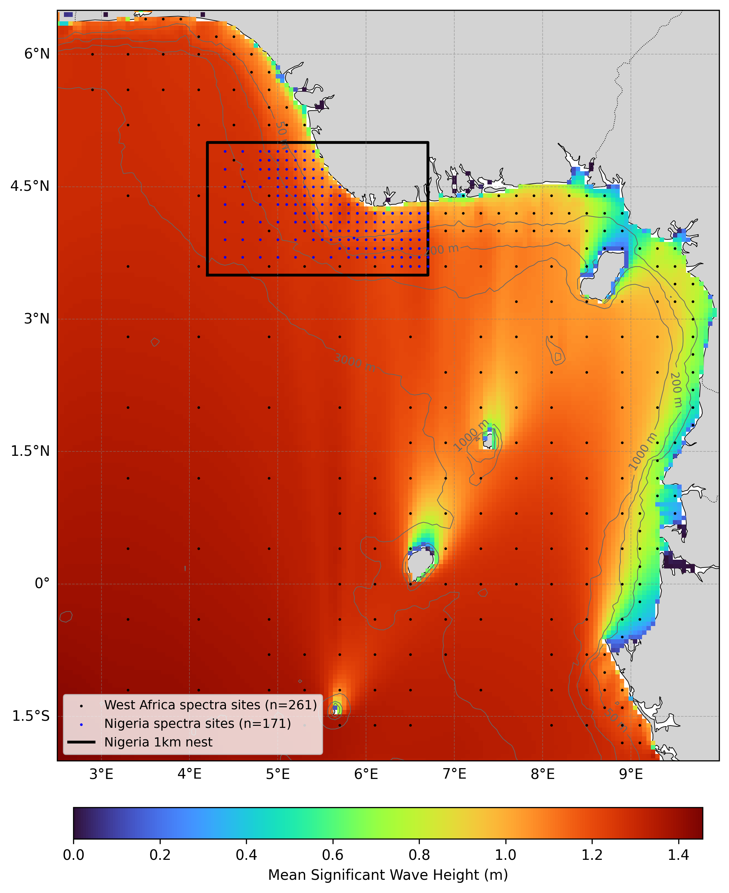

  

# Oceanum West Africa ERA5 Wave Hindcast

**February 2025**

| | |
|---|---|
| **Model** | SWAN 41.31 |
| **Period** | Feb 1979 - Updating |
| **Spatial resolution** | 0.05 degree (West Africa), 0.01 degree (Nigeria) |
| **Temporal resolution** | 1 hourly |
| **Region** | 2.5E - 10E, 2S - 6.5N |
| **Forcings** | ERA5 winds and Oceanum spectra |

---

## Dataset description

The West Africa wave hindcast dataset provides a detailed account of ocean wave parameters across the Gulf of Guinea and adjacent West African coastal waters (Figure 1). Wave spectra are computed over a 45+ year period between 1979 and present using the SWAN (Simulating WAves Nearshore) third-generation spectral wave model. The model is driven by inputs from the Oceanum Global Wave Model for spectral boundaries and <a href="https://www.ecmwf.int/en/forecasts/dataset/ecmwf-reanalysis-v5" target="_blank">ERA5 reanalysis winds</a> from the European Centre for Medium-Range Weather Forecasts. Bathymetry is derived from the <a href="https://www.gebco.net/data_and_products/gridded_bathymetry_data/" target="_blank">GEBCO 2024</a> grid.

The modelling setup employs the <a href="https://journals.ametsoc.org/view/journals/atot/29/9/jtech-d-11-00092_1.xml" target="_blank">ST6</a> source term parameterisations. Spectra are discretised into 36 directional bins and 32 frequency bins, covering a frequency range from 0.037 to 0.7102 Hz with 10% logarithmic increments. The parent domain features a regular grid with 5 km (0.05 degree) resolution covering the West African coastal region and adjacent Atlantic waters. A higher-resolution 1 km (0.01 degree) nested domain covers Nigerian coastal waters in the Gulf of Guinea, receiving spectral boundary conditions from the parent grid.

The dataset provides hourly estimates for an extensive array of ocean wave parameters (Table 2) including spectral quantities integrated over the full spectrum and for spectral partitions (defined from an 8-second split and from the Watershed method). These data are stored over the entire grid at native resolution. Additionally, frequency-direction wave spectra are available at 261 sites for the West Africa domain and 171 sites for the Nigeria nest, with resolution increasing from deep ocean areas towards the coast (see Figure 1).

**Figure 1.** Mean significant wave height from the West Africa hindcast domain. The locations of 2D spectra hourly output are shown by the black dots (West Africa 5km) and blue dots (Nigeria 1km). The black box indicates the extent of the Nigeria high-resolution nest. Depth contours are shown at 50m, 200m, 1000m, and 3000m.

---

## Validation

The wave hindcast can be validated against satellite altimeter observations using the <a href="https://hindcast-satellite-validation-main-prod.apps.oceanum.io/" target="_blank">Oceanum Hindcast Satellite Validation App</a>. This interactive tool allows users to compare modelled significant wave height against satellite altimeter measurements at any location within the model domain, providing density scatter plots, quantile comparisons, and statistical metrics.

---

## Data description

**Table 1.** Data description.

| Field | Value |
|---|---|
| **Title** | Oceanum West Africa ERA5 wave hindcast |
| **Institution** | <a href="https://oceanum.io" target="_blank">Oceanum</a> |
| **Access** | <a href="https://ui.datamesh.oceanum.io/" target="_blank">Oceanum Datamesh</a> |
| **Source** | <a href="https://swanmodel.sourceforge.io/" target="_blank">SWAN 41.31A</a> |
| **Source terms** | <a href="https://journals.ametsoc.org/view/journals/atot/29/9/jtech-d-11-00092_1.xml" target="_blank">ST6</a> |
| **Temporal coverage** | 1979-02-01 to present (updating) |
| **Temporal resolution** | Hourly |
| **Spatial coverage (West Africa)** | [2.5E, 2S, 10E, 6.5N] at 0.05 degree |
| **Spatial coverage (Nigeria)** | [4.2E, 3.5N, 6.7E, 5N] at 0.01 degree |
| **Spectra output sites (West Africa)** | 261 |
| **Spectra output sites (Nigeria)** | 171 |
| **Frequency discretisation** | 32 frequencies between 0.037 - 0.7102 Hz at 10% logarithmic increments |
| **Direction resolution** | 10 deg |
| **Bathymetry** | <a href="https://www.gebco.net/data_and_products/gridded_bathymetry_data/" target="_blank">GEBCO 2024 Grid</a> |
| **Winds** | <a href="https://www.ecmwf.int/en/forecasts/dataset/ecmwf-reanalysis-v5" target="_blank">ERA5 Reanalysis</a> |
| **Boundary** | <a href="https://ui.datamesh.oceanum.io/datasource/oceanum_wave_glob05_era5_v1_spec" target="_blank">Oceanum Global WW3 ERA5 hourly wave spectra</a> |

### Linked Datamesh datasources

#### West Africa (5 km)

- <a href="https://ui.datamesh.oceanum.io/datasource/oceanum_wave_wafr_era5_grid" target="_blank">Oceanum West Africa 5 km hourly wave parameters</a>
- <a href="https://ui.datamesh.oceanum.io/datasource/oceanum_wave_wafr_era5_spec" target="_blank">Oceanum West Africa 5 km hourly wave spectra</a>
- <a href="https://ui.datamesh.oceanum.io/datasource/oceanum_wave_wafr_era5_gridstats" target="_blank">Oceanum West Africa 5 km gridded wave statistics</a>

#### Nigeria (1 km)

- <a href="https://ui.datamesh.oceanum.io/datasource/oceanum_wave_nga_era5_grid" target="_blank">Oceanum Nigeria 1 km hourly wave parameters</a>
- <a href="https://ui.datamesh.oceanum.io/datasource/oceanum_wave_nga_era5_spec" target="_blank">Oceanum Nigeria 1 km hourly wave spectra</a>

---

## Integrated parameters gridded output

Integrated wave parameters are stored hourly over the domain at the native model resolution. Table 2 describes long names and units of all 37 gridded output parameters, including one wind-forced partition and three swell partitions from the Watershed method.

**Table 2.** Gridded output parameters.

*All parameters are defined on the `time`, `latitude` and `longitude` coordinates.*

| Variable | Long Name | Units |
|---|---|---|
| <a href="https://vocab.nerc.ac.uk/standard_name/sea_floor_depth_below_sea_surface/" target="_blank">depth</a> | depth below sea surface | m |
| <a href="https://vocab.nerc.ac.uk/standard_name/sea_surface_wave_from_direction_at_variance_spectral_density_maximum/" target="_blank">dpm</a> | mean direction at the spectral peak of wind and swell waves | degree |
| <a href="https://vocab.nerc.ac.uk/standard_name/sea_surface_wind_wave_from_direction_at_variance_spectral_density_maximum/" target="_blank">dpmsea</a> | mean direction at the spectral peak of wind waves below 8 seconds period | degree |
| <a href="https://vocab.nerc.ac.uk/standard_name/sea_surface_swell_wave_from_direction_at_variance_spectral_density_maximum/" target="_blank">dpmswe</a> | mean direction at the spectral peak of swell waves above 8 seconds period | degree |
| <a href="https://vocab.nerc.ac.uk/standard_name/sea_surface_wave_directional_spread/" target="_blank">dspr</a> | directional spreading of wind and swell waves | degree |
| fspr | normalised width of the frequency spectrum of wind and swell waves | - |
| <a href="https://vocab.nerc.ac.uk/standard_name/sea_surface_wave_significant_height/" target="_blank">hs</a> | significant height of wind and swell waves | m |
| <a href="https://vocab.nerc.ac.uk/standard_name/sea_surface_wind_wave_significant_height/" target="_blank">hsea</a> | significant height of wind waves under 8 seconds period | m |
| <a href="https://vocab.nerc.ac.uk/standard_name/sea_surface_swell_wave_significant_height/" target="_blank">hswe</a> | significant height of swell waves above 8 seconds period | m |
| <a href="https://vocab.nerc.ac.uk/standard_name/sea_surface_wind_wave_from_direction/" target="_blank">pdir0</a> | directional spreading of wind waves | degree |
| <a href="https://vocab.nerc.ac.uk/standard_name/sea_surface_primary_swell_wave_from_direction/" target="_blank">pdir1</a> | directional spreading of primary swell waves | degree |
| <a href="https://vocab.nerc.ac.uk/standard_name/sea_surface_secondary_swell_wave_from_direction/" target="_blank">pdir2</a> | directional spreading of secondary swell waves | degree |
| <a href="https://vocab.nerc.ac.uk/standard_name/sea_surface_tertiary_swell_wave_from_direction/" target="_blank">pdir3</a> | directional spreading of tertiary swell waves | degree |
| <a href="https://vocab.nerc.ac.uk/standard_name/sea_surface_wind_wave_directional_spread/" target="_blank">pdspr0</a> | directional spreading of wind waves | degree |
| <a href="https://vocab.nerc.ac.uk/standard_name/sea_surface_primary_swell_wave_directional_spread/" target="_blank">pdspr1</a> | directional spreading of primary swell waves | degree |
| <a href="https://vocab.nerc.ac.uk/standard_name/sea_surface_secondary_swell_wave_directional_spread/" target="_blank">pdspr2</a> | directional spreading of secondary swell waves | degree |
| <a href="https://vocab.nerc.ac.uk/standard_name/sea_surface_tertiary_swell_wave_directional_spread/" target="_blank">pdspr3</a> | directional spreading of tertiary swell waves | degree |
| <a href="https://vocab.nerc.ac.uk/standard_name/sea_surface_wind_wave_significant_height/" target="_blank">phs0</a> | sea surface wind wave significant height | m |
| <a href="https://vocab.nerc.ac.uk/standard_name/sea_surface_primary_swell_wave_significant_height/" target="_blank">phs1</a> | sea surface primary swell wave significant height | m |
| <a href="https://vocab.nerc.ac.uk/standard_name/sea_surface_secondary_swell_wave_significant_height/" target="_blank">phs2</a> | sea surface secondary swell wave significant height | m |
| <a href="https://vocab.nerc.ac.uk/standard_name/sea_surface_tertiary_swell_wave_significant_height/" target="_blank">phs3</a> | sea surface tertiary swell wave significant height | m |
| <a href="https://vocab.nerc.ac.uk/standard_name/sea_surface_wind_wave_period_at_variance_spectral_density_maximum/" target="_blank">ptp0</a> | sea surface wind wave period at variance spectral density maximum | s |
| <a href="https://vocab.nerc.ac.uk/standard_name/sea_surface_primary_swell_wave_period_at_variance_spectral_density_maximum/" target="_blank">ptp1</a> | sea surface primary swell wave period at variance spectral density maximum | s |
| <a href="https://vocab.nerc.ac.uk/standard_name/sea_surface_secondary_swell_wave_period_at_variance_spectral_density_maximum/" target="_blank">ptp2</a> | sea surface secondary swell wave period at variance spectral density maximum | s |
| <a href="https://vocab.nerc.ac.uk/standard_name/sea_surface_tertiary_swell_wave_period_at_variance_spectral_density_maximum/" target="_blank">ptp3</a> | sea surface tertiary swell wave period at variance spectral density maximum | s |
| pwlen0 | mean wavelength of wind waves | m |
| pwlen1 | mean wavelength of primary swell waves | m |
| pwlen2 | mean wavelength of secondary swell waves | m |
| pwlen3 | mean wavelength of tertiary swell waves | m |
| <a href="https://vocab.nerc.ac.uk/standard_name/sea_surface_wave_mean_period_from_variance_spectral_density_first_frequency_moment/" target="_blank">tm01</a> | mean absolute wave period of wind and swell waves from the first frequency moment | s |
| <a href="https://vocab.nerc.ac.uk/standard_name/sea_surface_wave_mean_period_from_variance_spectral_density_second_frequency_moment/" target="_blank">tm02</a> | mean absolute wave period of wind and swell waves from the second frequency moment | s |
| <a href="https://vocab.nerc.ac.uk/standard_name/sea_surface_wave_period_at_variance_spectral_density_maximum/" target="_blank">tps</a> | smooth relative peak wave period of wind and swell waves | s |
| <a href="https://vocab.nerc.ac.uk/standard_name/sea_surface_wind_wave_period_at_variance_spectral_density_maximum/" target="_blank">tpssea</a> | smooth relative peak wave period of wind waves below 8 seconds period | s |
| <a href="https://vocab.nerc.ac.uk/standard_name/sea_surface_swell_wave_period_at_variance_spectral_density_maximum/" target="_blank">tpsswe</a> | smooth relative peak wave period of swell waves above 8 seconds period | s |
| <a href="https://vocab.nerc.ac.uk/standard_name/eastward_wind/" target="_blank">xwnd</a> | eastward component of wind velocity | m/s |
| <a href="https://vocab.nerc.ac.uk/standard_name/northward_wind/" target="_blank">ywnd</a> | northward component of wind velocity | m/s |

---

## Spectra output

Frequency-direction wave spectra are stored hourly at the spectra output sites within the domain. Table 3 describes the spectra output variables, using the exact variable names served by Datamesh.

**Table 3.** Spectra output variables.

*Spectra are defined on the `time`, `site`, `freq` and `dir` coordinates; `lon` and `lat` are per-site data variables giving each site's location.*

| Variable | Long Name | Units |
|---|---|---|
| <a href="https://vocab.nerc.ac.uk/standard_name/sea_surface_wave_directional_variance_spectral_density/" target="_blank">efth</a> | sea surface wave variance spectral density | m² s / deg |
| <a href="https://vocab.nerc.ac.uk/standard_name/sea_floor_depth_below_sea_surface/" target="_blank">dpt</a> | water depth | m |
| <a href="https://vocab.nerc.ac.uk/standard_name/wind_speed/" target="_blank">wspd</a> | wind speed | m/s |
| <a href="https://vocab.nerc.ac.uk/standard_name/wind_from_direction/" target="_blank">wdir</a> | wind direction | degree |
| <a href="https://vocab.nerc.ac.uk/standard_name/latitude/" target="_blank">lat</a> | latitude | degrees_north |
| <a href="https://vocab.nerc.ac.uk/standard_name/longitude/" target="_blank">lon</a> | longitude | degrees_east |

---

www.oceanum.science
