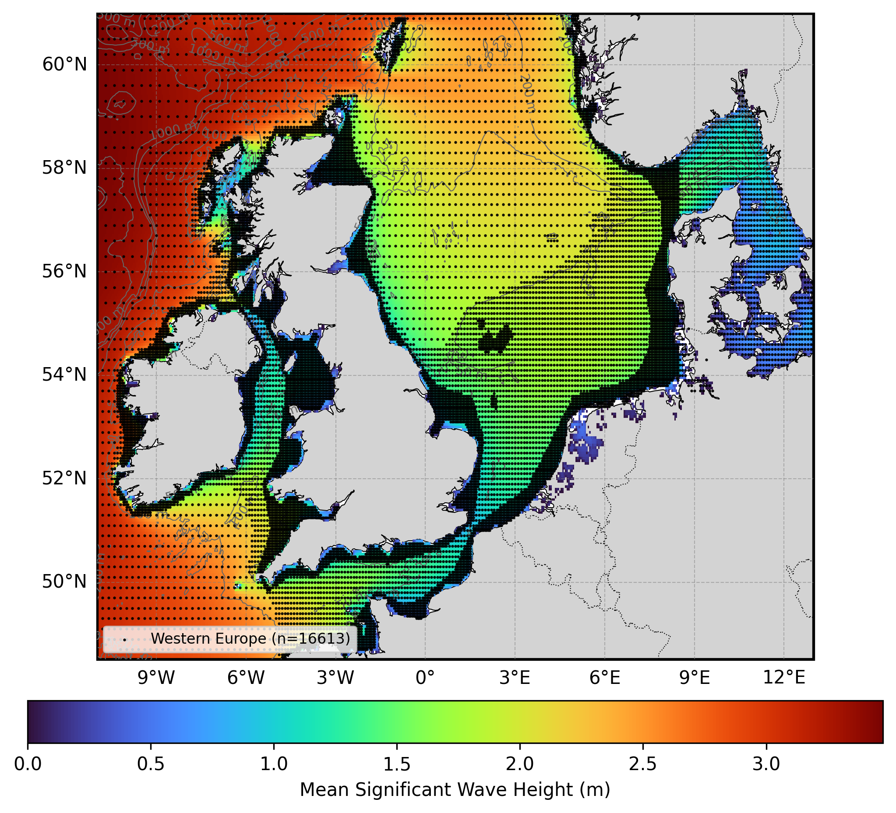

# Oceanum Western Europe Wave Forecast Specification

**February 2025**

| | |
|---|---|
| **Model** | SWAN 41.31 |
| **Forecast horizon** | 7 days |
| **Spatial resolution** | 0.05 degree (~5 km) |
| **Temporal resolution** | 1 hourly |
| **Region** | 11W - 13E, 48.5N - 61N |
| **Forcings** | GFS/ECMWF winds, tidal currents, and Oceanum spectra |
| **Update frequency** | 6-hourly (GFS) / 12-hourly (ECMWF) |

---

## Dataset description

The Western Europe wave forecast dataset provides operational wave predictions across the North Sea, Irish Sea, English Channel, and adjacent Atlantic coastal waters (Figure 1). The domain encompasses the coastal waters of the United Kingdom, Ireland, France, Belgium, Netherlands, Germany, Denmark, and Norway. Wave forecasts are produced using the SWAN (Simulating WAves Nearshore) third-generation spectral wave model, with a 7-day forecast horizon updated multiple times daily.

Two forcing configurations are available: <a href="https://www.ncep.noaa.gov/products/gfs/" target="_blank">NOAA GFS</a> winds with forecasts updated every 6 hours (00, 06, 12, 18 UTC), and <a href="https://www.ecmwf.int/en/forecasts/datasets/open-data" target="_blank">ECMWF IFS Open Data</a> winds with forecasts updated every 12 hours (00, 12 UTC). Spectral boundary conditions are supplied by the Oceanum Global WW3 wave model forced with the respective wind source. Tidal currents are prescribed from Oceanum's Western Europe tidal constituents, enabling accurate representation of wave-current interactions in the North Sea and English Channel. Bathymetry is derived from the <a href="https://www.gebco.net/data_and_products/gridded_bathymetry_data/" target="_blank">GEBCO 2023</a> global bathymetric grid.

The modelling setup employs the <a href="https://journals.ametsoc.org/view/journals/atot/29/9/jtech-d-11-00092_1.xml" target="_blank">ST6</a> source term parameterisations. Spectra are discretised into 36 directional bins and 32 frequency bins, covering a frequency range from 0.037 to 0.71 Hz with 10% logarithmic increments. The model features a regular grid with a 5 km (0.05 degree) resolution, spanning Western European waters from the Atlantic approaches to the North Sea and Baltic entrance.

The dataset provides hourly forecast estimates for an extensive array of ocean wave parameters (Table 2) including spectral quantities integrated over the full spectrum and for spectral partitions. Partitions are defined from an 8-second split (sea/swell) and from the Watershed method, which identifies one wind-forced partition and up to three swell partitions. Forecasts are archived for 30 days, and frequency-direction wave spectra are available at 5144 sites distributed across the domain (see Figure 1). Nowcast datasets are also available, constructed by retaining the most recent data from each forecast cycle to provide a continuous near-real-time historical record.

**Figure 1.** Mean significant wave height from the Western Europe hindcast domain (used for forecast validation). The locations of 2D spectra hourly output are shown by the black dots. Depth contours are shown at 50m, 200m, 500m, 1000m, and 2000m.

---

## Validation

The wave model physics and calibration have been validated against satellite altimeter observations for the corresponding hindcast domain. Validation results are available through the <a href="https://hindcast-satellite-validation-main-prod.apps.oceanum.io/" target="_blank">Oceanum Hindcast Satellite Validation App</a>, which provides density scatter plots, quantile comparisons, and statistical metrics for the Western Europe region.

---

## Data description

**Table 1.** Data description.

| Field | Value |
|---|---|
| **Title** | Oceanum Western Europe wave forecast |
| **Institution** | <a href="https://oceanum.io" target="_blank">Oceanum</a> |
| **Access** | <a href="https://ui.datamesh.oceanum.io/" target="_blank">Oceanum Datamesh</a> |
| **Source** | <a href="https://swanmodel.sourceforge.io/" target="_blank">SWAN 41.31A</a> |
| **Source terms** | <a href="https://journals.ametsoc.org/view/journals/atot/29/9/jtech-d-11-00092_1.xml" target="_blank">ST6</a> |
| **Forecast horizon** | 7 days |
| **Update frequency** | 6-hourly (GFS) / 12-hourly (ECMWF) |
| **Archive period** | 30 days |
| **Temporal resolution** | 1 hourly |
| **Spatial coverage** | [11W, 48.5N, 13E, 61N] at 0.05 degree |
| **Spectra output sites** | 5144 |
| **Frequency discretisation** | 32 frequencies between 0.037 - 0.71 Hz at 10% logarithmic increments |
| **Direction resolution** | 10 deg |
| **Bathymetry** | <a href="https://www.gebco.net/data_and_products/gridded_bathymetry_data/" target="_blank">GEBCO 2023 Grid</a> |
| **Winds** | <a href="https://www.ncep.noaa.gov/products/gfs/" target="_blank">NOAA GFS</a> or <a href="https://www.ecmwf.int/en/forecasts/datasets/open-data" target="_blank">ECMWF IFS</a> |
| **Currents** | Oceanum Western Europe tidal constituents |
| **Boundary** | Oceanum Global WW3 wave forecast (GFS or ECMWF forced) |

### Linked Datamesh datasources

**GFS-forced (6-hourly updates):**
- <a href="https://ui.datamesh.oceanum.io/datasource/oceanum_wave_gfs_weuro_grid" target="_blank">Oceanum Western Europe GFS wave forecast parameters</a>
- <a href="https://ui.datamesh.oceanum.io/datasource/oceanum_wave_gfs_weuro_spec" target="_blank">Oceanum Western Europe GFS wave forecast spectra</a>

**ECMWF-forced (12-hourly updates):**
- <a href="https://ui.datamesh.oceanum.io/datasource/oceanum_wave_ec_weuro_grid" target="_blank">Oceanum Western Europe ECMWF wave forecast parameters</a>
- <a href="https://ui.datamesh.oceanum.io/datasource/oceanum_wave_ec_weuro_spec" target="_blank">Oceanum Western Europe ECMWF wave forecast spectra</a>

**Nowcasts (continuous near-real-time archive):**
- <a href="https://ui.datamesh.oceanum.io/datasource/oceanum_wave_gfs_weuro_grid_nowcast" target="_blank">Oceanum Western Europe GFS wave nowcast parameters</a>
- <a href="https://ui.datamesh.oceanum.io/datasource/oceanum_wave_gfs_weuro_spec_nowcast" target="_blank">Oceanum Western Europe GFS wave nowcast spectra</a>
- <a href="https://ui.datamesh.oceanum.io/datasource/oceanum_wave_ec_weuro_grid_nowcast" target="_blank">Oceanum Western Europe ECMWF wave nowcast parameters</a>
- <a href="https://ui.datamesh.oceanum.io/datasource/oceanum_wave_ec_weuro_spec_nowcast" target="_blank">Oceanum Western Europe ECMWF wave nowcast spectra</a>

---

## Gridded output parameters

Integrated wave parameters are stored hourly over the domain at the native model resolution. Table 2 describes the gridded output parameters.

**Table 2.** Gridded output parameters.

| Variable | Long Name | Units |
|---|---|---|
| depth | depth below sea surface | m |
| hs | significant height of wind and swell waves | m |
| hs_sea | significant height of wind waves | m |
| hs_sw | significant height of swell waves | m |
| tps | smooth relative peak wave period of wind and swell waves | s |
| tps_sea | smooth relative peak wave period of wind waves | s |
| tps_sw | smooth relative peak wave period of swell waves | s |
| dpm | mean direction at the spectral peak of wind and swell waves | degree |
| dpm_sea | mean direction at the spectral peak of wind waves | degree |
| dpm_sw | mean direction at the spectral peak of swell waves | degree |
| tm01 | mean wave period based on first moment | s |
| tm02 | mean wave period based on second moment | s |
| dspr | directional spreading | degree |
| fspr | frequency spreading | - |
| phs0 | significant wave height of partition 0 (wind-forced) | m |
| phs1 | significant wave height of partition 1 (swell) | m |
| phs2 | significant wave height of partition 2 (swell) | m |
| phs3 | significant wave height of partition 3 (swell) | m |
| ptp0 | peak period of partition 0 (wind-forced) | s |
| ptp1 | peak period of partition 1 (swell) | s |
| ptp2 | peak period of partition 2 (swell) | s |
| ptp3 | peak period of partition 3 (swell) | s |
| pdir0 | peak direction of partition 0 (wind-forced) | degree |
| pdir1 | peak direction of partition 1 (swell) | degree |
| pdir2 | peak direction of partition 2 (swell) | degree |
| pdir3 | peak direction of partition 3 (swell) | degree |
| pwl0 | wavelength of partition 0 (wind-forced) | m |
| pwl1 | wavelength of partition 1 (swell) | m |
| pwl2 | wavelength of partition 2 (swell) | m |
| pwl3 | wavelength of partition 3 (swell) | m |
| pdspr0 | directional spreading of partition 0 (wind-forced) | degree |
| pdspr1 | directional spreading of partition 1 (swell) | degree |
| pdspr2 | directional spreading of partition 2 (swell) | degree |
| pdspr3 | directional spreading of partition 3 (swell) | degree |
| xwnd | eastward component of wind velocity | m/s |
| ywnd | northward component of wind velocity | m/s |
| xcur | eastward component of tidal current velocity | m/s |
| ycur | northward component of tidal current velocity | m/s |

---

www.oceanum.science
